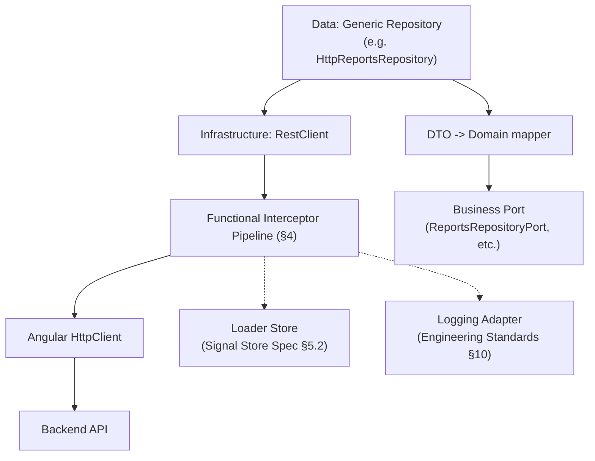
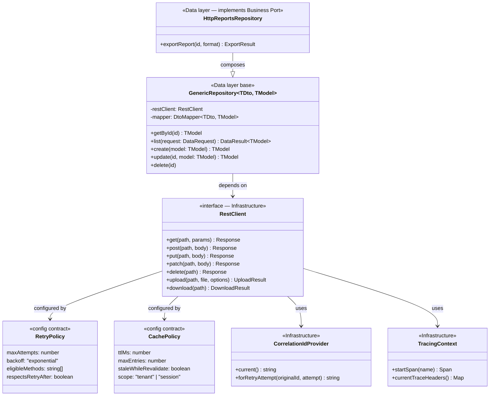

# Generic API Framework — Specification

**Project:** Enterprise Reporting Platform (dmsReports)
**Document type:** Architecture Detail Spec (Spec-Driven Development — Stage 1f)
**Status:** Draft — pending approval
**Depends on:** [Software Architecture Specification](software-architecture-specification.md) (§12 Infrastructure, §16 Data), [Authentication Architecture Specification](authentication-architecture-specification.md) (§11 Interceptors), [Engineering Standards](../engineering-standards.md) (§9 Error Handling, §10 Logging), [Signal Store Architecture Specification](signal-store-architecture-specification.md) (§5.2 Loader Store)
**Date:** 2026-07-23

---

## 1. Purpose

Specify one generic, reusable HTTP/API framework — living in the Infrastructure layer, with a Generic Repository pattern in the Data layer built on top of it — so that every network call in the platform gets the same retry/caching/cancellation/timeout/observability behavior for free, instead of each Feature or repository reinventing it. Specification only — no implementation.

---

## 2. Assumptions

| # | Assumption |
|---|---|
| A1 | This framework sits underneath, and is consistent with, the `authTokenInterceptor`/`refreshOnUnauthorizedInterceptor`/`errorNormalizationInterceptor` already defined in the Authentication Architecture Specification §11 — this document adds the remaining interceptors and composes the full pipeline (§4), it does not redefine the auth-specific ones. |
| A2 | The backend returns errors in a documented, structured shape (problem-detail-like: status, message, an echoed correlation ID) — a documented fallback mapping exists for endpoints that don't yet conform, so Error Mapping (§5.9) doesn't assume universal backend compliance on day one. |
| A3 | Tracing (§5.11) integrates with whatever APM/observability backend the platform adopts, via a vendor-neutral propagation standard (W3C Trace Context) rather than a vendor-specific SDK baked into this framework. |

---

## 3. Architecture

| Layer | Owns |
|---|---|
| **Infrastructure** (`libs/infrastructure/http`) | The `RestClient` contract and its implementation, all functional interceptors (new ones from this spec plus the auth-related ones from the Authentication Architecture Specification), the cache store, retry/timeout/polling utilities, upload/download adapters, correlation-ID and tracing-context providers. |
| **Data** (`libs/data/*`) | The **Generic Repository** base pattern (§5.14) — composed by every concrete repository (`HttpReportsRepository`, etc.) to fulfill its Business-defined Port with minimal boilerplate — plus per-resource DTO↔domain mappers. |
| **Business** | Defines the Ports (`ReportsRepositoryPort`, etc.) that Data-layer repositories fulfill — unchanged from the Software Architecture Specification; this framework doesn't alter that contract, only how the Data-layer side is *implemented*. |
| **Core** | Registers the interceptor pipeline (§4) once, at each shell's composition root — same pattern already established for the auth interceptors. |

---

## 4. Interceptor Pipeline

Functional interceptors compose like nested middleware: the request phase runs **outer → inner** in the order below; the response phase unwinds **inner → outer**. This is the single defined ordering every request goes through — there is no "raw" HTTP escape hatch that bypasses it.

| Order | Interceptor | Request phase | Response phase |
|---|---|---|---|
| 1 (outermost) | `correlationIdInterceptor` | Generates (or propagates, for a retry) a Correlation ID (§5.13), attaches it as a header | No-op — ID already available to everything inside |
| 2 | `tracingInterceptor` | Attaches W3C Trace Context headers, starts a span (§5.11) | Ends the span |
| 3 | `loggingInterceptor` | Logs the outgoing request (method, path, correlation ID) | Logs the final response/error (status, duration, correlation ID) |
| 4 | `cacheInterceptor` | Checks the cache (§5.5); **short-circuits here on a hit** | Stores a successful GET response in the cache |
| 5 | `authTokenInterceptor` *(Authentication Architecture Spec §11)* | Attaches the current Access/Iframe Token | — |
| 6 | `timeoutInterceptor` | Starts the per-request timeout clock (§5.8) | Aborts and maps to a timeout error if exceeded |
| 7 (innermost, wraps dispatch) | `retryInterceptor` | Dispatches the request; on a transient failure, retries within the timeout budget (§5.4) | — |
| — | `refreshOnUnauthorizedInterceptor` *(Auth Spec §11)* | — | On a `401`, triggers refresh-and-retry (re-enters this pipeline from the top with the **same** Correlation ID, marked as a retry attempt) |
| — | `errorNormalizationInterceptor` *(Auth Spec §11)* | — | Maps any remaining error to the typed domain-error taxonomy (§5.9), running last so it sees the final outcome of retry/refresh |

---

## 5. Requirement Design

### 5.1 REST

A single generic, typed client contract (`get<T>`, `post<TReq,TRes>`, `put`, `patch`, `delete`) sitting above Angular's `HttpClient`. Base URLs are resolved from the Configuration Layer (never hardcoded per call site). Every call — regardless of caller — goes through the full pipeline in §4; there is no bypass, so every network call in the platform is uniformly observable, retryable, cacheable, and error-mapped by construction rather than by convention.

### 5.2 File Upload

- Multipart/form-data construction; upload progress exposed as a Signal (`uploadProgress`), per the platform's Signals-first convention.
- Client-side pre-checks (file size/type) run before dispatch as a fast-fail UX improvement — **never trusted as the actual security boundary**; the backend re-validates independently.
- Cancellable mid-upload (composes Request Cancellation, §5.6).
- Retry policy for uploads is **more conservative** than for GET: a failure after partial bytes were sent is not blindly retried from scratch unless the backend explicitly supports resumable/idempotent upload semantics — retrying a large upload naively can be wasteful or, worse, create a duplicate server-side artifact.

### 5.3 File Download

- Returns a typed Blob response; filename is derived from the `Content-Disposition` header when present, falling back to a caller-supplied default.
- Download progress exposed as a Signal, mirroring upload.
- For very large exports, this framework defers to the pattern already established in the Enterprise Data Table Specification (§7.5/§14): a backend-generated file plus a download reference, rather than holding an enormous Blob entirely in browser memory.

### 5.4 Retry

- Eligible only for **idempotent** requests: `GET`/`PUT`/`DELETE` by default, or a `POST` carrying an explicit idempotency-key header — a plain `POST` without one is never auto-retried, to avoid duplicate side effects.
- Eligible failures are transient/technical only: network errors, `502`/`503`/`504` — never a `4xx` business-outcome error (a `403` is a permission fact, not a glitch, and retrying it wastes a round trip and confuses the user-facing error state).
- Exponential backoff with jitter, a bounded maximum attempt count, and respect for a `Retry-After` response header when present.
- The cumulative retry loop is bounded by the same ceiling as the request's own Timeout (§5.8) — retries cannot silently extend a request well past its configured timeout budget.
- Distinct from, and layered separately from, the 401-triggered refresh-and-retry (Authentication Architecture Specification §11) — that is a session-lifecycle concern, this is a transient-network concern.

### 5.5 Caching

- Cache-key derivation is deterministic: method + URL + params + any context that legitimately changes the result (e.g., tenant ID) — applies only to `GET` by default; mutating methods are never implicitly cached.
- In-memory store, TTL-based expiry, size-bounded via LRU eviction (consistent with the Memory Optimization discipline established in the Enterprise Data Table Specification §14).
- **Explicit invalidation API** — a repository calls it after a mutation (e.g., updating a report invalidates that report's and the reports-list's cache entries) — passive TTL expiry alone is not relied upon for consistency after a known write.
- Optional **stale-while-revalidate** mode: serve the cached value immediately while a background refresh updates it — an opt-in strategy per endpoint, not the default.
- **Cache is tenant/session-scoped and cleared on logout** (Auth Store's `logout()` triggers a cache clear) — this is a security requirement, not just a freshness one: a cached response must never leak across a logout/login boundary or across tenants in a white-label deployment.

### 5.6 Request Cancellation

- A cancellation-token contract (conceptually `AbortController`-based) that any caller can compose over — auto-cancel tied to a component/store's destroy lifecycle, and explicit "supersede" cancellation for patterns like Autocomplete's search-as-you-type or a cascading dropdown's dependency change (both already established in the Component Library and Dynamic Form Engine specifications) — this framework provides the one mechanism those patterns build on, rather than each Feature reimplementing it.
- **A cancelled request is a distinct outcome, not an error.** It must never surface as an Error State to the user — the user's own subsequent action superseded it, so it resolves silently (§5.9 explicitly excludes cancellation from the error taxonomy shown to the user).

### 5.7 Polling

- Configurable interval; **automatically stops on component/store destroy** (no orphaned timers).
- **Backoff on repeated failure** — consecutive failures extend the polling interval rather than hammering a failing endpoint at the original cadence indefinitely; a subsequent success resets the interval to its configured default.
- **Pauses when the browser tab is hidden/backgrounded** (`document.visibilityState`), resuming on foreground — avoids wasted network/battery cost for a dashboard the user isn't currently looking at.
- Each poll tick composes Request Cancellation (§5.6): a new tick cancels a still-in-flight previous tick rather than allowing overlapping in-flight requests to race.
- Distinct from Retry (§5.4): Retry recovers one failed request; Polling is a deliberate, ongoing repeated-fetch pattern for live-updating data (e.g., a dashboard widget, a background export job's status).

### 5.8 Timeout

- Per-request timeout with a configurable default and a per-call override.
- On timeout, the underlying request is **actually aborted**, not merely ignored client-side — a "logical timeout" that leaves the real request running wastes a connection and risks a late, stale response being mistakenly applied after the caller has moved on.
- Independent of, but bounds, Retry's cumulative budget (§5.4) and each Polling tick (§5.7).

### 5.9 Error Mapping

Extends the typed domain-error taxonomy already established in Engineering Standards §9 / Authentication Architecture Specification §11:

| Source | Mapped to |
|---|---|
| Network failure / no response | `NetworkError` |
| Timeout (§5.8) | `TimeoutError` |
| `400`/`422` | `ValidationError` (carries field-level detail where the backend provides it) |
| `401` (only if refresh itself fails, per Auth Spec §11) | `UnauthorizedError` |
| `403` | `ForbiddenError` |
| `404` | `NotFoundError` |
| `5xx` (after retry exhausted) | `ServerError` |
| Response doesn't match expected DTO shape | `MappingError` (§5.12) |
| Cancellation (§5.6) | **Not** part of this taxonomy — resolved silently, never surfaced as an error |

Every mapped error carries the Correlation ID (§5.13) so a user-reported issue can be traced directly to backend logs.

### 5.10 Logging

Per Engineering Standards §10: every request/response is logged through the single Logging adapter, at a level matching its outcome (request start at `debug`, success at `debug`/`info`, error at `warn`/`error`), always including the Correlation ID, method, path, status, and duration. Query-string values and request/response **bodies are never logged wholesale** (they may carry PII or business-confidential report data) — only shape/size metadata, unless a specific field is explicitly allow-listed.

### 5.11 Tracing

W3C Trace Context (`traceparent`/`tracestate`) headers are generated/propagated per request, enabling correlation with the backend's own distributed tracing/APM (vendor-neutral per A3). A single user action that fans out into multiple requests (e.g., a dashboard load triggering several widget fetches) shares one parent span, so the resulting trace shows the fan-out as one logical operation rather than N unrelated calls.

### 5.12 Correlation ID

- Generated once per outgoing request (a UUID), attached as a request header, and threaded through every log line for that request's lifecycle (§5.10) and into every mapped error (§5.9).
- The backend is expected to echo it back in error responses, and the shared Error State component (Component Library) displays it (de-emphasized) so a user reporting a failure can supply a concrete, traceable reference.
- **A retried request (§5.4) or a refresh-and-retry (§5.11's Auth Spec cross-reference) reuses the same Correlation ID**, annotated with an attempt/sequence marker in logs — so related attempts group together in log search rather than appearing as unrelated requests.
- Distinguished from Tracing (§5.11): Correlation ID is a simple, always-present, human-greppable per-request identifier aimed at log search; Tracing is a richer, span-based structure aimed at APM tooling. The two may share a value in simple deployments but serve different consumers.

### 5.13 Response Mapping

Every repository maps a raw DTO response to its domain Model via an explicit mapper function (per Folder Structure Specification's Data-layer convention). This framework standardizes **where** that step plugs into the request lifecycle: mapping runs after error-mapping/cache-storage but before the result reaches the calling Business code, so it is never skipped or performed ad hoc per call site. A response that fails to match its expected DTO shape becomes a `MappingError` (§5.9) rather than an uncaught exception deep in Business code.

### 5.14 Generic Repository

- A reusable, composable base that, given a resource path, a DTO type, a domain Model type, and a mapper, provides standard operations — `getById`, `list` (accepting pagination/sort/filter parameters **shape-compatible with the Enterprise Data Table's `DataRequest`**, §5 of that spec), `create`, `update`, `delete` — without each concrete repository re-implementing this boilerplate from scratch.
- Concrete repositories **compose** the Generic Repository for common CRUD and add resource-specific methods on top (e.g., `ReportsRepository` adds `exportReport()`) — composition over a deep inheritance hierarchy, consistent with the platform's general preference for composition.
- The Generic Repository is the concrete mechanism a Data-layer class uses to fulfill its Business-defined Port with minimal boilerplate — because its `list()` shape matches the Enterprise Data Table's `DataRequest`/`DataResult` contract, any repository built on it can back a Table's server-mode data source with no adapter glue code in between.

---

## 6. Interfaces

---

## 7. Risks

| # | Risk | Mitigation |
|---|---|---|
| R1 | A `POST` endpoint is added to the Retry-eligible set without an idempotency key, causing duplicate server-side writes under transient network failure. | Retry eligibility (§5.4) defaults to method-based idempotency only; adding a `POST` to the retryable set requires an explicit, reviewed idempotency-key contract with the backend, not a config flip. |
| R2 | The cache (§5.5) is not properly scoped/cleared on logout, leaking one tenant's or user's cached data to the next session on a shared device. | Stated as a hard security requirement in §5.5, not a performance nicety — cache clearing on `logout()` should be a required test scenario (Engineering Standards §15). |
| R3 | Logging (§5.10) is extended casually to include a full response body "just for this one debugging session" and the change ships. | Body logging requires an explicit per-field allow-list, reviewed the same as any other logging change under Engineering Standards §10/§16 — never a blanket "log everything" toggle. |
| R4 | Polling's tab-visibility pause (§5.7) is skipped for a "critical" dashboard widget, reintroducing the wasted-cost problem the rule exists to prevent. | The visibility-pause behavior is a framework default, not an opt-in — a Feature that genuinely needs background polling despite tab visibility must justify and document that exception explicitly. |

---

## 8. Dependencies

- Upstream: Software Architecture Specification (§12 Infrastructure, §16 Data), Authentication Architecture Specification (§11, three interceptors this pipeline composes around), Engineering Standards (§9, §10), Signal Store Architecture Specification (§5.2 Loader Store integration point), Enterprise Data Table Specification (`DataRequest`/`DataResult` shape reused by Generic Repository's `list()`).
- Downstream: every Data-layer repository in every bounded context (`reports-data`, `user`, `notifications`, etc.) is expected to compose the Generic Repository rather than hand-roll HTTP calls.

---

## 9. Acceptance Criteria

- [ ] All 14 requested capabilities (REST, File Upload, File Download, Retry, Caching, Request Cancellation, Polling, Timeout, Error Mapping, Logging, Tracing, Correlation ID, Interceptors, Response Mapping, Generic Repository) are each given a concrete design decision.
- [ ] The full interceptor pipeline is presented as one defined, ordered composition (§4), reconciled explicitly with the three auth-specific interceptors already defined in the Authentication Architecture Specification.
- [ ] Cancellation is explicitly excluded from the error taxonomy shown to users, not conflated with a failure.
- [ ] Correlation ID and Tracing are explicitly distinguished from each other, not treated as the same concept.
- [ ] The Generic Repository's `list()` shape is shown to be compatible with the Enterprise Data Table's `DataRequest`/`DataResult` contract, avoiding adapter glue code between the two specs.
- [ ] No implementation appears anywhere in this document.

---

## 10. Open Questions

1. Final choice of in-memory cache eviction parameters (TTL/max-entries defaults, §5.5) — left configurable here, pending real endpoint-latency and payload-size data.
2. Whether resumable/chunked upload (§5.2) is needed in the near term or can remain a documented future extension point — depends on expected file sizes for report-related uploads, not yet known.
3. Which APM/observability backend Tracing (§5.11) ultimately integrates with — this spec only commits to W3C Trace Context propagation, deliberately deferring the vendor choice.

---

## 11. Next Steps

Recommended next: apply the Generic Repository pattern concretely to the **Reports Feature's `HttpReportsRepository`**, which will validate whether §5.14's shape and the Enterprise Data Table's `DataRequest` compatibility claim actually hold up against a real backend contract.
