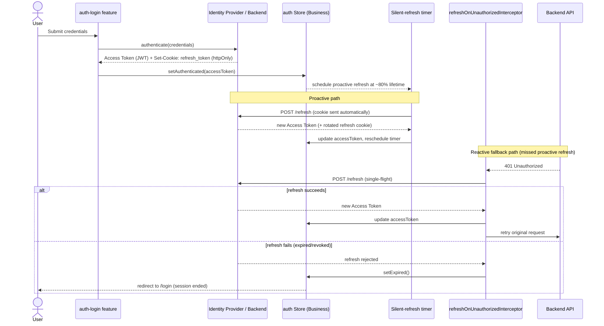
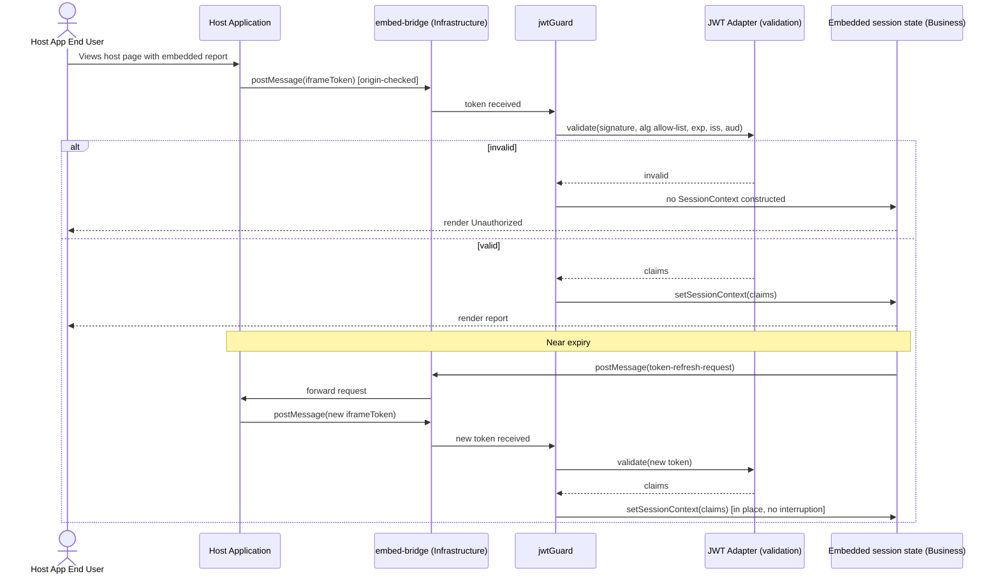
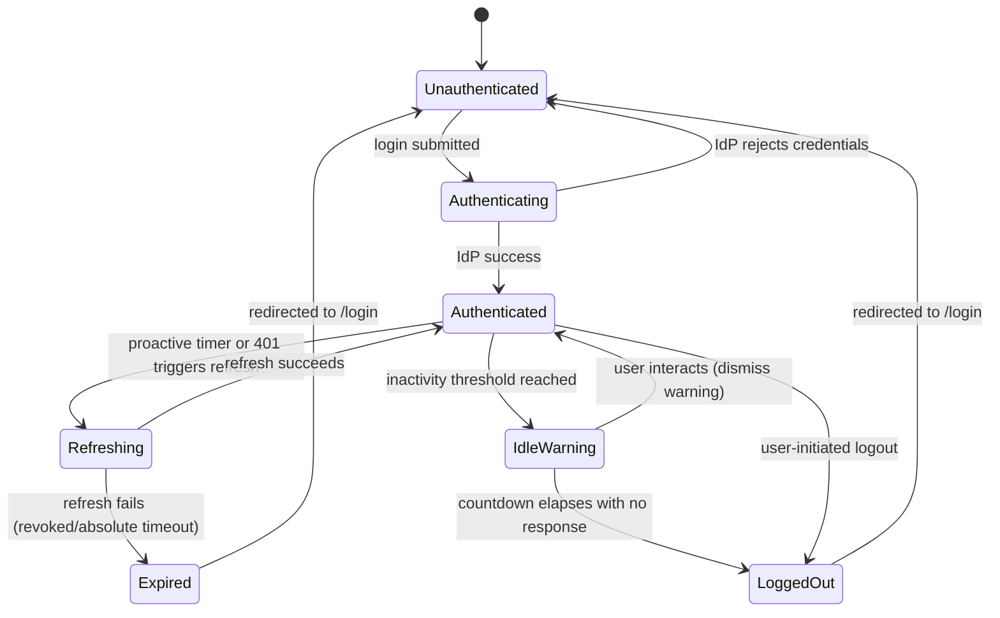
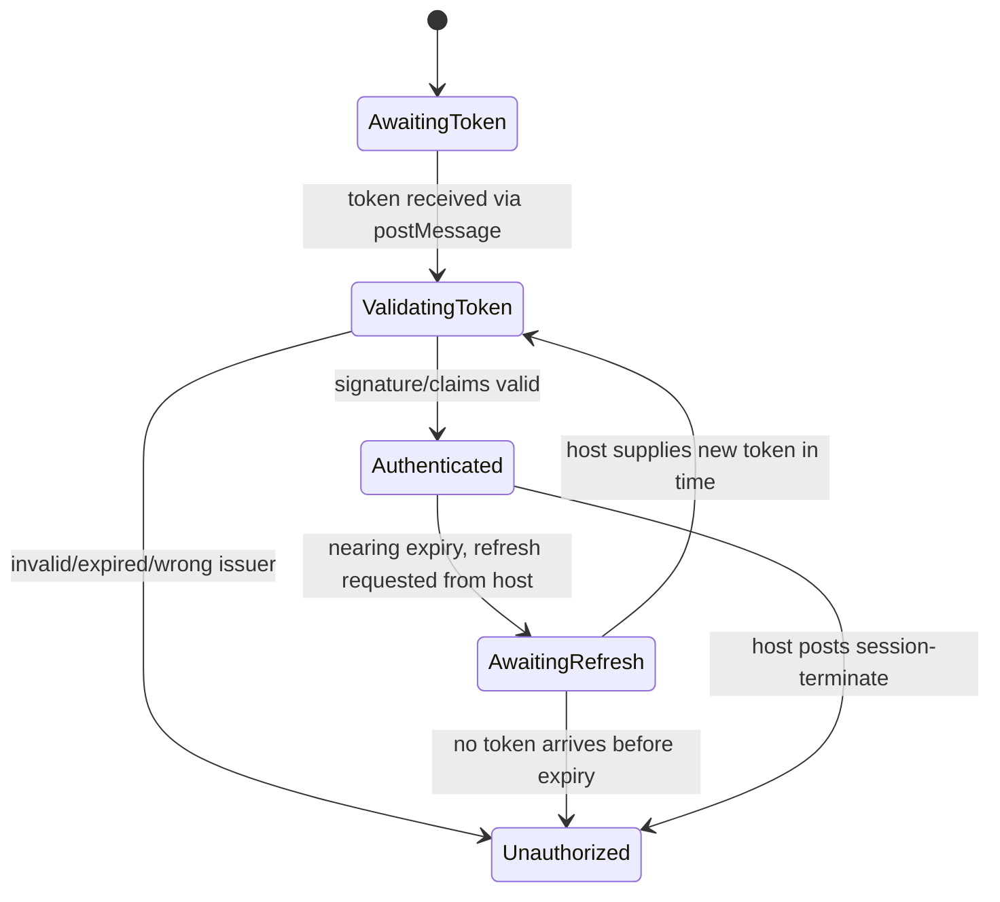
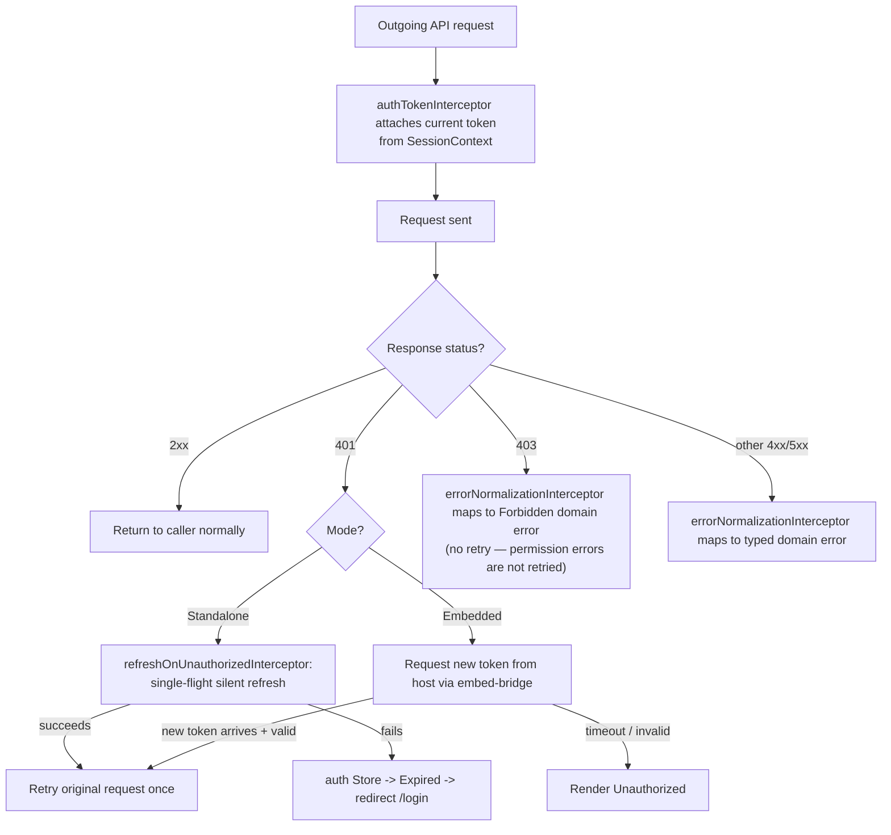

# Authentication Architecture Specification

**Project:** Enterprise Reporting Platform (dmsReports)
**Document type:** Architecture Detail Spec (Spec-Driven Development — Stage 1d)
**Status:** Draft — pending approval
**Depends on:** [Product Vision](../product-vision.md), [Software Architecture Specification](software-architecture-specification.md), [Routing Architecture Specification](routing-architecture-specification.md), [Engineering Standards](../engineering-standards.md)
**Date:** 2026-07-22

---

## 1. Purpose

Define how identity, tokens, and access-control decisions work end-to-end for both shells: token issuance and shape, refresh mechanics, session lifecycle, and how Role/Permission-based access is evaluated identically by both shells (per Vision FR-3.2). This spec supplies the content the Routing Architecture Specification deferred: what `authGuard`, `jwtGuard`, and `roleGuard` actually check, and what `SessionContext` actually contains.

---

## 2. Assumptions

| # | Assumption |
|---|---|
| A1 | Standalone login is backed by an OIDC/OAuth2-style identity provider issuing a short-lived JWT **access token** plus a **refresh token**, rather than a custom credential scheme — this is the enterprise-standard default and the one assumed throughout this spec. The exact IdP (Auth0/Okta/Entra ID/custom) is a backend/infra decision outside this document's scope; this spec depends only on the token shapes described in §4. |
| A2 | The Embedded **iframe token** is a JWT signed by the *host application's own backend*, using an asymmetric algorithm, verifiable by this platform against a per-host/per-tenant public key or JWKS endpoint registered during host onboarding. |
| A3 | The backend exposes a refresh endpoint (Standalone) and a token-introspection-free validation path for iframe tokens (Embedded validates locally against a public key — no round-trip to the host is required to validate signature/expiry). |
| A4 | Permission evaluation (`AuthorizationService.evaluate()`) is table-stakes logic this spec defines the *shape* of; the actual role→permission mapping data and its administration UI are covered by a future RBAC data-model/admin spec, not here. |

---

## 3. Scope

This document covers: token model (§4), Standalone authentication (§5), Embedded/iframe authentication (§6), Role and Permission-based access (§7–§8), the shared `SessionContext`/`AuthorizationService` seam (§9), functional Guards (§10), functional Interceptors (§11), diagrams (§12), and Security Considerations (§13).

It does **not** cover: the RBAC permission taxonomy's concrete data model, the identity provider's own configuration, or host-onboarding operational process (tenant registration of signing keys) — these are downstream specs.

---

## 4. Token Model Overview

| Token | Issued by | Used by | Lifetime | Storage |
|---|---|---|---|---|
| **Access Token** (Standalone) | Platform's IdP, on login | Attached to every API request (Standalone) | Short-lived (minutes) | **In memory only** — held in the Business `auth` Store's Signal; never written to `localStorage`/`sessionStorage`. |
| **Refresh Token** (Standalone) | Platform's IdP, on login | Silently exchanged for a new Access Token before/after expiry | Longer-lived (hours–days), rotated on use | **httpOnly, Secure, SameSite=Strict cookie** — never readable by JavaScript at all, eliminating the XSS token-theft vector for this token entirely. |
| **Iframe Token** (Embedded) | The **host application's** backend | Delivered once at embed bootstrap; validated locally; drives the Embedded `SessionContext` | Short-lived (minutes), by host's choice | Held only in memory for the duration it's needed to derive `SessionContext`; the raw JWT string is never persisted to storage and never logged (§13). |

All three are JWTs in this design (A1/A2) — the distinction that matters architecturally is **who issues them and who is responsible for refreshing them**, not their format.

---

## 5. Standalone Authentication

### 5.1 Login

The user submits credentials (or completes an IdP redirect flow) through the `auth-login` Feature. On success, the backend/IdP returns an Access Token (JWT) and sets the Refresh Token as an httpOnly cookie. The Business `auth` Store transitions to `Authenticated`, populating `SessionContext` from the Access Token's claims (roles/permissions, `sub`, `exp`).

### 5.2 Silent Refresh

Two independent triggers keep the session alive without visible interruption:

1. **Proactive:** a timer scheduled at a fixed fraction of the Access Token's lifetime (e.g., refresh scheduled when ~80% of its lifetime has elapsed) calls the refresh endpoint *before* expiry, so an in-flight user action never hits an expired token.
2. **Reactive (safety net):** the `refreshOnUnauthorizedInterceptor` (§11) catches a `401` on any API call and triggers the same refresh flow if the proactive timer was missed (e.g., device woke from sleep past the scheduled time).

Both triggers converge on one **single-flight refresh operation** — if multiple requests independently detect the need to refresh at once, only one refresh call is made; the others await its result and retry afterward. This prevents a "refresh storm" and prevents a race where two concurrent refreshes each rotate the refresh token and invalidate each other.

The backend is expected to **rotate** the refresh token on every use (issue a new one, invalidate the old) and to treat presentation of an already-used refresh token as a signal of possible theft, revoking the entire session family — this spec assumes that behavior exists server-side; it is not something the frontend enforces, only something the frontend must tolerate gracefully (a revoked-family response is just another refresh failure, handled per §5.4/§5.5).

### 5.3 Session Timeout

- **Idle timeout:** a client-side inactivity timer (reset by user interaction — pointer/keyboard/route navigation) that, after a configured idle period, shows a countdown warning modal; if unacknowledged, the session ends (§5.5 logout flow) rather than silently expiring mid-action.
- **Absolute timeout:** bounded by the Refresh Token's own maximum lifetime, enforced server-side — no amount of activity extends a session past this ceiling, forcing periodic re-authentication as an enterprise security control.
- Embedded mode has no equivalent idle-timeout concept (see §6.5) — its expiry is purely the Iframe Token's own `exp`.

### 5.4 Session Expiry (unrecoverable)

If a silent refresh attempt itself fails (refresh token invalid, expired past absolute timeout, or revoked), the session cannot be recovered client-side. The `auth` Store transitions to `Expired`, the in-memory Access Token is cleared, and the user is routed to `/login` with a message indicating the session ended — this is a **routing-layer redirect**, per the Routing Architecture Specification's rule that Standalone never shows a static "Unauthorized" page when a login flow is available.

### 5.5 Logout

A user-initiated logout: calls a backend logout/revoke endpoint (invalidating the refresh token and clearing its cookie server-side), clears all in-memory session state (`auth` Store reset to `Unauthenticated`), and navigates to `/login`. If the IdP is a full SSO provider, this may also redirect through the IdP's own end-session endpoint (front-channel logout) — flagged as an **open question (§16)** pending IdP selection, since this spec doesn't assume a specific provider.

---

## 6. Embedded Authentication (Iframe Token)

### 6.1 Token Contract (claims — illustrative, not final)

| Claim | Meaning |
|---|---|
| `iss` | Identifies the issuing host application/tenant. |
| `aud` | Identifies this platform (and, if needed, a specific deployment/tenant instance of it). |
| `sub` | The host's own identifier for its end user (opaque to us — we don't need to know who they are beyond their granted claims). |
| `roles` / `permissions` | The role(s) and/or explicit permission grants this session carries, per §7/§8. |
| `reportScope` *(optional)* | Restricts the token to one specific report/report set, enabling least-privilege, single-report embeds. |
| `tenantId` | Ties the session to a tenant for white-label/theming purposes (Configuration Layer). |
| `iat`, `exp`, `nbf` | Standard timing claims. |
| `jti` | Unique token identifier — available for optional replay-detection tooling (§13). |

### 6.2 Transport Mechanism

**Recommended: `postMessage`-based delivery**, not a URL query parameter. The embedding host's page, after the iframe signals it has loaded (or proactively, once the iframe's origin is known), posts the signed JWT to the iframe via `window.postMessage`, with the iframe validating the message's `origin` against an allow-list before accepting it. This is the Infrastructure `embed-bridge` adapter's responsibility (Architecture Spec §12).

**Why not a URL parameter:** a JWT in the URL is retained in browser history, may be sent to servers via the `Referer` header on subsequent navigation, and is more likely to end up in access/proxy logs — all of which are exactly the leakage vectors JWT-based (rather than cookie-based) embedded auth was chosen to avoid in the first place (Vision R6 mitigation). A bootstrap-script-tag/config-object delivery is an acceptable fallback for hosts that cannot use `postMessage`, but it must never place the raw token in the visible URL.

### 6.3 Token Validation

Performed once, at `jwtGuard` activation (Routing Spec §5), by the Infrastructure `jwt` adapter:

1. **Structural check** — well-formed JWT (three segments, parseable header/payload).
2. **Algorithm allow-list** — only explicitly registered asymmetric algorithms (e.g., RS256/ES256) are accepted; a token asserting `alg: none` or any algorithm outside the allow-list is rejected outright, regardless of what the payload claims.
3. **Signature verification** — against the public key registered for the token's `iss`/tenant (via a cached JWKS lookup or a pre-shared public key from Configuration).
4. **Claims validation** — `exp` not passed (small clock-skew tolerance, e.g., 30–60 seconds), `nbf` respected if present, `iss`/`aud` match this deployment's expected values exactly (no partial/prefix matching).
5. **Derivation** — on success, `SessionContext` is populated from the validated claims (§9); on any failure at any step, the guard routes to `/unauthorized` (Routing Spec §4) and no partial `SessionContext` is ever constructed from an unverified token.

### 6.4 Token Refresh (Embedded)

The platform does not hold an embedded-mode refresh token — refreshing is the **host's** responsibility, since only the host can re-authenticate its own end user. The pattern:

- Before the current Iframe Token nears expiry, the embedded shell posts a `token-refresh-request` message to the host (via the same `embed-bridge` channel used for delivery).
- The host obtains a fresh signed JWT from its own backend and posts it back the same way §6.2 describes initial delivery.
- The shell re-runs §6.3 validation on the new token and updates `SessionContext` in place — the user sees no interruption if the host responds in time.
- If no refreshed token arrives before expiry, the shell transitions to the Unauthorized state (§6.5/§12) — there is no fallback login form to offer (Vision FR-2.2).

### 6.5 Session Termination (Embedded equivalent of Logout)

There is no user-facing logout affordance in Embedded mode (no chrome, per Vision FR-2.5). Two ways an embedded session ends:

1. **Natural expiry** — the Iframe Token's `exp` passes with no refreshed token supplied (§6.4) → Unauthorized.
2. **Host-initiated termination** — the host may post a `session-terminate` message (e.g., its own user logged out) at any time; on receipt, the shell immediately clears `SessionContext` and transitions to Unauthorized, without waiting for natural expiry.

---

## 7. Role Based Access (RBAC)

Roles are a coarse-grained **assignment convenience**, not the thing directly checked at runtime. A user/session is assigned one or more roles (e.g., `Viewer`, `Editor`, `Administrator`); each role maps to a default set of permissions (§8). Nothing in Presentation, Routing, or Business logic should ever branch on a role name directly (`if role === 'Administrator'`) — see §8's rule — roles exist to make *administration* convenient (assign one role instead of ten permissions), while permissions are what's actually evaluated.

---

## 8. Permission Based Access

Permissions are fine-grained capability grants (e.g., `view:report`, `export:report`, `manage:users`, `admin:*`), resolved from the union of: (a) permissions implied by the session's assigned role(s), and (b) any explicit permission grants/overrides layered on top of role defaults, supporting exceptions without inventing a new role per edge case.

**Hard rule (also stated in Routing Spec §5, restated here as its authoritative source):** every access-control decision — Guards, conditional UI rendering, feature gating — goes through `AuthorizationService.evaluate(sessionContext, requiredPermission)`. No call site checks a role name directly. This is what lets the permission taxonomy evolve (new permissions, new role→permission mappings, per-tenant customization for white-label deployments) without touching every place that currently reads `if (role === ...)` — a direct application of the Open/Closed Principle to the access-control seam.

---

## 9. Shared `SessionContext` & `AuthorizationService`

This is the structural mechanism, first introduced in the Routing Architecture Specification, that lets one Business-layer authorization implementation serve both shells:

| | Standalone | Embedded |
|---|---|---|
| **Populated by** | `authGuard`, from the Access Token's claims plus the live `auth` Store state | `jwtGuard`, from the validated Iframe Token's claims (§6.3) |
| **Shape consumed by `roleGuard`/`AuthorizationService`** | Identical `SessionContext` (roles, permissions, subject, tenant) | Identical `SessionContext` |
| **Refreshed by** | Silent refresh (§5.2) | Host-driven token refresh (§6.4) |
| **Torn down by** | Logout (§5.5) or expiry (§5.4) | Natural expiry or host termination (§6.5) |

`AuthorizationService.evaluate()` itself has no notion of "Standalone" or "Embedded" — it only ever sees a `SessionContext` and a required permission. This is the guarantee behind Vision FR-3.2 and Success Criterion SC3.

---

## 10. Functional Guards

*(Extends Routing Architecture Specification §5 with auth-specific internal behavior.)*

- **`authGuard`** — reads the `auth` Store's current state. If already `Authenticated`, allows immediately (synchronous, no network call on every navigation). If `Unauthenticated`/`Expired`, and no session-bootstrap check has run yet this app load, it first attempts one silent-refresh call (to cover the "user still has a valid refresh-token cookie from a previous visit but no in-memory access token yet" case) before deciding to redirect to `/login`.
- **`jwtGuard`** — runs the full §6.3 validation pipeline **once** per embed instance (result cached in the `auth`/embedded session state); it does not re-validate on every internal navigation within the same embedded instance, only when a new token arrives via the refresh flow (§6.4) or termination message (§6.5) invalidates the cached result.
- **`roleGuard`** — unchanged from the Routing Spec: calls `AuthorizationService.evaluate(sessionContext, requiredPermission)` against whichever `SessionContext` the upstream guard produced.

---

## 11. Functional Interceptors

*(Per Engineering Standards §9 — functional only, registered in Core, implemented in Infrastructure/http.)*

| Interceptor | Responsibility | Notes |
|---|---|---|
| `authTokenInterceptor` | Attaches the current Access Token (Standalone) or the current validated Iframe Token (Embedded) as an `Authorization` header on outgoing API requests. | Reads the current token from the Business `auth` Store/`SessionContext` — never re-reads storage directly, since the Access Token is never persisted to storage in the first place (§4). |
| `refreshOnUnauthorizedInterceptor` | Catches a `401` response. Standalone: triggers the single-flight silent-refresh-and-retry flow (§5.2); on refresh failure, forwards to session-expiry handling (§5.4). Embedded: a `401` here means the backend independently rejected an already-`jwtGuard`-validated token (e.g., revoked mid-session) — since there is no embedded refresh token, this requests a fresh token from the host (§6.4) and retries once if one arrives in time, otherwise surfaces Unauthorized. | Must not retry indefinitely — one refresh-and-retry attempt per failed request, to avoid infinite loops if the backend is simply misconfigured. |
| `errorNormalizationInterceptor` | Maps any HTTP error response into the platform's typed domain error shape (Engineering Standards §9) before it reaches Business/Data. | Runs after the refresh attempt has had its chance to turn a 401 into a successful retry — Business only ever sees a normalized, final error. |

**Ordering:** `authTokenInterceptor` (request phase) → request sent → `errorNormalizationInterceptor`/`refreshOnUnauthorizedInterceptor` (response phase, refresh-and-retry resolved before normalization finalizes an error) — declared explicitly in Core's interceptor registration so the chain's behavior is readable in one place rather than inferred from registration order accidentally.

---

## 12. Diagrams

### 12.1 Sequence Diagram — Standalone Login, Silent Refresh, and 401 Fallback

### 12.2 Sequence Diagram — Embedded Iframe Token Handshake and Refresh

### 12.3 State Diagram — Standalone Session Lifecycle

### 12.4 State Diagram — Embedded Token Lifecycle

### 12.5 Flow Diagram — Request-Time Token Handling (both shells)

---

## 13. Security Considerations

| # | Consideration | Mitigation adopted in this design |
|---|---|---|
| S1 | Access Token theft via XSS. | Access Token is held in memory only, never in `localStorage`/`sessionStorage` — an XSS payload cannot read it from persistent storage; its blast radius is limited to the current tab's runtime. |
| S2 | Refresh Token theft via XSS. | Refresh Token is an `httpOnly`, `Secure`, `SameSite=Strict` cookie — never readable by any JavaScript, including malicious injected scripts. |
| S3 | CSRF against cookie-authenticated refresh endpoint. | `SameSite=Strict` (or `Lax` at minimum) on the refresh cookie plus backend CSRF-token double-submit if the refresh endpoint is state-changing — flagged for confirmation with backend in the CSRF-specific hardening pass. |
| S4 | Algorithm-confusion / `alg:none` attacks on either JWT type. | Explicit algorithm allow-list enforced at the validation layer (§6.3) — a token is rejected if its header claims an algorithm outside the allow-list, regardless of payload content. |
| S5 | Iframe Token leakage via URL/history/Referer/logs. | `postMessage` transport recommended over URL parameters specifically to avoid this (§6.2); URL-param fallback explicitly discouraged. |
| S6 | Cross-tenant / wrong-host token acceptance. | Strict `iss`/`aud` exact-match validation per registered tenant (§6.3) — no partial or prefix matching, preventing a token signed for Tenant A's key from being accepted under Tenant B's registration. |
| S7 | Clickjacking / unauthorized embedding by hosts not entitled to embed. | `Content-Security-Policy: frame-ancestors` allow-listing per tenant (Architecture Spec, Vision NFR — Security), enforced independently of and in addition to JWT validation — a valid token from an allow-listed host is necessary but the framing restriction is a separate, defense-in-depth control. |
| S8 | Refresh token replay after rotation (stolen, already-used token replayed). | Backend-enforced refresh-token rotation with reuse detection (assumption A3-adjacent) — the frontend's role is only to handle the resulting revoked-session response gracefully (§5.4), not to implement detection itself. |
| S9 | Sensitive claim/token leakage via logs. | Per Engineering Standards §10 — raw JWTs and their claims are never logged; only redacted/non-identifying diagnostic fields (e.g., `jti` hash, expiry timestamp) are permitted in logs. |
| S10 | Embedded session outliving host's own user session (host user logs out, iframe unaware). | Host-initiated `session-terminate` message (§6.5) is the explicit mechanism for this — integration guidance for host developers (P5) must state this is their responsibility to send. |
| S11 | Token replay within its validity window (a captured, still-valid JWT reused from a different context). | `jti` claim is available for optional short-lived replay-tracking if a given deployment's risk profile requires it; not mandatory by default given tokens are already short-lived, but named here so it's a conscious choice, not an oversight. |
| S12 | Permission staleness — a long-lived Embedded session's claims no longer reflect a since-revoked permission. | Iframe Tokens are deliberately short-lived (§4) precisely so a revoked permission surfaces on the next required refresh (§6.4) rather than persisting for the life of a long-lived credential. |

---

## 14. Risks

| # | Risk | Mitigation |
|---|---|---|
| R1 | A component or guard checks a role name directly, bypassing `AuthorizationService`, quietly reintroducing the coupling §7/§8 explicitly forbid. | Code review checklist item (extends Engineering Standards §16): grep for direct role-string comparisons outside `libs/business/auth` as a review flag. |
| R2 | Host integrators (P5) implement `postMessage` origin-checking incorrectly (accepting `*` origin), undermining S5/S6's protections at the host's end. | Publish the embed integration contract (future Embedded Integration Guide) with an explicit, non-optional origin-check requirement and example failure modes. |
| R3 | Silent refresh's single-flight mechanism has a bug allowing a duplicate refresh race, causing spurious logouts under concurrent request load. | Call out as a mandatory test scenario in the Standalone auth implementation's test plan (concurrent 401s trigger exactly one refresh call). |
| R4 | IdP choice (deferred, A1) turns out to not support one of the assumed capabilities (e.g., no refresh-token rotation). | Revisit §5.2/§13 S8 once the IdP is selected; treat this spec's refresh design as the target behavior to select an IdP against, not an unchangeable constraint. |

---

## 15. Dependencies

- Upstream: Product Vision, Software Architecture Specification, Routing Architecture Specification.
- Downstream: RBAC permission-taxonomy/data-model spec (concrete permission keys and role→permission mappings); Embedded Integration Guide for host developers (P5), which must document the `postMessage` contract from §6.2/§6.4/§6.5 as a stable, versioned API.

---

## 16. Acceptance Criteria

- [ ] All twelve requested elements (JWT, Refresh Token, Silent Refresh, Role Based Access, Permission Based Access, Iframe Token, Token Validation, Token Refresh, Session Timeout, Logout, Interceptor, Functional Guard) are each given a concrete design, not just named.
- [ ] Standalone and Embedded token handling are both fully specified, including their respective refresh mechanisms (silent refresh vs. host-driven postMessage refresh).
- [ ] `SessionContext`/`AuthorizationService` reuse across both shells is shown structurally (§9), consistent with the Routing Architecture Specification.
- [ ] Sequence, State, and Flow diagrams are present as Mermaid, covering both modes.
- [ ] A dedicated Security Considerations section addresses token storage, algorithm confusion, transport leakage, cross-tenant acceptance, clickjacking, replay, and logging — not just a generic OWASP mention.
- [ ] No implementation code appears in this document.

---

## 17. Open Questions

1. Identity Provider selection (OIDC-compliant SaaS vs. custom) — this spec's Standalone design assumes standard Authorization Code + refresh-token-rotation semantics; needs confirmation once an IdP is chosen (A1).
2. Whether IdP front-channel SSO logout applies (§5.5) — depends on the same IdP decision.
3. Whether `jti`-based replay tracking (S11) is required for any particular tenant's risk profile, or left as a future enhancement.
4. Exact idle-timeout and absolute-timeout durations (§5.3) — left as configurable values (Configuration Layer), not fixed here, pending a security/compliance policy input.

---

## 18. Next Steps

Recommended next: the **RBAC / Authorization Model** spec, to supply the concrete permission taxonomy and role→permission mapping that `AuthorizationService.evaluate()` (§9) operates over — this authentication spec defines the mechanism, that spec defines the data it runs on.
