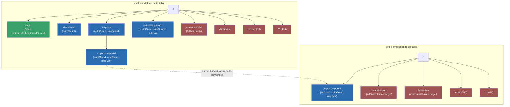
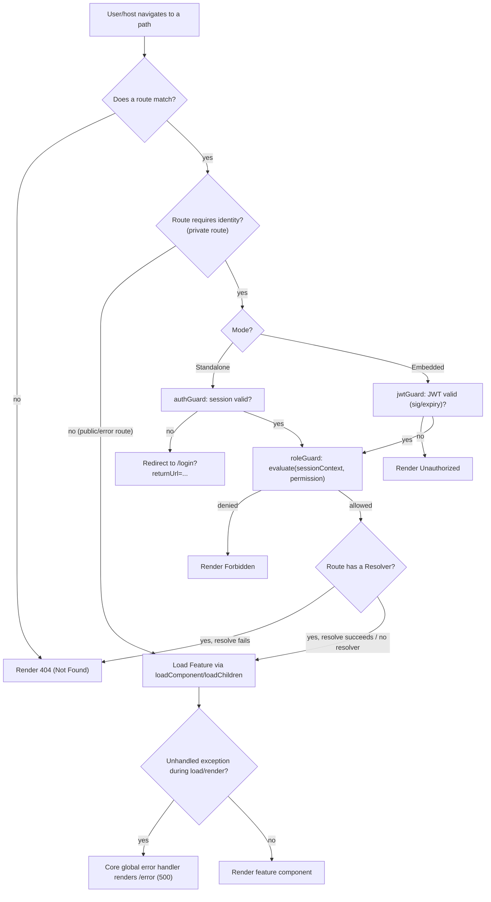
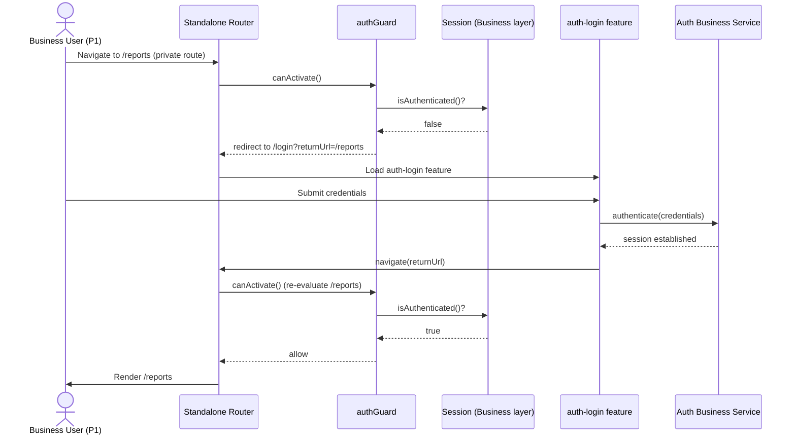
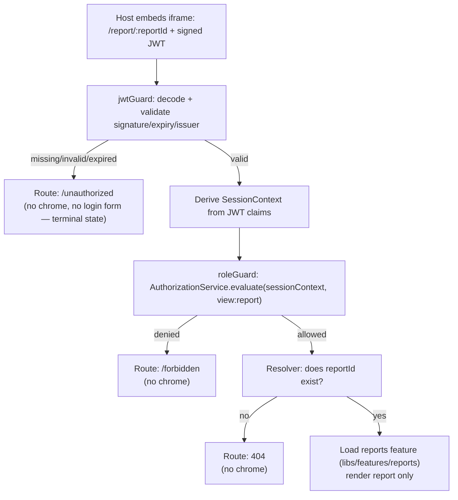
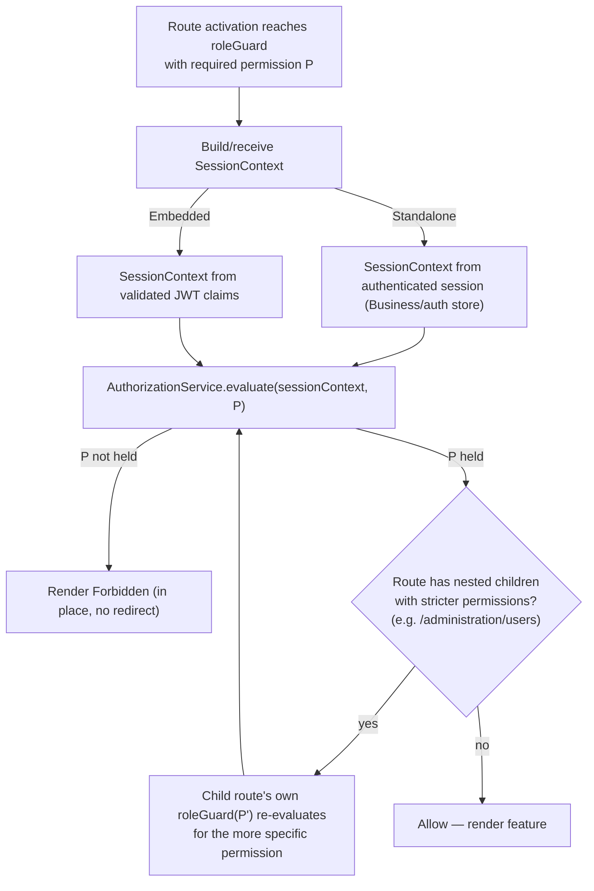

# Routing Architecture Specification

**Project:** Enterprise Reporting Platform (dmsReports)
**Document type:** Architecture Detail Spec (Spec-Driven Development — Stage 1c)
**Status:** Draft — pending approval
**Depends on:** [Product Vision](../product-vision.md), [Software Architecture Specification](software-architecture-specification.md) (§13 Routing Layer), [Folder Structure Specification](folder-structure-specification.md) (§15 Guards, §16 Resolvers), [Engineering Standards](../engineering-standards.md)
**Date:** 2026-07-22

---

## 1. Purpose

Define concretely how routing works for both shells: which routes exist, how they're lazily loaded, how authentication/authorization gate them, and what happens on every non-happy-path outcome (404, 500, Unauthorized, Forbidden). This document fills in the Routing Layer contract that the Software Architecture Specification (§13) established but left unspecified in detail.

### 1.1 Assumptions

- `authGuard`, `roleGuard`, `jwtGuard` (named in the Architecture Spec and Folder Structure Spec) are functional guards per project constraint — no class-based guards.
- Both shells' Routing Layer consumes the **same `roleGuard`** and the **same Business AuthorizationService**, fed by a common internal `SessionContext` abstraction populated differently per shell (Standalone: from an authenticated session; Embedded: from validated JWT claims) — this is the concrete mechanism satisfying Vision FR-3.2 (one shared RBAC model, two shells).
- The RBAC permission model itself (roles, permissions, claim shape) is out of scope here — this spec defines *where* checks are wired into routing, not the permission taxonomy, which belongs to the upcoming RBAC / Authorization Model spec.
- Error-state components (404/500/Unauthorized/Forbidden) are generic, parameterized presentational components living in the Shared layer (per its purity rule — no business logic, just rendering a given error variant) — Routing decides *when* to navigate to them, Shared owns *how* they look.

### 1.2 Dependencies

- Downstream of: Software Architecture Specification, Folder Structure Specification.
- Upstream of (to be detailed further by): RBAC / Authorization Model Spec (defines `AuthorizationService.evaluate()` semantics and the permission taxonomy `roleGuard` checks against), Standalone Authentication Spec (defines what `authGuard` actually checks), Embedded Authentication Spec (defines the JWT contract `jwtGuard` validates).

---

## 2. Route Taxonomy

| Category | Definition | Applies to |
|---|---|---|
| **Public routes** | Reachable with no active session and no valid JWT. | `/login` (Standalone only); 404 (both — a bad URL must be explainable even to an unauthenticated visitor). |
| **Private routes** | Require a positively-established identity (authenticated session, or validated JWT) before activation. | `/dashboard`, `/reports/**`, `/administration/**` (Standalone); `/report/:reportId` (Embedded). |
| **Feature routes** | Lazily-loaded vertical slices, each owned by one Feature module (per Architecture Spec §10). | `auth-login`, `dashboard`, `reports`, `administration`. |
| **Embedded routes** | The reduced route set mounted only in `shell-embedded`; no dashboard/nav/login routes exist in this shell at all — not merely hidden, **not present in the route table**. | `/report/:reportId`, plus Embedded's own Unauthorized/Forbidden/404 variants. |
| **Error routes** | Terminal, non-business routes representing a failure outcome rather than a feature. | 404 (Not Found), 500 (Server/Unexpected Error), Unauthorized, Forbidden — see §4. |

**Standalone route table is a strict superset in spirit but not in code** — `shell-embedded`'s route table is authored independently and only imports the `reports` Feature and the shared error routes; it does not import (and therefore cannot accidentally expose) `auth-login`, `dashboard`, or `administration`. This is enforced structurally, not by hiding navigation links.

---

## 3. Standalone Components & Lazy Loading Conventions

- Every route's component is a **Standalone Component** loaded via `loadComponent` (leaf routes) or a route group loaded via `loadChildren` pointing at a Feature's own route file (route groups with children, e.g., `administration`'s sub-routes) — never an `NgModule`-based lazy chunk.
- **One lazy chunk per Feature.** `auth-login`, `dashboard`, `reports`, and `administration` are each an independent lazy boundary; navigating to `/reports` never pulls in `administration`'s code, and vice versa — this is what keeps `shell-embedded`'s bundle free of Standalone-only code even in principle (it never even references those Features' routes, so their chunks aren't in its build graph at all).
- **Guards and resolvers are attached per-route**, not globally — a route declares exactly the guard chain it needs (see §5), so the chain is visible by reading the route table rather than being implicit.
- **Route parameters are typed at the boundary** — a route like `/reports/:reportId` resolves `reportId` through a Resolver (Folder Structure Spec §16) that hands the Feature a validated identifier or fails to the appropriate error route (see §7) rather than letting an invalid ID reach the component.

---

## 4. Error Routes — 404, 500, Unauthorized, Forbidden

A key design decision this spec makes explicit: **each error state has a different trigger source**, and the taxonomy below is what keeps them from collapsing into one ambiguous "something went wrong" page.

| Error | Trigger source | Standalone behavior | Embedded behavior |
|---|---|---|---|
| **404 — Not Found** | Router itself — no route matches the path, or a Resolver determines the requested resource (e.g., `reportId`) doesn't exist. | Renders the shared Not Found component within the Standalone shell's chrome. | Renders the shared Not Found component with **no chrome** (still just the report viewport region) — an invalid `reportId` from a host integrator is exactly this case, and P5 (host developer) needs a clear, unambiguous signal here. |
| **500 — Server / Unexpected Error** | Core's **global error handler** — an unhandled exception or an unrecoverable technical failure (e.g., Data layer exhausted its retry policy). Not guard-driven; this is the last-resort path when nothing else caught the failure. | Global error handler navigates to (or overlays) the shared error-boundary component. | Same mechanism, no chrome. |
| **Unauthorized (401)** | `authGuard`/`jwtGuard` — no valid identity established. | **Redirects to `/login`** with a `returnUrl`, rather than rendering a standalone "Unauthorized" page — Standalone always has a login flow to send the user to, so a static Unauthorized page would be redundant UX. | **Renders the shared Unauthorized component directly** — Embedded has no login screen to redirect to (Vision FR-2.2), so this is the terminal state for a missing/invalid/expired JWT (Vision FR-2.3, SC5). |
| **Forbidden (403)** | `roleGuard` — identity established, but the evaluated permission denies access to the requested route/resource. | Renders the shared Forbidden component **in place**, within shell chrome. | Renders the shared Forbidden component **in place**, no chrome. |

**Why Standalone and Embedded diverge only on Unauthorized, never on Forbidden:** an authenticated-but-forbidden user has nowhere useful to be redirected to (redirecting to login would create a loop, since re-authenticating doesn't change their role) — so Forbidden is always rendered in place, in both shells. An unauthenticated user in Standalone, by contrast, has an obvious next step (log in), which Embedded structurally lacks.

**Ownership:** all four error states are rendered by **one generic, parameterized Shared component** (varying only by title/icon/message per variant), consistent with the Shared layer's purity rule — the *decision* of which variant to show and when lives entirely in Routing/Core, never in the component itself.

---

## 5. Guard Composition

| Route type | Guard chain (in order) | Notes |
|---|---|---|
| Standalone private route | `authGuard` → `roleGuard` | `authGuard` must resolve before `roleGuard` runs — an unauthenticated user is redirected to `/login` before any permission check occurs. |
| Standalone public route (`/login`) | *(reverse-guard)* `redirectIfAuthenticatedGuard` | Prevents an already-authenticated user from re-visiting `/login`; sends them to `/dashboard` instead. |
| Embedded route (`/report/:reportId`) | `jwtGuard` → `roleGuard` | `jwtGuard` validates signature/expiry and derives a claims-based `SessionContext`; the **same** `roleGuard` used by Standalone then evaluates permission against that context. |
| Error routes | *(none)* | Error routes are guard-free by design — a Forbidden/Unauthorized/404/500 route must always be reachable regardless of session state, or the app could fail to explain its own failure. |

**Shared `roleGuard` contract:** regardless of which upstream guard ran, `roleGuard` receives one common `SessionContext` shape and calls the same Business `AuthorizationService.evaluate(sessionContext, requiredPermission)`. This is the structural reuse point that fulfills Vision FR-3.2 — RBAC is evaluated identically no matter which shell or which authentication mechanism produced the session.

---

## 6. Route Tables

### 6.1 `shell-standalone`

| Path | Feature | Guard chain | Lazy boundary |
|---|---|---|---|
| `/login` | `auth-login` | `redirectIfAuthenticatedGuard` | `loadComponent` |
| `/dashboard` | `dashboard` | `authGuard` | `loadComponent` |
| `/reports` | `reports` | `authGuard`, `roleGuard(view:reports)` | `loadComponent` |
| `/reports/:reportId` | `reports` | `authGuard`, `roleGuard(view:report)`, resolver validates `reportId` | `loadComponent` |
| `/administration/**` | `administration` | `authGuard`, `roleGuard(admin:*)` | `loadChildren` (own sub-route table) |
| `/unauthorized` | shared error component | *(none)* | `loadComponent` — reachable, but `authGuard` never routes here in Standalone (see §4); kept only as a defensive fallback target. |
| `/forbidden` | shared error component | *(none)* | `loadComponent` |
| `/error` | shared error component (500) | *(none)* | Target of Core's global error handler |
| `**` (wildcard) | shared error component (404) | *(none)* | `loadComponent` |

### 6.2 `shell-embedded`

| Path | Feature | Guard chain | Lazy boundary |
|---|---|---|---|
| `/report/:reportId` | `reports` | `jwtGuard`, `roleGuard(view:report)`, resolver validates `reportId` | `loadComponent` |
| `/unauthorized` | shared error component | *(none)* | Reachable target when `jwtGuard` fails |
| `/forbidden` | shared error component | *(none)* | Reachable target when `roleGuard` fails |
| `/error` | shared error component (500) | *(none)* | Target of Core's global error handler |
| `**` (wildcard) | shared error component (404) | *(none)* | Covers invalid `reportId` and any unrecognized path |

Note what is **absent** from `shell-embedded`'s table: `/login`, `/dashboard`, `/administration` do not exist here at all — this is the routing-level enforcement of Vision FR-2.4/FR-2.5 ("no dashboard, no navigation, no login screen").

---

## 7. Diagrams

### 7.1 Routing Diagram

### 7.2 Navigation Flow (mode-agnostic route-resolution decision tree)

### 7.3 Authentication Flow (Standalone)

### 7.4 Embedded Flow (routing-focused)

*(Complements the full bootstrap sequence in the Architecture Specification §18.4 — this view isolates the route-outcome decision made from the JWT/permission result.)*

### 7.5 Permission Flow (RBAC / roleGuard, shared by both shells)

---

## 8. Risks

| # | Risk | Mitigation |
|---|---|---|
| R1 | A future engineer adds `/dashboard` or `/administration` to `shell-embedded`'s route table "temporarily," silently reintroducing chrome/nav into Embedded mode. | Code review checklist item (Engineering Standards §16) should explicitly check `shell-embedded`'s route table against this spec's §6.2 whenever it's touched. |
| R2 | `roleGuard` logic diverges between how it's invoked from Standalone vs. Embedded, undermining the shared-RBAC guarantee (Vision FR-3.2). | `roleGuard` must remain a single implementation in `libs/routing/guards`, parameterized only by the `SessionContext` it receives — never forked per shell. |
| R3 | Embedded's Unauthorized page is mistaken by a host integrator (P5) for a generic error, delaying their debugging of an expired/misconfigured JWT. | Unauthorized/Forbidden/404 variants must be visually and textually distinct (per §4's shared component's variant contract) — this is a requirement for the Shared error component's design, not just its routing trigger. |
| R4 | 500 errors bypass the intended `/error` route by being caught too late (e.g., inside a component's own try/catch) and rendered inconsistently. | Core's global error handler (Engineering Standards §9) is the single authority for unhandled-exception routing; components must not implement ad hoc error-page rendering themselves. |

---

## 9. Acceptance Criteria

- [ ] Every requirement in the prompt (Standalone Components, Lazy Loading, Authentication, Authorization, Embedded Routes, Feature Routes, Public Routes, Private Routes, 404, 500, Unauthorized, Forbidden) is addressed with a concrete rule, not just mentioned.
- [ ] Route tables are provided for both shells, showing guard chains and lazy-loading boundaries explicitly.
- [ ] The divergence between Standalone and Embedded error handling (Unauthorized redirect-vs-page) is explained, not just asserted.
- [ ] `roleGuard` reuse across both shells is shown structurally (§5, §7.5), evidencing Vision FR-3.2.
- [ ] All five requested diagrams are present as Mermaid: Routing Diagram, Navigation Flow, Authentication Flow, Embedded Flow, Permission Flow.
- [ ] No implementation code appears in this document.

---

## 10. Open Questions

1. Whether Standalone's `/unauthorized` route (kept only as a defensive fallback per §6.1) should be removed entirely once it's confirmed `authGuard` never has a code path that reaches it — recommend keeping it until the Standalone Authentication spec confirms there's truly no scenario (e.g., a mid-session token revocation) that needs it.
2. Exact permission-key naming scheme (`view:reports`, `admin:*` used illustratively above) is deferred to the RBAC / Authorization Model spec.
3. Whether `/error` (500) should be a real navigable route or an overlay rendered without a URL change — this spec assumes a route for simplicity/testability, but the answer may depend on whether the host application (Embedded case) needs the URL to reflect the error state.

---

## 11. Next Steps

This spec's guard chains (`roleGuard` fed by a common `SessionContext`) are only placeholders for the actual decision logic until the **RBAC / Authorization Model** spec defines `AuthorizationService.evaluate()` and the permission taxonomy — recommended as the next spec, followed by the Standalone and Embedded Authentication specs that `authGuard`/`jwtGuard` depend on.
