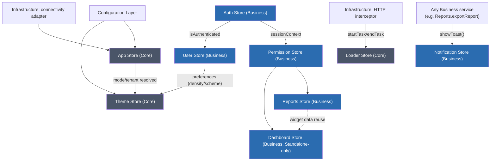

# Signal Store Architecture Specification

**Project:** Enterprise Reporting Platform (dmsReports)
**Document type:** Architecture Detail Spec (Spec-Driven Development — Stage 1e)
**Status:** Draft — pending approval
**Depends on:** [Software Architecture Specification](software-architecture-specification.md) (§7 Dependency Rules), [Authentication Architecture Specification](authentication-architecture-specification.md) (§9 SessionContext/AuthorizationService), [Engineering Standards](../engineering-standards.md) (§4 Signal Store Conventions)
**Date:** 2026-07-23

---

## 1. Purpose

Define every Signal Store in the platform's core: what state it owns, how derived values and side effects are structured, its public method surface, what (if anything) it persists and how, what it depends on, where it lives, and store-specific best practices. This document also resolves Engineering Standards §18's open question on Signal Store implementation pattern (§3.2) and a dependency-rule tension the Software Architecture Specification's original matrix didn't anticipate (§3.3). No code appears below.

---

## 2. Assumptions

| # | Assumption |
|---|---|
| A1 | Every store below is a Signal-based class following Engineering Standards §4's conventions (private writable state, public readonly Signals/`computed()`, mutation only via named methods) — this spec details each store's *content*, not the mechanical pattern itself, which Engineering Standards already fixes. |
| A2 | "Effects" means Angular's `effect()` — a reactive side effect (DOM mutation, timer scheduling, cross-store method invocation) — kept distinct from Methods (imperative APIs a consumer calls) and Computed Signals (pure derived values with no side effect). |
| A3 | Stores described here are the platform's **cross-cutting and core-domain** stores. Feature- or engine-specific stores with their own dedicated specs (`TableEngineStore` in the Enterprise Data Table Specification, `FormEngineStore` in the Dynamic Form Engine Specification) are out of scope here, though they follow the same store pattern. |

---

## 3. Store Categorization & Dependency Rule Refinement

### 3.1 Two categories, not nine unrelated stores

| Category | Stores | Defining trait |
|---|---|---|
| **Business-domain stores** | Auth, User, Permission, Reports, Dashboard, Notification | Each owns a bounded-context library (`libs/business/*`), and at least one of them depends on a Data-layer Port for real backend-fetched domain data. Follows the ordinary Feature → Business dependency rule — no exception needed. |
| **Core cross-cutting stores** | App, Loader, Theme | Pure application/UI infrastructure with **no business/domain meaning** — they exist to coordinate app-wide concerns (bootstrap/mode, in-flight-request tracking, visual theming) that have no Data-layer Port of their own. |

### 3.2 Resolving Engineering Standards §18's open question

This spec settles it: **hand-rolled Signal Store classes are the standard**, not a third-party state library (`@ngrx/signals` or equivalent). Rationale: every store below fits the simple State/Computed/Effects/Methods contract Engineering Standards §4 already defines, with no need for the additional machinery (entity adapters, dev-tools middleware) a dedicated library provides. This keeps the runtime dependency surface minimal, consistent with the platform-wide preference for Signals over additional abstraction. This decision is revisitable via its own ADR if a future store's complexity genuinely outgrows this pattern, but is the default starting point.

### 3.3 The named exception: Core stores are injectable from any layer — except Shared

The Software Architecture Specification's dependency matrix (§7.1) allows **only the shell application itself** to depend on Core — Business, Feature, and Presentation cannot. That rule holds for Core's *composition* code (interceptor registration, bootstrap wiring). It does not comfortably fit App/Loader/Theme, because these three are meant to be called from deep inside Business services and Features (e.g., a Business service registers a loading task during an export; a Feature reads `Theme`'s density setting) — code that the original matrix does not permit to reach Core.

**This spec makes one deliberate, narrow amendment:** the **public injection surface of the App, Loader, and Theme stores** may be depended on by any layer — Infrastructure, Business, Feature, Presentation — because they represent cross-cutting application infrastructure, not business logic or feature-specific wiring. This exception is scoped **only** to these three stores' public tokens, not to Core's other contents (interceptor registration, bootstrap sequencing remain reachable only from the shell app, unchanged).

**Shared is explicitly excluded from this exception, with no carve-out.** Shared's entire value proposition is being usable with zero workspace dependency beyond Angular/CDK (Folder Structure Spec §9) — including being testable or reused in total isolation from this app's DI tree. A Shared component therefore never injects Theme/Loader/App directly. Where Shared needs themed values, it reads them via the CSS custom property side-channel Theme Store's effect writes to `:root` (§7.3) — never via DI.

---

## 4. Business-Domain Stores

### 4.1 Auth Store

*(Formalizes the session-lifecycle design already established in the Authentication Architecture Specification §5/§6/§12.3/§12.4.)*

| | |
|---|---|
| **State** | `authStatus` (`unauthenticated`\|`authenticating`\|`authenticated`\|`refreshing`\|`expired`\|`loggedOut` for Standalone; a parallel `awaitingToken`\|`validating`\|`authenticated`\|`awaitingRefresh`\|`unauthorized` set for Embedded), a **private** in-memory access token / validated JWT claims (never exposed as a public Signal, §7.2), `tokenExpiryAt`, `idleWarningActive` |
| **Computed Signals** | `isAuthenticated`, `sessionContext` (the shared shape consumed by `roleGuard`/`AuthorizationService`), `timeUntilExpiry` |
| **Effects** | Schedules the proactive silent-refresh timer whenever `authStatus` becomes `authenticated` (Standalone, Auth Spec §5.2); starts/clears the idle-inactivity timer; listens for Embedded `postMessage` token-refresh/termination events via the embed-bridge and re-validates (Auth Spec §6.4/§6.5) |
| **Methods** | `login()`, `logout()`, `refresh()`, `handleEmbeddedTokenReceived()`, `extendSession()` (dismiss idle warning), `forceExpire()` |
| **Persistence** | **Nothing persisted by this store.** The access token/validated claims live in memory only (Auth Spec S1); the Standalone refresh token is an httpOnly cookie the browser — not this store — manages; nothing here ever touches `localStorage`. |
| **Dependencies** | Business `auth` domain model, Infrastructure JWT adapter (validation), Infrastructure HTTP adapter (refresh calls), Infrastructure embed-bridge (Embedded mode) |
| **Folder Structure** | `libs/business/auth/src/stores/auth.store.ts` |
| **Best Practices** | The raw token/claims value is never exposed as a public Signal — only `isAuthenticated`/`sessionContext` are public; the `authTokenInterceptor` (Infrastructure) reads the current token through a dedicated non-Signal accessor method, not by subscribing to a broadly-exposed Signal, minimizing the surface that could accidentally bind to sensitive data in a template. |

### 4.2 User Store

| | |
|---|---|
| **State** | `profile` (id/name/email/avatarUrl), `roles` (display list), `preferences` (locale, density, notification preferences) |
| **Computed Signals** | `displayName`, `initials` (avatar fallback), `hasCompletedProfile` |
| **Effects** | Fetches the profile whenever Auth Store's `isAuthenticated` transitions to `true` — a cross-store reactive dependency, not a direct method call from Auth Store into User Store (keeps the two decoupled; User Store watches Auth Store's public Signal) |
| **Methods** | `loadProfile()`, `updateProfile()`, `updatePreferences()` |
| **Persistence** | `preferences` persisted server-side via a `UserPreferencesPort` (so they follow the user across devices), with a small local cache for instant load on next visit; `profile` itself is not cached long-term client-side and is refetched each session, avoiding stale PII lingering in storage |
| **Dependencies** | Auth Store (reactive trigger only, not a direct call), `UserRepositoryPort` (Data layer) |
| **Folder Structure** | `libs/business/user/src/stores/user.store.ts` |
| **Best Practices** | In Embedded mode, this store holds only whatever minimal profile fields are present as JWT claims (e.g., a display-name claim) — Embedded has no general user-profile API access (the host owns that), so `loadProfile()` is a no-op/short-circuit under Embedded mode rather than attempting a fetch that has nowhere to go. |

### 4.3 Permission Store

*(Co-located with Auth's bounded context but kept as a distinct store, since permissions can refresh independently of the session/token — e.g., a mid-session role change without a full re-login.)*

| | |
|---|---|
| **State** | `permissions` (resolved set), `roles`, an internal evaluation-result cache keyed by permission key |
| **Computed Signals** | A small number of precomputed, broadly-used convenience flags (e.g., `isAdministrator`) — **not** a generic parameterized "computed signal per permission," since a Signal is a memoized single value, not a lookup function |
| **Effects** | Recomputes the permission set whenever Auth Store's `sessionContext` changes — the same cross-store reactive-watch pattern as User Store, never a direct push from Auth Store |
| **Methods** | `can(permission)`, `canAny(permissions[])`, `canAll(permissions[])`, `refreshPermissions()` (re-fetches/re-derives without requiring a full token refresh) — parameterized checks are Methods, not Computed Signals, precisely because they take an argument |
| **Persistence** | **Never persisted.** Permissions are always derived fresh from the current session on every load; a cached, stale permission set could grant access after a real server-side revocation — this is a security rule, not a convenience choice |
| **Dependencies** | Auth Store (`sessionContext`), Business `AuthorizationService` |
| **Folder Structure** | `libs/business/auth/src/stores/permission.store.ts` (same lib as Auth Store, separate file/class) |
| **Best Practices** | Every access-control call site uses `can()`/`canAny()`/`canAll()` — never a direct `roles.includes(...)` check anywhere else in the codebase, per the hard rule already established in the Authentication Architecture Specification §8. |

### 4.4 Reports Store

| | |
|---|---|
| **State** | `reports` (list), `selectedReportId`, `loadingStatus`, `error`, current request state (filters/sort/page — mirroring the Enterprise Data Table's request-state shape when a report list is rendered through that component) |
| **Computed Signals** | `visibleReports` (permission-filtered via Permission Store), `hasReports`, `selectedReportPermissions` (view/export/edit flags for the currently selected report) |
| **Effects** | Re-fetches the reports list whenever Permission Store's `permissions` change (e.g., a role change should update visible reports without requiring a page reload) |
| **Methods** | `loadReports()`, `selectReport(id)`, `applyFilters(filters)`, `exportReport(id, format)` (delegates to an Export port), `refresh()` |
| **Persistence** | Last-used filter/sort/view state may persist via the same `TableViewPreferencesPort` pattern established in the Enterprise Data Table Specification, if the reports list is rendered through that component; **report data itself is never persisted** — always refetched, so a permission change or data update is never masked by stale cached rows |
| **Dependencies** | `ReportsRepositoryPort` (Data layer), Permission Store |
| **Folder Structure** | `libs/business/reports/src/stores/reports.store.ts` |
| **Best Practices** | **This store is the concrete, load-bearing proof of Vision FR-3.1/FR-3.2** — it is consumed identically by the Standalone shell's `dashboard`/`reports` Features and the Embedded shell's direct report route. It must never contain any mode-specific branching (`if (embedded) {...}`) — any mode-specific behavior belongs in the Routing/Guard layer that populates its inputs, not inside this store. |

### 4.5 Dashboard Store

*(Standalone-only — never instantiated in the Embedded shell, per Vision FR-2.4.)*

| | |
|---|---|
| **State** | `widgets` (layout/config list), per-widget `widgetData`, `layoutMode` (`view`\|`edit`, if customizable), per-widget loading flags |
| **Computed Signals** | `visibleWidgets` (permission-filtered), `isDashboardEmpty` |
| **Effects** | Lazily fetches each widget's data as it becomes visible (viewport/`IntersectionObserver`-driven, consistent with the lazy-loading patterns already established for the Enterprise Data Table); optionally re-fetches on a configured auto-refresh interval, with the interval cleared on component/store teardown |
| **Methods** | `loadDashboard()`, `refreshWidget(id)`, `reorderWidgets()`, `saveLayout()` |
| **Persistence** | Widget layout/configuration persisted per-user via a preferences port (same pattern as User Store's `preferences`); **widget data itself is never persisted** — always fetched fresh |
| **Dependencies** | Reports Store (widgets frequently surface report summaries), Permission Store, a `WidgetDataPort` per widget type |
| **Folder Structure** | `libs/business/dashboard/src/stores/dashboard.store.ts` |
| **Best Practices** | Structurally excluded from the Embedded shell — not merely unused but never imported by `shell-embedded`'s providers at all, mirroring the Routing Architecture Specification's rule that Embedded's absent Features aren't just hidden, they're not in the build graph. |

### 4.6 Notification Store

*(Deliberately consolidates the Component Library's two related but distinct surfaces — the transient Snackbar/Toast and the persistent Notification Center — into one store, since both represent "communicating an event to the user," just at different lifetimes.)*

| | |
|---|---|
| **State** | `toastQueue` (ordered, ephemeral pending/active toast messages), `notifications` (persistent list: id/title/message/read/severity/timestamp) |
| **Computed Signals** | `unreadCount`, `hasActiveToast` |
| **Effects** | Auto-dismisses a toast after its `durationMs` elapses, pausing the timer on hover/focus (Component Library §13); optionally syncs `notifications` from a backend push/poll source — the specific transport (WebSocket vs. polling) is an Infrastructure integration detail, not fixed by this store |
| **Methods** | `showToast(message, options)`, `dismissToast(id)`, `addNotification()`, `markAsRead(id)`, `markAllAsRead()`, `clearAll()` |
| **Persistence** | The persistent `notifications` list is backend-synced via a `NotificationsRepositoryPort` (fetched/marked-read server-side, so it follows the user across sessions/devices); `toastQueue` is purely ephemeral and never persisted, by definition |
| **Dependencies** | `NotificationsRepositoryPort` (Data layer) for the persistent half; no Data dependency needed for toast-only usage (any Business service calls `showToast()` directly, in-memory) |
| **Folder Structure** | `libs/business/notifications/src/stores/notification.store.ts` |
| **Best Practices** | Because a `NotificationsRepositoryPort` is involved, this store lives in Business (not Core) even though "showing a toast" feels UI-adjacent — the deciding factor throughout this spec is "does it need a Data-layer Port for real backend-fetched domain data," not "does it feel visual." |

---

## 5. Core Cross-Cutting Stores

*(Covered by the named exception in §3.3 — injectable from any layer except Shared.)*

### 5.1 App Store

| | |
|---|---|
| **State** | `mode` (`standalone`\|`embedded`), `tenantId`, `isOnline`, `appVersion`, `bootstrapStatus` (`booting`\|`ready`\|`error`), `locale` |
| **Computed Signals** | `isEmbedded`, `isReady` |
| **Effects** | Reflects the Infrastructure connectivity adapter's online/offline events into `isOnline`; once `mode`/`tenantId` resolve, triggers downstream bootstrap (e.g., Theme Store loading the tenant's theme, §5.3) |
| **Methods** | `markReady()` — most of this store's state is set once, during bootstrap, rather than mutated broadly across the app's lifetime; treat most setters as bootstrap-internal, not a general-purpose public API |
| **Persistence** | **Nothing persisted.** `mode` is derived from which shell bundle is running, `tenantId`/`locale` are resolved fresh from the Configuration Layer on every load — none of this is "remembered" across sessions, it's recomputed each time |
| **Dependencies** | Configuration Layer (mode-detection, runtime-config), Infrastructure connectivity adapter |
| **Folder Structure** | `libs/core/src/stores/app.store.ts` |
| **Best Practices** | Keep this store minimal — a Feature-specific flag creeping in here (instead of that Feature's own store) is a review-blocking finding; App Store answers "what kind of app instance is this," nothing more. |

### 5.2 Loader Store

| | |
|---|---|
| **State** | `activeTasks` (map of task id → label), derived `globalLoading` |
| **Computed Signals** | `isGlobalLoading` (any active task), `activeTaskLabels` (for a "3 operations in progress" style indicator) |
| **Effects** | None of its own — this store is a largely passive registry, *driven by* effects/calls elsewhere (the `authTokenInterceptor`'s sibling, a dedicated loading-tracking interceptor, registers/deregisters a request; a long-running Business operation wraps itself with `withLoading`) |
| **Methods** | `startTask(id, label?)`, `endTask(id)`, `withLoading(id, operation)` (a convenience wrapper that starts/ends a task around an async operation) |
| **Persistence** | **None — purely ephemeral.** Loading state must never survive a reload; there is nothing to persist by definition. |
| **Dependencies** | None upstream (a coordination leaf); consumed by Infrastructure interceptors, Business services, and the shell-root loading-bar presentational piece (§3.3) |
| **Folder Structure** | `libs/core/src/stores/loader.store.ts` |
| **Best Practices** | This store tracks **global/app-wide** loading only (e.g., a top loading bar reflecting *any* in-flight request); ordinary per-component local loading state (a single button's `loading` input, per Component Library §2) stays local to that component and must not be routed through this store — mixing the two defeats the point of having a "global" indicator at all. |

### 5.3 Theme Store

| | |
|---|---|
| **State** | `colorScheme` (`light`\|`dark`\|`system`), `density` (`compact`\|`cozy`\|`condensed`), `tenantThemeTokens` (loaded from Configuration), `isThemeLoaded` |
| **Computed Signals** | `effectiveColorScheme` (resolves `system` against the OS-level `prefers-color-scheme` media query) |
| **Effects** | **Applies resolved theme tokens and `effectiveColorScheme`/`density` to the document root as CSS custom properties** whenever they change — this is the store's defining side effect, and it is the *only* channel through which Shared components ever receive theming (§3.3); also listens for OS-level color-scheme media-query changes when `colorScheme` is `system` |
| **Methods** | `setColorScheme()`, `setDensity()`, `loadTenantTheme()` (invoked once at bootstrap from Configuration) |
| **Persistence** | The user's `colorScheme`/`density` preference is persisted (low-stakes, non-sensitive UI preference — unlike Auth's tokens, plain `localStorage` or a synced `UserPreferencesPort` entry is acceptable here); `tenantThemeTokens` is **never** cached client-side long-term — always sourced fresh from Configuration on load, so a centrally-updated white-label brand takes effect promptly rather than being stuck on a stale cached value |
| **Dependencies** | Configuration Layer (`theming`, `runtime-config`); optionally User Store, if scheme/density preference syncs server-side per user rather than staying local-only |
| **Folder Structure** | `libs/core/src/stores/theme.store.ts` |
| **Best Practices** | Shared components must **never** inject this store (§3.3) — they read theming purely through the CSS custom properties this store's effect writes to `:root`. This is what keeps the Component Library genuinely framework-context-free and reusable in isolation. |

---

## 6. Cross-Store Interaction



---

## 7. Consolidated Folder Structure

```
libs/
├── core/
│   └── src/
│       └── stores/
│           ├── app.store.ts
│           ├── loader.store.ts
│           └── theme.store.ts
│
└── business/
    ├── auth/
    │   └── src/
    │       └── stores/
    │           ├── auth.store.ts
    │           └── permission.store.ts
    ├── user/
    │   └── src/stores/user.store.ts
    ├── reports/
    │   └── src/stores/reports.store.ts
    ├── dashboard/
    │   └── src/stores/dashboard.store.ts
    └── notifications/
        └── src/stores/notification.store.ts
```

---

## 8. Risks

| # | Risk | Mitigation |
|---|---|---|
| R1 | The App/Loader/Theme "injectable from anywhere" exception (§3.3) is read too broadly and used to justify putting an actual business-domain store in Core to dodge the ordinary Business-layer rules. | The exception is named and scoped to exactly these three stores in this document — any new "Core store" proposal must be checked against §3.1's defining trait (no Data Port, no domain meaning) before being added to the exception list, not assumed to qualify by precedent. |
| R2 | Loader Store is used for per-component local loading states "since it's already there," defeating its purpose as a global indicator. | Called out explicitly in §5.2's Best Practices; a code-review checklist addition (extending Engineering Standards §16) should flag any `LoaderStore.startTask()` call originating from a component-local, non-global loading concern. |
| R3 | Permission Store's cache (§4.3) becomes stale within its own session between `refreshPermissions()` calls, causing a UI element to show as accessible after a real-time permission change until the next explicit refresh. | `refreshPermissions()` should be invoked by any Feature performing an action that could plausibly change the current user's own permissions (e.g., an administrator editing their own role) — document this as a required call site, not just an available method. |
| R4 | Notification Store's dual nature (ephemeral toast + persisted list) tempts a future refactor to split it into two stores without re-checking whether Business logic elsewhere assumed the single-store consolidation. | §4.6 states the consolidation rationale explicitly so a future split is a conscious architectural decision (its own ADR), not an incidental refactor. |

---

## 9. Dependencies

- Upstream: Software Architecture Specification (§7 dependency rules, amended here per §3.3), Authentication Architecture Specification (Auth/Permission content), Engineering Standards (§4 Signal Store conventions).
- Downstream: every Feature composes one or more of these stores; the Enterprise Data Table's `TableEngineStore` and the Dynamic Form Engine's `FormEngineStore` both integrate with Permission Store for field/column-level permission gating, following the precedent set here.

---

## 10. Acceptance Criteria

- [ ] All 9 requested stores (App, Auth, User, Permission, Reports, Dashboard, Loader, Notification, Theme) are each specified with all 8 requested attributes (State, Computed Signals, Effects, Methods, Persistence, Dependencies, Folder Structure, Best Practices).
- [ ] The Business-domain vs. Core cross-cutting categorization is justified by an explicit, checkable rule (§3.1), not asserted arbitrarily.
- [ ] The dependency-rule tension between "Core stores callable from Business/Feature" and the existing Architecture Specification's matrix is resolved as a named, scoped exception rather than silently contradicted.
- [ ] Engineering Standards §18's open question on Signal Store implementation is explicitly settled (§3.2).
- [ ] Cross-store reactive dependencies are shown structurally (§6), not just described in prose.
- [ ] No code appears anywhere in this document.

---

## 11. Open Questions

1. Whether Theme/scheme/density preference should sync server-side per user (via User Store) by default, or remain local-only (`localStorage`) — left as an option in §5.3, pending a product decision on whether cross-device preference continuity matters enough to justify the extra Data-layer round trip.
2. Whether Notification Store's real-time sync transport (WebSocket vs. polling, §4.6) should be decided now or deferred until a concrete notification-producing backend event exists — recommend deferring, since the store's contract doesn't depend on the answer.
3. Whether the §3.3 exception should eventually extend to a fourth store if a genuine need arises (e.g., a future global "unsaved changes" guard store) — recommend evaluating any candidate against §3.1's defining trait before adding it, rather than treating the exception list as open-ended by default.

---

## 12. Next Steps

These nine stores are foundational — recommended next: apply Permission Store's `can()`/`canAny()`/`canAll()` contract concretely by finally writing the **RBAC / Authorization Model** spec (the permission taxonomy this store and `AuthorizationService` have been depending on as a placeholder since the Routing and Authentication Architecture Specifications).
