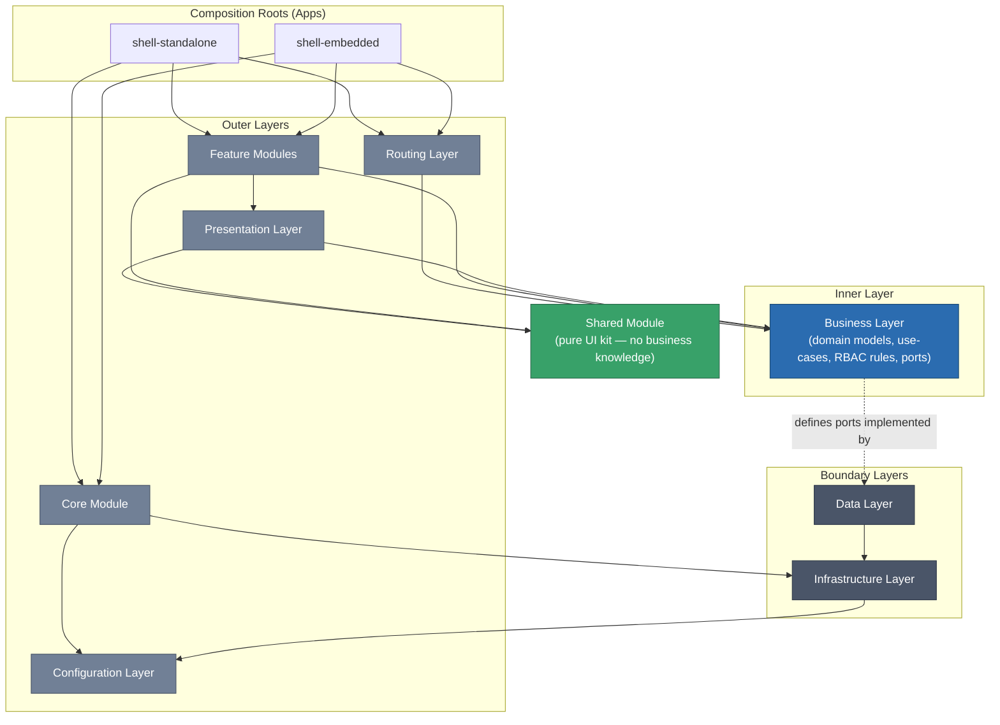
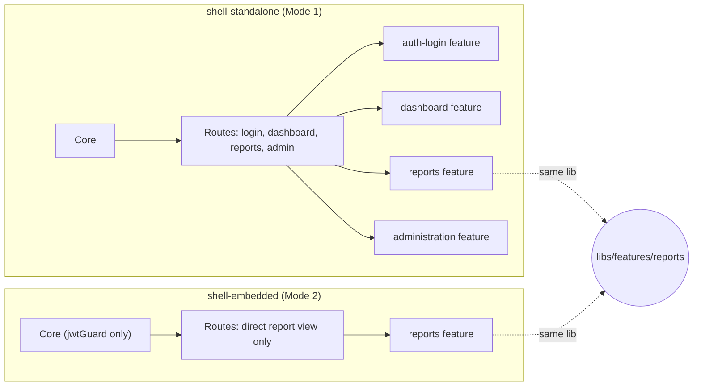
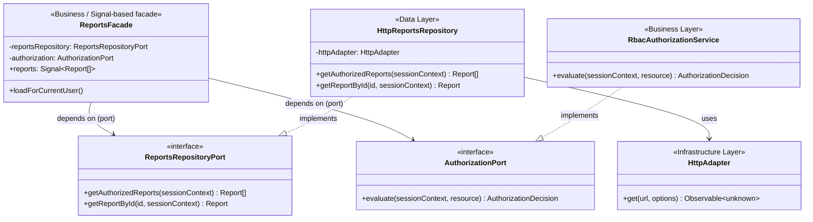
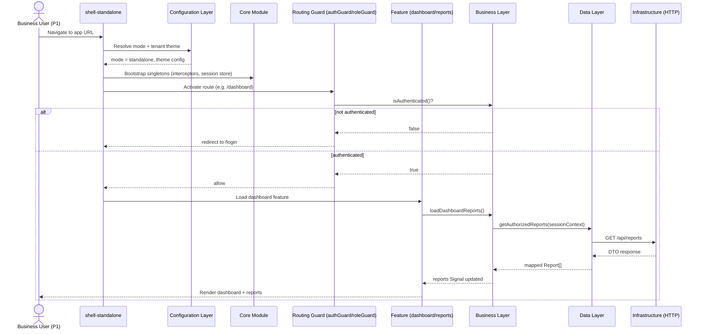
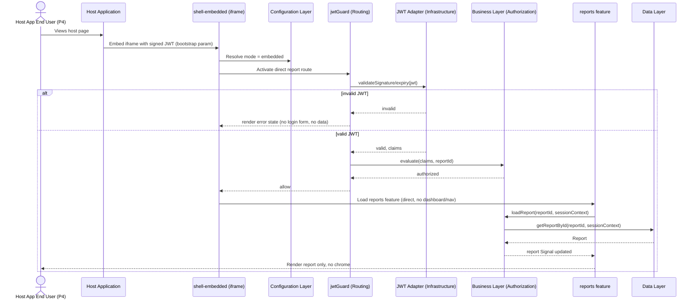
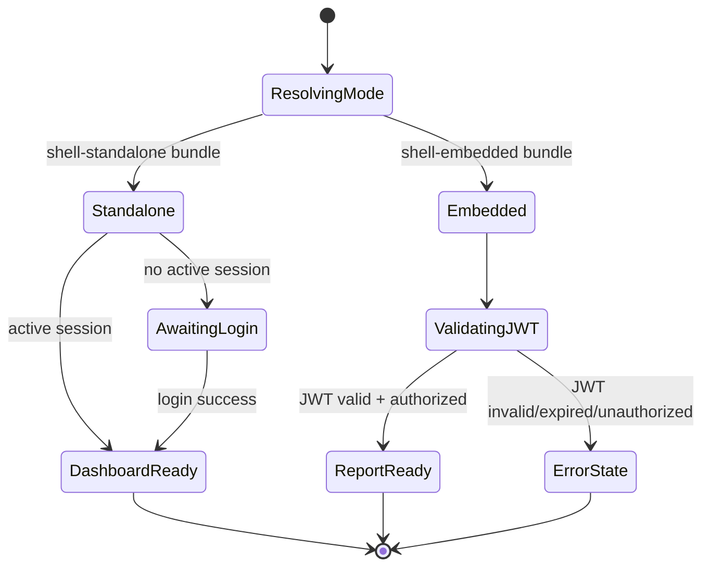

# Software Architecture Specification

**Project:** Enterprise Reporting Platform (dmsReports)
**Document type:** Architecture Specification (Spec-Driven Development — Stage 1)
**Status:** Draft — pending approval
**Depends on:** [Product Vision](../product-vision.md)
**Related decision record:** [ADR-0001 — Layered Architecture & Workspace Structure](../adr/0001-layered-architecture-and-workspace-structure.md)
**Date:** 2026-07-22

---

## 1. Purpose & Scope

This document defines the target software architecture for the dmsReports platform: its layering model, workspace/folder structure, dependency rules, and the responsibilities of each module described in the Product Vision (Core, Shared, Feature, Configuration, Infrastructure, Routing, Presentation, Business, Data). It is implementation-agnostic — it describes structure and contracts, not code.

It exists to satisfy Vision goals **G1, G4, G5, G6, G8** and to retire vision Open Question #5 (workspace structure).

---

## 2. Assumptions

| # | Assumption |
|---|---|
| A1 | Both Standalone and Embedded modes (per Vision Mode 1/2) are delivered from **one workspace**, as two separate deployable application shells that share libraries — not two independently maintained codebases. |
| A2 | Angular 20 with Standalone Components, Signals, functional guards/interceptors, and `inject()` is the implementation baseline (per project constraints). |
| A3 | A monorepo-style workspace with enforceable module/dependency boundaries is available (e.g., Nx, or Angular CLI multi-project workspace plus `eslint-plugin-boundaries`/custom ESLint import rules). The specific tool is an implementation detail to be ratified in ADR-0001; this spec assumes *some* enforced-boundary tool exists. |
| A4 | Backend services expose data over HTTP (REST and/or GraphQL) behind a contract owned by the backend team; this spec treats the backend as an external dependency accessed only through the Data/Infrastructure layers. |
| A5 | RBAC rules and the Standalone/Embedded authentication contracts are defined in their own upcoming specs; this document defines *where* that logic lives architecturally, not its content. |
| A6 | White-labeling (Vision G5) is satisfied structurally by a Configuration Layer seam now; the operational tenant-onboarding process remains a future initiative (Vision NG5). |

---

## 3. Alternatives Considered

| # | Alternative | Why not chosen |
|---|---|---|
| B1 | **Single Angular app with runtime `if(mode)` branching** for login/dashboard/nav vs. embedded view, one bundle for everything. | Ships Standalone-only code (login, dashboard, admin, nav) into the Embedded bundle regardless of runtime branching (dead code still shipped), hurting embed load performance (Vision NFR) and increasing the iframe attack surface (Vision G7). Also erodes boundary discipline over time (Vision R1). |
| B2 | **Two fully separate applications/repos**, one per mode, with no shared library layer. | Directly reproduces Vision Risk R1 (logic divergence) — reporting engine, RBAC, and theming would need to be built and maintained twice. Violates DRY/Clean Architecture constraints (C3). |
| B3 | **Micro-frontend / Module Federation** per feature, loaded independently at runtime. | Adds real infrastructure complexity (independent deployments, shared-dependency version skew, runtime composition) not justified by current scope. Revisit only if a future requirement demands independently deployable features/tenants at runtime; noted as a future evolution path, not adopted now. |
| B4 (chosen) | **Monorepo workspace**: shared libraries organized by architectural layer, consumed by two thin application shells (`shell-standalone`, `shell-embedded`), with tooling-enforced dependency boundaries. | Satisfies G1 (single codebase, no duplication), G6 (extensible to future shells), G7 (each shell composes only what it needs, keeping Embedded lean), and gives Dependency Rules (§5) a concrete enforcement mechanism. |

Full rationale and consequences are recorded in [ADR-0001](../adr/0001-layered-architecture-and-workspace-structure.md).

---

## 4. Architectural Style

The platform follows a **Clean/Layered Architecture** adapted for Angular, combined with a **shared-core, thin-shell** composition model:

- **Dependency Rule (Clean Architecture):** dependencies point inward, toward Business logic. Outer layers (Presentation, Routing, Infrastructure, Data) depend on inner layers (Business) through **interfaces ("ports") defined by the Business layer**, never the reverse. Concrete implementations (Data repositories, Infrastructure adapters) are supplied via Angular DI at the composition root (each shell).
- **Shared-core, thin-shell:** all business rules, data access, and reusable UI live in layer-organized libraries used by *both* shells. Each shell (`shell-standalone`, `shell-embedded`) is a thin composition root that wires up only the Feature Modules, Routing, and Core providers relevant to its mode.
- **Vertical slicing within Feature Modules:** each feature (Reports, Dashboard, Administration, Auth) is a self-contained vertical slice of Presentation + its own use of Business services, independently lazy-loadable.

---

## 5. Application Layers — Overview



**Reading the diagram:** solid arrows are compile-time/DI dependencies ("depends on / imports"); the dashed arrow from Business → Data is a **Dependency Inversion** relationship — Business defines the port (interface), Data implements it, and only the DI configuration at each shell's composition root wires the concrete implementation in. Business never imports Data's or Infrastructure's concrete code.

---

## 6. Folder Structure

Recommended workspace layout (library names are illustrative; exact tool — Nx vs Angular CLI multi-project — is ratified in ADR-0001):

```
dms-reports/
├── apps/
│   ├── shell-standalone/          # Composition root — Mode 1
│   │   └── src/
│   │       ├── bootstrap.ts        # inject() providers, mode = 'standalone'
│   │       ├── app.routes.ts       # full route table: login, dashboard, reports, admin
│   │       └── app.config.ts
│   └── shell-embedded/            # Composition root — Mode 2
│       └── src/
│           ├── bootstrap.ts        # inject() providers, mode = 'embedded'
│           ├── app.routes.ts       # single route: direct report view
│           └── app.config.ts
│
├── libs/
│   ├── core/                      # Core Module — singleton, app-wide
│   │   └── src/
│   │       ├── providers/          # app-wide singleton providers
│   │       ├── error-handling/
│   │       └── bootstrap/          # mode detection wiring, functional initializers
│   │
│   ├── shared/                    # Shared Module — reusable, presentation-only
│   │   └── src/
│   │       ├── ui/                 # design-system primitives (buttons, tables, charts wrappers)
│   │       ├── pipes/
│   │       ├── directives/
│   │       └── utils/              # pure, framework-light helpers
│   │
│   ├── business/                  # Business Layer — one lib per bounded context
│   │   ├── auth/                   # session/identity domain model, RBAC evaluation, ports
│   │   ├── reports/                # report domain model, use-cases, data ports
│   │   ├── dashboard/
│   │   └── administration/
│   │
│   ├── data/                      # Data Layer — implements Business-defined ports
│   │   ├── auth-data/
│   │   ├── reports-data/
│   │   └── administration-data/
│   │
│   ├── infrastructure/            # Infrastructure Layer — framework/browser-facing adapters
│   │   ├── http/                   # HTTP client wrapper, functional interceptors
│   │   ├── storage/                # browser storage adapters
│   │   ├── jwt/                    # JWT decode/validate adapter
│   │   ├── embed-bridge/           # iframe / postMessage adapter (Embedded mode)
│   │   └── logging/                # telemetry/error logging adapter
│   │
│   ├── config/                    # Configuration Layer
│   │   ├── environment/            # build-time env config
│   │   ├── runtime-config/         # runtime/tenant config loader
│   │   ├── theming/                # design tokens, white-label theme schema
│   │   └── mode-detection/         # standalone vs embedded resolution
│   │
│   ├── routing/                   # Routing Layer — shared route contracts
│   │   ├── guards/                 # functional guards (authGuard, roleGuard, jwtGuard)
│   │   └── resolvers/              # functional resolvers
│   │
│   └── features/                  # Presentation + per-feature composition
│       ├── auth-login/              # Standalone-only feature
│       ├── dashboard/                # Standalone-only feature
│       ├── reports/                  # Shared by BOTH shells
│       └── administration/          # Standalone-only feature
│
└── tools/
    └── boundaries/                 # dependency-rule enforcement config (lint rules / Nx tags)
```

Key structural point: **`libs/features/reports` is consumed by both `shell-standalone` and `shell-embedded`** — this is the concrete mechanism satisfying Vision FR-3.1 (one reporting engine, two entry modes) and Success Criterion SC1.

---

## 7. Dependency Rules

### 7.1 Allowed-dependency matrix

Rows may depend on columns marked ✅. Anything not marked is forbidden and must be caught by tooling (Nx module boundaries or ESLint import-boundary rules), not by convention alone.

| ↓ depends on → | Config | Shared | Business | Data | Infra | Routing | Presentation | Feature | Core |
|---|:---:|:---:|:---:|:---:|:---:|:---:|:---:|:---:|:---:|
| **Config**        | – | | | | | | | | |
| **Shared**        | | – | | | | | | | |
| **Business**      | | | – | (ports only) | | | | | |
| **Data**          | | | ✅ (ports) | – | ✅ | | | | |
| **Infrastructure**| ✅ | | | | – | | | | |
| **Routing**       | | | ✅ | | | – | | | |
| **Presentation**  | | ✅ | ✅ | | | | – | | |
| **Feature**       | | ✅ | ✅ | | | ✅ | ✅ | – | |
| **Core**          | ✅ | | ✅ | | ✅ | | | | – |
| **Shells (apps)** | ✅ | ✅ | | | | ✅ | | ✅ | ✅ |

### 7.2 Rules stated explicitly

1. **Inward dependency only:** Presentation, Feature, Routing, Data, Infrastructure, and Core may depend on Business; Business never depends on any of them.
2. **Dependency Inversion at the Business/Data boundary:** Business defines repository/gateway *interfaces* (ports). Data implements those interfaces. Wiring the concrete class to the interface token happens only in each shell's composition root (`app.config.ts`), never inside Business.
3. **Shared is a leaf:** Shared may depend only on Angular/CDK primitives. It must never import from Business, Data, Infrastructure, Routing, or any Feature. This keeps it a pure, stateless UI kit safe to use everywhere, including inside the minimal Embedded bundle.
4. **Feature modules never import each other directly:** `features/dashboard` must not import from `features/administration`, etc. Cross-feature composition happens only at the shell level (routing) or through Business-layer contracts.
5. **Infrastructure never imports Business or Data:** Infrastructure is framework/browser-facing only (HTTP, storage, JWT decode, iframe bridge, logging). It exposes low-level adapters that Data consumes; it has no notion of domain/business meaning.
6. **Configuration is a dependency-free leaf:** Configuration may be read by any layer (mode detection, theming, feature flags) but itself depends on nothing else in the workspace.
7. **Core is composition glue, not business logic:** Core wires singleton providers (HTTP interceptors, global error handler, mode bootstrap) using Business/Infrastructure/Config, but contains no feature-specific UI or domain rules of its own.
8. **Enforcement is mandatory, not advisory:** every rule above must be encoded as a lint/module-boundary rule (Nx `enforce-module-boundaries` tags, or an equivalent ESLint import-boundary configuration) so violations fail CI, per Vision Risk R1 mitigation.

---

## 8. Core Module

**Responsibility:** Application-wide singletons instantiated exactly once per shell at bootstrap. Not a feature; it is composition glue.

**Contains:**
- Global HTTP interceptor registrations (functional interceptors — e.g., auth-token attachment, error normalization).
- Global error handler.
- Mode bootstrap: resolves Standalone vs Embedded at startup (via Configuration Layer) and exposes it as a read-only Signal for the rest of the app to react to.
- App-level singleton services that must exist exactly once (e.g., the root session/auth state store consumed by both Routing guards and Presentation).

**Depends on:** Configuration, Infrastructure, Business (to obtain the concrete session/auth service to expose as a singleton).
**Must not contain:** any feature-specific UI, any route definitions, any component beyond perhaps a root shell/error-boundary component.
**Consumed by:** shell apps only, at bootstrap — Feature modules do not import Core directly; they consume what Core provides via DI tokens.

---

## 9. Shared Module

**Responsibility:** A framework-level, stateless UI kit and utility layer with **zero business knowledge**. It is the platform's design-system layer and the primary vehicle for white-label theming (Vision G5).

**Contains:**
- Presentational (dumb) Standalone Components: buttons, tables/grids, chart wrapper primitives, modals, form controls, layout primitives.
- Pipes and directives with no domain awareness (formatting, truncation, `appTooltip`, etc.).
- Pure utility functions (formatting, date/number helpers).
- Design tokens consumption points (CSS custom properties / theme classes) that the Configuration Layer's theming module populates at runtime.

**Depends on:** Angular core/CDK only.
**Must not contain:** calls to Business services, HTTP calls, RBAC checks, or feature-specific logic. A component here must render identically regardless of which feature or which shell uses it.
**Consumed by:** Presentation, Feature modules, Core (sparingly, e.g., a shared error display).

---

## 10. Feature Modules

**Responsibility:** Lazy-loaded, vertical slices of end-user-facing functionality: `auth-login`, `dashboard`, `reports`, `administration`. Each combines Presentation components with calls into the Business layer for that domain, plus its own route definitions (composed into the shell's route table by the Routing layer).

| Feature | Used by Standalone | Used by Embedded | Notes |
|---|:---:|:---:|---|
| `auth-login` | ✅ | ❌ | Never loaded into the Embedded shell — Embedded has no login screen (Vision FR-2.2). |
| `dashboard` | ✅ | ❌ | Embedded has no dashboard (Vision FR-2.4/2.5). |
| `reports` | ✅ | ✅ | **The one feature shared by both shells** — same Presentation components and Business use-cases, entered via dashboard navigation (Standalone) or direct deep link (Embedded). |
| `administration` | ✅ | ❌ | Admin-only, Standalone-only surface. |

**Depends on:** Presentation (its own), Business, Shared, Routing (its own guards/routes).
**Must not depend on:** other Feature modules directly.
**Boundary rule specific to this platform:** because `features/reports` is loaded by both shells, it must not assume the presence of dashboard/nav chrome around it — it must be renderable as a fully self-contained viewport (satisfies Vision FR-2.5).

---

## 11. Configuration Layer

**Responsibility:** Supplies environment, runtime, tenant, and mode configuration to the rest of the system — the architectural seam for future white-label deployments (Vision G5) and for Standalone/Embedded mode detection (Vision FR-3.4).

**Contains:**
- Build-time environment config (API base URLs, build flags).
- Runtime/tenant configuration loader (branding: logo, colors, app name — consumed by Shared's theming primitives).
- Feature flag resolution.
- Mode-detection logic: determines Standalone vs Embedded at bootstrap (e.g., from the shell being built/deployed, and/or bootstrap parameters) and exposes it as a value Core reads once at startup.

**Depends on:** nothing else in the workspace (leaf layer).
**Consumed by:** Core (mode bootstrap), Infrastructure (API base URL, JWT validation parameters such as issuer/audience), Shared (theming tokens), Routing (which route table to mount).

---

## 12. Infrastructure Layer

**Responsibility:** Framework- and browser-facing technical adapters. This is where the platform talks to the outside world. No business meaning lives here.

**Contains:**
- HTTP client wrapper and functional interceptors (auth header attachment, error mapping) — the low-level mechanism; *what token to attach* is decided by Business/Core, not here.
- Browser storage adapters (session/local storage wrappers), used minimally and only where the security posture allows (Vision NFR — Security).
- JWT adapter: decoding and low-level signature/expiry validation primitives (the *rule* of what counts as a valid embed session is a Business-layer/RBAC concern that calls this adapter).
- Embed bridge: `postMessage` adapter for host↔iframe communication (e.g., resize events per Vision FR-2.7).
- Logging/telemetry adapter.

**Depends on:** Configuration only.
**Must not depend on:** Business or Data (Data depends on Infrastructure, not the reverse) or any Feature/Presentation code.
**Consumed by:** Data (to perform actual network calls), Core (to register interceptors).

---

## 13. Routing Layer

**Responsibility:** Route composition and access control at the navigation boundary, using **functional guards and resolvers only** (per project constraint C1).

**Contains:**
- Functional guards: `authGuard` (Standalone session check), `roleGuard` (RBAC route gating), `jwtGuard` (Embedded JWT validity check).
- Functional resolvers for pre-fetching route data where appropriate.
- Per-shell route tables: `shell-standalone`'s table includes login, dashboard, reports, admin; `shell-embedded`'s table includes only the direct report route.

**Depends on:** Business (guards call Business-layer authorization/session services to make their decision — guards themselves contain no business rules, only orchestration).
**Consumed by:** shell apps, to assemble `app.routes.ts`.

---

## 14. Presentation Layer

**Responsibility:** Standalone Components that render UI and orchestrate user interaction for a given feature, using Signals for local/reactive view state.

**Contains:**
- Container/smart components per feature (e.g., `ReportViewerComponent`, `DashboardComponent`), composed from Shared's dumb components.
- View-level state expressed as Signals, derived from Business-layer facades/services (also Signal-based where appropriate).
- No direct HTTP calls, no direct storage access — always mediated through Business.

**Depends on:** Business (via injected facades/services using `inject()`), Shared.
**Must not depend on:** Data or Infrastructure directly — Presentation only ever talks to Business.

---

## 15. Business Layer

**Responsibility:** The core of the platform — domain models, business rules, use-cases/application services, and the RBAC/authorization decision logic shared identically by both shells (Vision FR-3.2). This is the innermost layer per the Dependency Rule.

**Contains:**
- Domain models (Report, User, Role, Permission, Session, Dashboard, etc.) — plain TypeScript, no Angular/browser dependency.
- Application services / use-cases (e.g., "load reports visible to current user," "evaluate whether current session may access report X") exposed as injectable Signal-based facades/stores.
- **Ports** (interfaces) that Data must implement (e.g., a reports-repository port, an auth-repository port) — this is the Dependency Inversion seam from §7.2.
- Authorization/RBAC evaluation logic, consuming either a Standalone session or Embedded JWT claims through a common internal representation, so both shells produce one shared authorization outcome (Vision FR-3.2, Success Criterion SC3).

**Depends on:** nothing outside the workspace's own domain types; depends on Data **only through interfaces it defines itself**, never on Data's concrete classes.
**Must not depend on:** Presentation, Infrastructure, Routing, Configuration (theming/env details are irrelevant to business rules), or any specific Feature module.

---

## 16. Data Layer

**Responsibility:** Implements the ports defined by the Business layer — repositories/gateways that translate between backend DTOs and Business domain models.

**Contains:**
- Repository/gateway implementations (e.g., `HttpReportsRepository implements ReportsRepositoryPort`).
- DTO ⇄ domain model mappers.
- Caching/retry policy at the data-access level (not business policy — e.g., "retry a failed GET once" is a data concern; "which reports is this user allowed to request" is a Business concern).

**Depends on:** Business (to know which interfaces to implement) and Infrastructure (to perform the actual HTTP/storage operations).
**Must not depend on:** Presentation, Routing, Feature, Configuration directly (may receive config values like base URL only via Infrastructure, not by importing Configuration itself, keeping one clear path for env values).
**Consumed by:** wired into Business's ports at each shell's composition root via DI providers; Business code itself never references Data's concrete classes.

---

## 17. Shell Composition — How the Two Modes Differ



Both shells resolve to the **same `libs/features/reports`** artifact — this is the structural proof of Vision Success Criterion SC1 ("no duplicated implementation of report rendering").

---

## 18. UML Diagrams

### 18.1 Package / Layer Dependency Diagram

*(see §5 — the primary layer diagram)*

### 18.2 Conceptual Class Diagram — Business Ports & Data Adapters

Illustrative only — shows the Dependency Inversion contract shape, not implementation.



### 18.3 Sequence Diagram — Standalone Mode Bootstrap & Report View



### 18.4 Sequence Diagram — Embedded Mode Bootstrap & Direct Report View



### 18.5 State Diagram — Mode Detection at Bootstrap



---

## 19. Risks

| # | Risk | Impact | Mitigation |
|---|---|---|---|
| R1 | Boundary rules (§7) are documented but not enforced in tooling, allowing accidental violations (e.g., Presentation importing Data directly) to creep in. | High | Boundary enforcement (Nx tags or ESLint import rules) must be configured before first feature code is written; treat as a CI gate, not a code-review nicety. |
| R2 | Dependency Inversion pattern (Business defines ports, Data implements) is unfamiliar to contributors, leading to accidental direct Business→Data imports "for convenience." | Medium | Document the pattern with the class diagram in §18.2; add it to onboarding materials and PR review checklist. |
| R3 | `libs/features/reports` accumulates Standalone-only assumptions (e.g., assumes dashboard breadcrumb context) over time, silently breaking the Embedded shell. | Medium-High | Treat `features/reports` as a public contract consumed by two callers; any change must be validated against both shells (e.g., in CI) before merge. |
| R4 | Monorepo tooling choice (Nx vs Angular CLI + custom lint) is deferred to ADR-0001 and could stall feature work if not decided promptly. | Medium | ADR-0001 is delivered alongside this spec for immediate review/approval. |
| R5 | Configuration Layer becomes a dumping ground for unrelated concerns (env, theming, flags, mode) with unclear internal boundaries. | Low-Medium | Keep Configuration itself internally modular (environment/, theming/, feature-flags/, mode-detection/ as separate libs, per §6), even though externally it behaves as one layer. |

---

## 20. Dependencies

- **Upstream:** [Product Vision](../product-vision.md) (approved).
- **Downstream / to be specified next**, each of which will slot into the seams defined here without altering this architecture:
  - RBAC / Authorization Model Spec → fills in `libs/business/auth` content and the `AuthorizationPort` contract.
  - Standalone Authentication Spec → fills in `features/auth-login`, `authGuard`, and session-management details in Core.
  - Embedded Authentication Spec → fills in the JWT contract (claims shape, transport), `libs/infrastructure/jwt`, and `jwtGuard`.
  - Theming & White-Label Spec → fills in `libs/config/theming` and Shared's design-token consumption.

---

## 21. Acceptance Criteria

- [ ] All nine requested modules/layers (Core, Shared, Feature, Configuration, Infrastructure, Routing, Presentation, Business, Data) have a defined responsibility, explicit allowed/forbidden dependencies, and a folder location.
- [ ] A concrete folder structure is provided reflecting the layering model.
- [ ] Dependency rules are stated both as a matrix and as explicit numbered rules, naming an enforcement mechanism.
- [ ] At least one diagram each for: layer dependency (§5), workspace/shell composition (§17), a conceptual class/ports view (§18.2), and one sequence diagram per mode (§18.3, §18.4).
- [ ] The document demonstrates, structurally, that Standalone and Embedded shells share one `reports` feature, one Business layer, and one Shared UI kit (traceable to Vision FR-3.1/FR-3.2/SC1).
- [ ] No implementation code (no TypeScript classes, no Angular decorators, no actual method bodies) appears in this document — only structure, contracts, and diagrams.
- [ ] ADR-0001 exists recording this architectural decision with alternatives and consequences.

---

## 22. Open Questions

1. Final tool choice for monorepo + enforced boundaries (Nx vs Angular CLI workspace + custom ESLint rules) — tracked in ADR-0001, needs your ratification.
2. Whether `libs/business` should be split further per bounded context now (auth/reports/dashboard/administration as shown) or start coarser and split later — current spec assumes the finer-grained split shown in §6.
3. Exact mechanism for passing the signed JWT into the Embedded shell (URL param vs `postMessage` vs bootstrap script tag) is deferred to the Embedded Authentication Spec and does not affect this architecture's layering.

---

## 23. Next Steps

Pending approval of this architecture (and ADR-0001), recommended next spec: **RBAC / Authorization Model**, since both the Routing Layer's `roleGuard`/`jwtGuard` and the Business Layer's `AuthorizationPort` are direct dependents of it.
