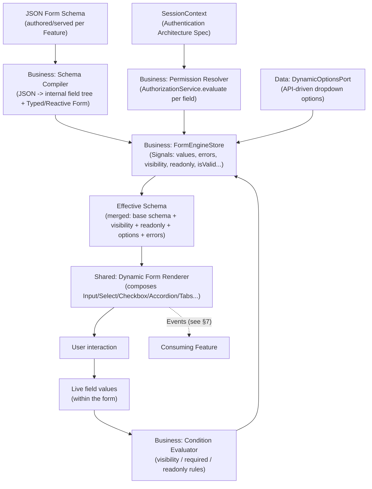
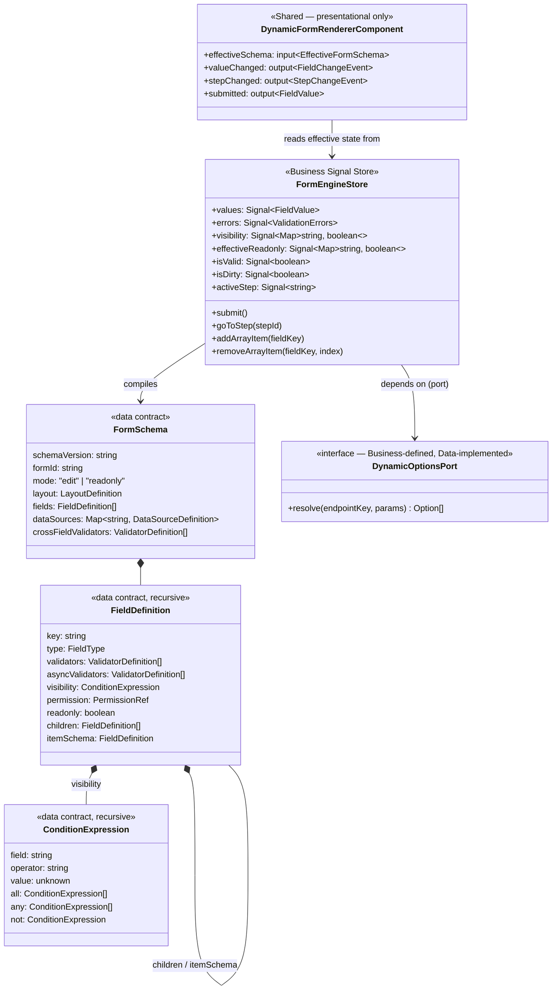

# JSON-Driven Dynamic Form Engine — Specification

**Project:** Enterprise Reporting Platform (dmsReports)
**Document type:** Feature Specification (Spec-Driven Development — Stage 2)
**Status:** Draft — pending approval
**Depends on:** [Software Architecture Specification](architecture/software-architecture-specification.md), [Authentication Architecture Specification](architecture/authentication-architecture-specification.md) (§7–§9 RBAC/`SessionContext`/`AuthorizationService`), [Component Library Specification](component-library-specification.md) (Inputs, Select, Autocomplete, Checkbox, Radio, Toggle, Accordion, Tabs), [Engineering Standards](engineering-standards.md)
**Date:** 2026-07-23

---

## 1. Purpose

Define a single, schema-driven engine that renders and validates forms from a JSON definition — used wherever the platform needs a configurable form (report filters, administration screens, future report-parameter prompts) without hand-building a bespoke reactive form per case. No implementation code appears below; the JSON Schema, interfaces, and strategies are specified structurally and by example JSON only.

---

## 2. Assumptions

| # | Assumption |
|---|---|
| A1 | The engine builds on Angular's Typed Reactive Forms internally — "JSON-driven" describes the *authoring* surface (a form is defined as data), not a replacement for Angular's own form primitives. |
| A2 | Permission checks reuse the existing `SessionContext`/`AuthorizationService` from the Authentication Architecture Specification — this engine does not invent a second authorization mechanism. |
| A3 | Field-level UI (text input, select, checkbox, etc.) is always rendered by composing the existing Component Library — this engine does not define new visual primitives, only a schema that arranges and configures existing ones. |
| A4 | A JSON schema is authored/versioned like any other configuration artifact (stored with the feature that owns a given form, or served by the backend for administrator-configurable forms) — where schemas are authored/stored is a Feature-level concern outside this spec's scope. |

---

## 3. Architecture

### 3.1 Layering

Consistent with the Software Architecture Specification's layer model:

| Layer | Owns |
|---|---|
| **Business** (`libs/business/dynamic-forms`) | The schema domain model, the condition/validator expression evaluator, the **permission-resolution step** (merges `AuthorizationService` decisions into an "effective schema"), and the `FormEngineStore` (Signal-based public state). |
| **Data** (`libs/data/dynamic-forms-data`) | Implements a generic `DynamicOptionsPort` for API-driven dropdowns — one generic, parameterized repository, not one per form. |
| **Shared** (`libs/shared/ui/dynamic-form`) | The generic, schema-driven **renderer** — purely presentational, composing existing Component Library primitives. It receives an already-resolved *effective schema* (visibility/readonly/options already computed) and never itself talks to `AuthorizationService` or the network, preserving the Shared layer's purity rule (Architecture Spec §9, Folder Structure Spec §13/§14's resolution pattern). |
| **Feature** (each consuming Feature) | Supplies the JSON schema instance, hosts the `FormEngineStore`, and reacts to the engine's Events (§7) to perform its own business action (e.g., "submit report filter"). |

### 3.2 Data Flow



**Key architectural decision:** the Shared renderer is never permission-aware or network-aware itself — it only ever renders whatever the Business-layer `FormEngineStore` hands it as the current *effective* field state. This is the same resolution pattern already established for permission-aware Directives/Validators in the Folder Structure Specification: push the business-aware decision to the boundary that's allowed to depend on Business, keep Shared purely reactive to already-resolved flags.

### 3.3 Typed Forms vs. Runtime-Defined Schema (an explicit tradeoff)

A fully generic engine cannot give a Feature compile-time knowledge of a schema it only receives as data at runtime — this is stated plainly rather than glossed over. The engine's internal traversal operates on a structurally-typed generic representation (`FieldValue = string | number | boolean | Date | null | FieldValue[] | { [key: string]: FieldValue }`-shaped, described here conceptually, not as code). For Features that **do** know their form's shape at development time (the common case — a Feature author writes both the JSON schema and, alongside it, a TypeScript type describing the expected value shape), the engine's output can be narrowed/validated against that known type at the Feature boundary. The engine itself does not — and architecturally cannot — guarantee static typing for a schema whose shape is only known at runtime (e.g., an administrator-authored custom form).

---

## 4. JSON Schema

### 4.1 Root Document Shape

```json
{
  "schemaVersion": "1.0",
  "formId": "report-filter-form",
  "mode": "edit",
  "layout": {
    "type": "wizard"
  },
  "dataSources": {
    "regionList": { "type": "api", "endpointKey": "regions", "valueField": "code", "labelField": "name" },
    "countryList": {
      "type": "api",
      "endpointKey": "countries",
      "valueField": "code",
      "labelField": "name",
      "dependsOn": ["region"],
      "cache": true
    }
  },
  "crossFieldValidators": [
    {
      "type": "dateRange",
      "fields": ["startDate", "endDate"],
      "messageKey": "validation.dateRange.invalid"
    }
  ],
  "steps": [
    { "id": "scope", "titleKey": "wizard.scope.title", "fieldRefs": ["region", "country", "reportCategory"] },
    { "id": "range", "titleKey": "wizard.range.title", "fieldRefs": ["startDate", "endDate"] },
    {
      "id": "advanced",
      "titleKey": "wizard.advanced.title",
      "fieldRefs": ["includeArchived", "tags"],
      "visibility": { "field": "reportCategory", "operator": "equals", "value": "custom" }
    }
  ],
  "fields": [ /* see §4.2 */ ]
}
```

| Root key | Meaning |
|---|---|
| `schemaVersion` | Compiler compatibility marker — the Business-layer Schema Compiler rejects/migrates schemas outside its supported version range rather than failing unpredictably mid-render. |
| `formId` | Stable identifier used for schema-compilation caching (§8) and for correlating Events (§7) back to a specific form instance. |
| `mode` | `edit` \| `readonly` — a form-instance-wide default; individual fields can still be forced readonly independent of this (§4.4). |
| `layout.type` | `flat` \| `accordion` \| `wizard` \| `tabs` — selects which Component Library container (none, Accordion, a step navigator built on Tabs, or Tabs directly) the renderer wraps fields in. |
| `dataSources` | Named, reusable API-driven dropdown definitions (§4.5), referenced by `field.dataSource`. |
| `crossFieldValidators` | Form- (or group-)scoped validators spanning multiple fields (§4.6). |
| `steps` | Only present when `layout.type = "wizard"` — each step lists the field keys it contains (`fieldRefs`) and may itself carry a `visibility` condition, allowing entire steps to be conditionally skipped (§4.7 — visibility applies at step/section level too, not only field level). |
| `fields` | The field tree (§4.2). |

### 4.2 Field Definition Shape

```json
{
  "key": "startDate",
  "type": "date",
  "labelKey": "filters.startDate.label",
  "defaultValue": null,
  "validators": [
    { "type": "required", "messageKey": "validation.required" }
  ],
  "asyncValidators": [],
  "visibility": { "field": "reportCategory", "operator": "notEquals", "value": "quick" },
  "permission": { "view": "reports:filter:view", "edit": "reports:filter:edit" },
  "readonly": false
}
```

**Group (nested) field:**

```json
{
  "key": "address",
  "type": "group",
  "labelKey": "fields.address.label",
  "permission": { "view": "reports:filter:view", "edit": "reports:filter:edit" },
  "children": [
    { "key": "street", "type": "text", "labelKey": "fields.street.label" },
    { "key": "city", "type": "text", "labelKey": "fields.city.label" }
  ]
}
```

**Array (repeating) field:**

```json
{
  "key": "recipients",
  "type": "array",
  "labelKey": "fields.recipients.label",
  "minItems": 1,
  "maxItems": 20,
  "itemSchema": {
    "type": "group",
    "children": [
      { "key": "email", "type": "text", "validators": [{ "type": "required" }, { "type": "email" }] },
      { "key": "role", "type": "select", "dataSource": "recipientRoles" }
    ]
  }
}
```

**API-driven dropdown field:**

```json
{
  "key": "country",
  "type": "autocomplete",
  "labelKey": "fields.country.label",
  "dataSource": "countryList",
  "validators": [{ "type": "required" }]
}
```

### 4.3 Field Type Catalog

| `type` | Renders via (Component Library) | Notes |
|---|---|---|
| `text` \| `number` \| `email` \| `password` | Input | Direct mapping to the Input component's `type` variants. |
| `select` | Select | Options from `dataSource` or an inline `options` array (static). |
| `autocomplete` | Autocomplete | Same option-sourcing as `select`; used when option sets are large/server-searched. |
| `checkbox` | Checkbox | Supports tri-state (`indeterminate`) only when explicitly configured — not the default. |
| `radio` | Radio | `options` required. |
| `toggle` | Toggle | Boolean fields only. |
| `date` / `dateRange` | Input (`type="date"`, or a paired input for range) | Cross-field range validators (§4.6) commonly attach to `dateRange` pairs. |
| `group` | (no direct component — a structural node) | Recursively nests `children`; renders as a fieldset-style region, optionally within an Accordion panel if `layout.type = "accordion"`. |
| `array` | (no direct component — a structural node) | Recursively repeats `itemSchema`; each item is itself a `group` (or a single leaf field). |

### 4.4 Readonly & Permissions

Every field's **effective** editability is the conjunction of three independent signals, evaluated in this fixed order (Business layer, §3.2):

1. **Form-instance `mode`** (`edit`/`readonly`) — a blanket override; `readonly` mode makes every field non-editable regardless of anything else.
2. **Field-level `readonly`** — an explicit, schema-authored override (e.g., a field that's always display-only, like a computed total).
3. **Permission (`permission.edit`)** — evaluated via `AuthorizationService.evaluate(sessionContext, permission.edit)`; a user without this permission sees the field (if `permission.view` passes) but cannot edit it.

If `permission.view` itself fails, the field is not rendered at all (fully hidden, not merely disabled) — this distinction (hidden vs. disabled-but-visible) is deliberate and mirrors the Routing Architecture Specification's Forbidden-vs-Unauthorized distinction: a user who can't even *see* a field should not learn of its existence from a disabled control.

### 4.5 API-Driven Dropdowns (`dataSources`)

```json
"dataSources": {
  "countryList": {
    "type": "api",
    "endpointKey": "countries",
    "valueField": "code",
    "labelField": "name",
    "dependsOn": ["region"],
    "cache": true,
    "debounceMs": 300
  }
}
```

| Key | Meaning |
|---|---|
| `type` | `static` (inline `options` array on the field) or `api` (resolved via `DynamicOptionsPort`, §5). |
| `endpointKey` | An indirection, not a raw URL — resolved by the Data layer's implementation of `DynamicOptionsPort` to the actual backend call, keeping schemas backend-URL-agnostic and portable across environments. |
| `dependsOn` | Other field key(s) this source depends on — a cascading dropdown (e.g., `country` options depend on the currently-selected `region`) is re-fetched whenever a dependency changes, and is disabled/cleared when a dependency is empty. |
| `cache` | Whether resolved options are cached per distinct parameter set for the lifetime of the form instance (avoids re-fetching identical option lists, e.g., toggling back and forth between two regions). |
| `debounceMs` | Applies when the source itself is search-driven (paired with an `autocomplete` field) — same debounce convention as the Component Library's Autocomplete. |

### 4.6 Validators — Sync, Async, and Cross-Field

All three validator kinds share one **condition/reference expression grammar** (§4.7) so a value referenced in a visibility rule and a value referenced in a validator are written the same way.

```json
{ "type": "required" }
{ "type": "pattern", "params": { "regex": "^[A-Z]{2}$" } }
{ "type": "minDate", "params": { "compareTo": "$root.today" } }
{ "type": "uniqueName", "async": true, "endpointKey": "checkNameUnique", "debounceMs": 400 }
```

Cross-field validators are attached at the owning **group** (or form root), not to an individual field, matching Angular's own group-level-validator pattern:

```json
{
  "type": "dateRange",
  "fields": ["startDate", "endDate"],
  "messageKey": "validation.dateRange.invalid"
}
```

### 4.7 Condition Expression Grammar (Visibility, Required-if, Cross-Field)

A single small grammar, reused everywhere a rule needs to reference other field values:

```json
{ "field": "reportCategory", "operator": "equals", "value": "custom" }
{ "all": [
    { "field": "region", "operator": "notEmpty" },
    { "field": "includeArchived", "operator": "equals", "value": true }
] }
{ "any": [ { "field": "tier", "operator": "equals", "value": "gold" }, { "field": "tier", "operator": "equals", "value": "platinum" } ] }
{ "not": { "field": "country", "operator": "empty" } }
```

**Path scoping:** a bare `field` name (e.g., `"region"`) resolves to a sibling within the same group/array item; `"$root.fieldKey"` resolves from the form's root regardless of nesting depth. This distinction matters specifically for Form Arrays, where most conditions should be scoped to *that item's own fields*, but some (e.g., "hide this per-item field entirely if the form-level `mode` is `readonly`") need to reach the root.

---

## 5. Interfaces

*(Conceptual contracts — no implementation. Presented as a class diagram per the convention already established in the Software Architecture Specification §18.2.)*



---

## 6. Layout Strategies — Accordion & Wizard Forms

- **Accordion Forms** (`layout.type: "accordion"`): each top-level `group` field becomes one Accordion panel (composing the Component Library's Accordion), with the group's own `permission.view` determining whether the panel appears at all. Cross-field validators referencing fields across two different panels are fully supported (panels are a presentation grouping, not a validation boundary).
- **Wizard Forms** (`layout.type: "wizard"`): `steps[]` (§4.1) define an ordered sequence, each gated by the validity of its own `fieldRefs` before the engine allows `goToStep()` to advance forward (backward navigation is always allowed, revealing already-entered values). A step's own `visibility` condition (as shown in §4.1's `advanced` step) can skip that step entirely — evaluated using the same condition grammar as field visibility (§4.7), reinforcing that visibility rules are a single mechanism applied at two granularities (field and step), not two separate features.

---

## 7. Events

The engine's public Output surface (Component Library conventions §"Events" vs. "Outputs" distinction: these are the declarative Outputs a consuming Feature binds to):

| Event | Payload | Fires when |
|---|---|---|
| `valueChanged` | Whole-form current value snapshot | Any field's committed value changes (debounced per §9) |
| `fieldValueChanged` | `{ key, value, previousValue }` | A specific field's value changes — granular alternative to `valueChanged` for Features that only care about one field |
| `fieldVisibilityChanged` | `{ key, visible }` | A field's resolved visibility flips, from either a condition or a permission re-evaluation |
| `stepChanged` | `{ fromStepId, toStepId }` | Wizard navigation commits (after the leaving step's validity gate passes) |
| `stepValidationFailed` | `{ stepId, errors }` | An attempted forward step-navigation is blocked by invalid fields in the current step |
| `arrayItemAdded` / `arrayItemRemoved` | `{ fieldKey, index }` | A Form Array's item count changes |
| `dataSourceLoaded` / `dataSourceLoadFailed` | `{ sourceKey, options? , error? }` | An API-driven dropdown's fetch resolves or fails |
| `validationStateChanged` | `{ isValid, errors }` | The form's or a group's aggregate validity changes |
| `submitAttempted` | `{ isValid }` | A submit action is invoked while the form is invalid — triggers reveal of all currently-hidden validation errors (§9) |
| `submitted` | Final validated value snapshot | Submit action succeeds against a fully valid form |

---

## 8. Validation Strategy

- **Sync validators** run on value change by default, but **error display timing** defaults to "reveal on blur, or on submit attempt" rather than "reveal on every keystroke" — an aggressive on-change error display is available as a per-field override, not the default, consistent with treating validation UX as a first-class concern rather than an afterthought.
- **Cross-field validators** are attached at the group they logically belong to (§4.6) and are **dependency-scoped**: a `dateRange` validator referencing `startDate`/`endDate` only re-runs when one of those two fields changes, never on every keystroke anywhere else in the form (this is also a Performance Strategy concern, §9).
- **Async validators** are debounced (default configurable, illustrated as 300–400ms in §4.6), and a new keystroke cancels any in-flight async validation call before starting a new one — the same pattern the Component Library's Autocomplete already establishes, applied consistently here. Pending async-validation state is exposed as a Signal so the renderer can show an inline "checking…" affordance (composing the shared Loader).
- **The Readonly/Permission exception (critical rule):** a field that is not currently editable (form-wide `readonly` mode, field-level `readonly`, or a failed `permission.edit` check) is **excluded from the form's validity computation entirely** — its stored value is carried through untouched and never evaluated against its own validators. This prevents a common failure mode: a user with view-only access to a field containing legacy data that wouldn't pass today's validation rules must still be able to view (and the form as a whole must still be submittable for the fields they *can* edit) without being blocked by a field they have no ability to fix.
- **Error surfacing:** field-level errors render at that field via the Component Library's Form Control Contract error slot; cross-field errors render at the owning group (or, if unset, at the first field the validator references) — configurable per validator, not fixed.
- **Messages are key-based** (`messageKey`), never hardcoded strings in the schema, consistent with the Component Library's internationalization convention.

---

## 9. Performance Strategy

- **Schema compilation is cached per `formId` + `schemaVersion`.** Re-opening the same form type does not re-parse identical JSON into a fresh internal field tree each time.
- **Visibility/readonly/permission evaluation is dependency-tracked, not blanket.** Each field's computed visibility/readonly Signal only recomputes when a field it actually references (per §4.7's expression) changes — a form with 80 fields and one 3-field conditional rule does not re-evaluate all 80 fields' conditions on every keystroke.
- **Cross-field and async validators are similarly dependency-scoped** (§8) — the same principle applied to validation as to visibility.
- **Form Arrays above a configurable item-count threshold render virtualized**, reusing the Table component's virtualization approach conceptually — a 500-row repeating array does not mount 500 live item instances simultaneously.
- **API-driven dropdown fetches are debounced, cached per resolved parameter set, and cancel-on-supersede** (§4.5) — rapid cascading-dropdown changes (e.g., quickly changing `region` several times) never leave stale, out-of-order option responses to race each other.
- **Wizard steps are lazily constructed.** A step's internal Angular form-control tree is built only the first time that step is visited, not upfront for the entire wizard — reducing initial construction cost for long, multi-step forms. Once visited, a step's entered values persist even when navigating away (only *unvisited* steps remain deferred).
- **All renderer components are `OnPush`**, and the engine pushes discrete Signal updates rather than relying on broad, form-tree-wide change-detection sweeps — a change to one field's visibility does not force re-evaluation of unrelated fields' templates.

---

## 10. Risks

| # | Risk | Mitigation |
|---|---|---|
| R1 | The condition/validator expression grammar (§4.7) grows organically into an ad hoc scripting language as edge cases accumulate. | Keep the grammar's operator set deliberately small and closed (documented, versioned list); anything not expressible declaratively is a signal that case belongs in a Feature-specific validator/visibility hook, not a grammar extension. |
| R2 | A schema author sets an overly permissive `permission.view` (or omits it), unintentionally exposing a field to users who shouldn't see it. | Default-deny: a field with no `permission.view` specified is treated as requiring the form's baseline view permission, never as universally visible; this must be enforced by the Schema Compiler, not left to author discipline. |
| R3 | Deeply nested Form Arrays (arrays of groups containing arrays) create pathological performance or condition-scoping ambiguity. | Nesting depth for arrays-within-arrays is capped at a documented maximum (recommend 1 level — an array of groups, not an array of arrays) enforced at schema-compile time, not discovered at runtime. |
| R4 | The readonly/validation exception (§8) is misapplied, silently allowing an editable field's genuinely invalid value through because it was momentarily marked readonly by a fast-changing condition. | The exclusion applies to the field's **currently effective** editability at validation time only — if a condition later makes the field editable again, its validators re-engage immediately; this must be covered by a dedicated test scenario, not just documented behavior. |

---

## 11. Dependencies

- Upstream: Component Library Specification (all rendered primitives), Authentication Architecture Specification (`AuthorizationService`/`SessionContext`), Software Architecture Specification (layering).
- Downstream: any Feature adopting the engine (e.g., Reports filter forms, Administration screens) supplies its own JSON schema instance and, optionally, a companion TypeScript type for compile-time value-shape narrowing (§3.3).

---

## 12. Acceptance Criteria

- [ ] All 14 requested capabilities (Reactive Forms, Typed Forms, Signals, Conditional Fields, Async Validators, Cross Field Validators, Nested Groups, Form Arrays, Accordion Forms, Wizard Forms, API Driven Dropdowns, Readonly, Permissions, Dynamic Visibility) are each addressed with a concrete design decision.
- [ ] The Shared/Business boundary (renderer stays pure, permission/network awareness stays in Business/Data) is explicit and consistent with the Folder Structure Specification's existing resolution pattern.
- [ ] A JSON Schema is provided with concrete examples for every field type family (leaf, group, array) and every cross-cutting concern (visibility, permission, validators, data sources).
- [ ] Interfaces are presented as a conceptual contract diagram, not implementation code.
- [ ] Events, Validation Strategy, and Performance Strategy are each a dedicated section with concrete, non-generic rules.
- [ ] No implementation code (TypeScript classes, Angular decorators, method bodies) appears anywhere in this document — JSON examples and a conceptual class diagram are data/contract illustrations, not implementation.

---

## 13. Open Questions

1. Where JSON schemas are authored and stored (versioned in-repo per Feature vs. backend-served/administrator-editable) is left to each consuming Feature — worth a follow-up decision once the Administration spec defines whether end-users can author custom report-filter forms themselves.
2. Exact debounce/cache defaults (§4.5, §8) are illustrative; final defaults should be tuned once real API latency profiles for dropdown-backing endpoints are known.
3. Whether the condition grammar (§4.7) should be a hand-rolled format (as shown) or adopt an existing standard (e.g., JSONLogic) — this spec's examples are compatible with either; the decision affects tooling/validation availability more than the architecture itself, and can be settled via its own ADR.

---

## 14. Next Steps

Recommended next: apply this engine's schema to the first real consumer — the **Reports Filter Form** — as a concrete Feature-level spec, which will validate whether §4's schema shape and §8/§9's strategies hold up against a real, non-hypothetical field set.
