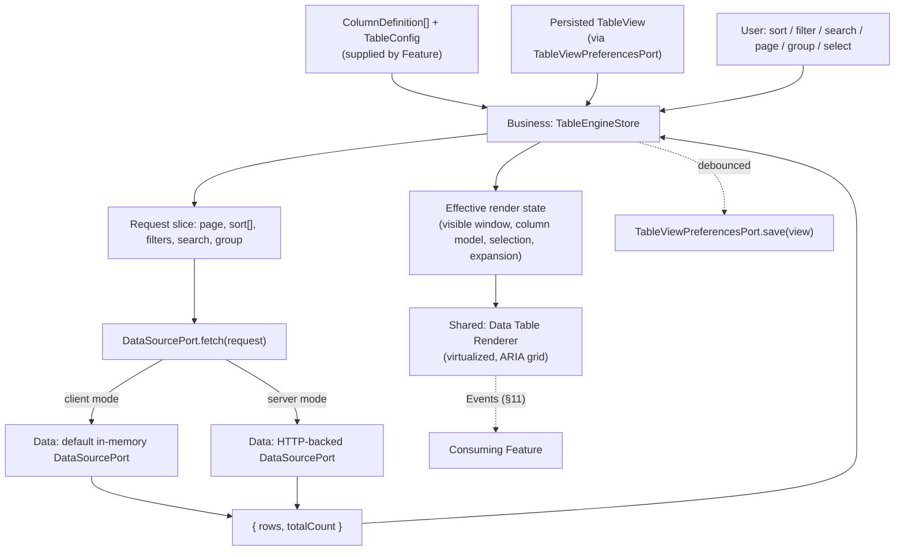
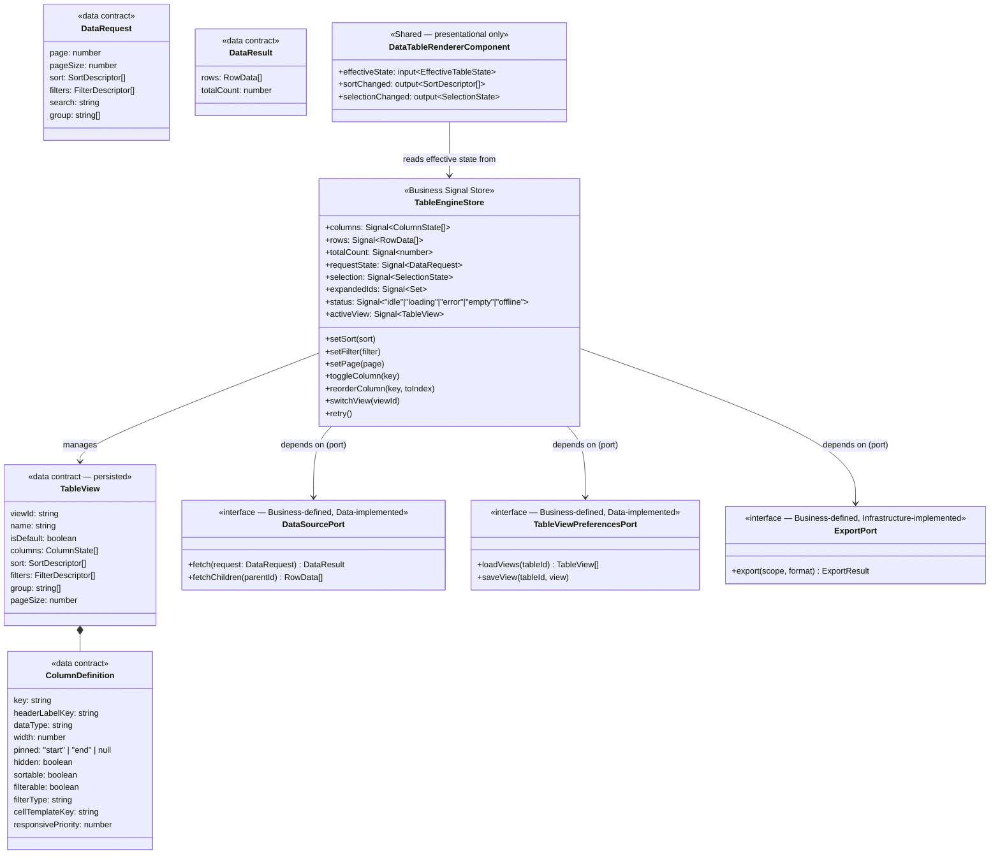

# Enterprise Data Table — Specification

**Project:** Enterprise Reporting Platform (dmsReports)
**Document type:** Feature Specification (Spec-Driven Development — Stage 2)
**Status:** Draft — pending approval
**Depends on:** [Component Library Specification](component-library-specification.md) (§20 Tables — superseded by this document, see §4), [Dynamic Form Engine Specification](dynamic-form-engine-specification.md) (reused for Advanced Search, §7.2), [Authentication Architecture Specification](architecture/authentication-architecture-specification.md), [Engineering Standards](engineering-standards.md)
**Date:** 2026-07-23

---

## 1. Purpose

Specify a single, enterprise-grade data table — inspired by SAP Fiori's table/grid patterns — intended to become **the one standard table component used across every product built on this platform**. Given that scope, this spec treats it as a first-class, long-lived platform asset rather than an ordinary Feature component: its architecture, state model, and performance/memory posture must hold up under both small administrative lists and large, densely-columned report grids. No Angular code appears below.

---

## 2. Assumptions

| # | Assumption |
|---|---|
| A1 | This component lives in `libs/shared/ui/data-table` per the Shared layer's purity rule — it is presentational and business-agnostic; a Feature always supplies its column configuration and its data source. |
| A2 | "Server" and "client" data operations (pagination, sort, filter) are two implementations of one shared contract (`DataSourcePort`), not two different components or two different code paths in the renderer. |
| A3 | Export-to-file (Excel/PDF, and CSV for very large result sets) may be delegated to a backend-generated file rather than assembled entirely in the browser — this is a per-deployment configuration choice, not a hardcoded assumption about dataset size. |
| A4 | "Advanced Search" is not a bespoke filter-builder UI invented for this component — it is rendered using the existing [Dynamic Form Engine](dynamic-form-engine-specification.md), avoiding a second, parallel form-building mechanism. |

---

## 3. Design Principles (SAP Fiori Inspiration)

Rather than a generic data-grid, this component deliberately borrows four specific Fiori conventions that materially shape the design below:

1. **Information density modes.** A global density setting — Compact / Cozy / Condensed — changes row height and cell padding via design tokens across the whole table at once, rather than the table having one fixed density. This is why row height is never a hardcoded pixel value anywhere in this spec.
2. **Toolbar-first interaction model.** Every cross-cutting action (search, filter, sort/group management, column settings, export) is reached from one consistent toolbar, not scattered context menus — see §7.5.
3. **Table View Variants.** Fiori's "Manage Views" pattern: a user can save a named combination of column layout + sort + filter + group state as a "View," switch between saved Views, and mark one as default — this generalizes what the brief calls "Column Persistence" into persisting the *whole* table configuration, not columns alone (§7.1).
4. **Illustrated, purpose-specific states.** Empty, Error, and Offline are three distinct illustrated states (Fiori's "Illustrated Message" pattern), never collapsed into one generic "something's wrong" placeholder — see §7.7.

---

## 4. Relationship to the Component Library's Existing Table Entry

The Component Library Specification (§20) already sketched a `Table` component. This document is the **authoritative, superseding specification** for that component — it does not conflict with §20's conventions (OnPush, design-token theming, ARIA-grid pattern, virtual scrolling as default) but replaces its brief entry with the full design below. Once this spec is approved, §20 should be edited to a short pointer at this document rather than duplicating content (tracked in Open Questions, §19).

---

## 5. Architecture

### 5.1 Layering

| Layer | Owns |
|---|---|
| **Business** (`libs/business/data-table`) | `TableEngineStore` (Signal store, §10), the `RowModel` abstraction (flat/grouped/tree, §6.1), sort/filter/selection/expansion evaluation logic, the `TableView` domain model (persisted configuration), and the `DataSourcePort`/`TableViewPreferencesPort`/`ExportPort` contracts (§9). |
| **Data** (`libs/data/data-table-data`) | The default in-memory `DataSourcePort` implementation (client-mode operations over a fully-loaded dataset) and the `TableViewPreferencesPort` implementation (persisting Views). |
| **Infrastructure** (`libs/infrastructure/*`) | Export adapters (CSV/Excel/PDF generation, or delegation to a backend-generated file per A3), a print adapter, and the connectivity adapter backing Offline detection (§7.7). |
| **Shared** (`libs/shared/ui/data-table`) | The purely presentational virtualized renderer, column headers, the cell-renderer registry, and the toolbar shell — composing existing Component Library primitives (Checkbox, Select, Pagination, Skeleton, Dialog, the shared error-state family, and the Dynamic Form Engine for Advanced Search). |
| **Feature** | Supplies `ColumnDefinition[]`, a `DataSourcePort` implementation (or accepts the default in-memory one), and reacts to Events (§11). |

### 5.2 Data Flow

**Key decision, consistent with the rest of this platform's Shared/Business split:** the renderer never calls `DataSourcePort` or `TableViewPreferencesPort` itself — it only ever renders the `TableEngineStore`'s current effective state, keeping Shared presentational and swappable independent of where data actually comes from.

### 5.3 Core Abstractions

- **`RowModel`** — one of three mutually exclusive structural modes: `flat` (a plain list), `grouped` (rows clustered under synthetic group-header rows derived from a column value, not part of the real dataset), or `tree` (parent/child rows where the hierarchy **is** the real dataset structure, with lazy child-loading for server-backed trees).
- **Row Expansion** — an orthogonal mechanic, applicable under *any* `RowModel`, that reveals a per-row detail template. **Expandable Rows** and **Master-Detail** are the same mechanic (a toggle plus a projected detail template); the difference is only what the Feature projects into the detail slot (extra inline fields vs. a full related-record panel) — this spec does not implement them as two separate features.
- **`DataSourcePort`** — one contract (`fetch(request) → { rows, totalCount }`) implemented once by an in-memory Data-layer class (client mode) and, per Feature, by an HTTP-backed one (server mode). The Table component itself never branches on "am I client or server" beyond which `DataSourcePort` it was given.

---

## 6. Core Abstractions — Detail

### 6.1 RowModel Selection Rule

| Requirement (from the brief) | RowModel used |
|---|---|
| Grouping | `grouped` — synthetic group-header rows, expand/collapse per group |
| Expandable Rows | `flat` or `grouped` + Row Expansion |
| Tree Data | `tree` |
| Master Detail | any RowModel + Row Expansion, projecting a full detail template |

---

## 7. Feature Design

### 7.1 Column Model & Persistence

*(Dynamic Columns, Hide/Show Columns, Column Persistence, Column Reordering, Column Resize, Sticky Header, Sticky/Pinned Columns)*

- **`ColumnDefinition`** (per column): `key`, `headerLabelKey`, `dataType`, `width`/`minWidth`/`maxWidth`, `resizable`, `reorderable`, `sortable`, `filterable`/`filterType`, `pinned` (`'start'`\|`'end'`\|`null`), `hidden`, `order`, `cellTemplateKey`, `responsivePriority` (§7.6), `ariaLabel`.
- **Dynamic Columns:** the column set may change at runtime (e.g., a report's field list changes). The engine rebuilds its internal column model by **key-matching** against any persisted View — a persisted column whose key still exists keeps its saved order/width/visibility/pin; a newly-appeared column key is inserted at a sensible default position rather than discarding the whole persisted layout.
- **Hide/Show Columns:** via a "Column Settings" panel reached from the toolbar (Fiori's Table Personalization dialog) — a checklist toggling `hidden`, plus "Show All" / "Reset to Default View" actions.
- **Column Persistence → Table View:** per §3's principle, persistence covers the *entire* table configuration (columns' order/width/visibility/pin, sort, filters, group, page size) as one named **`TableView`**, not columns in isolation. A user has exactly one auto-saved "current" View plus any number of explicitly named Views, switchable from the toolbar; switching Views is one atomic state transition (§10), not incremental field patching.
- **Column Reordering:** pointer drag-and-drop on headers, **plus a keyboard-accessible equivalent** — a "Move left / Move right" action in the column header's own menu — since drag-and-drop alone never satisfies keyboard accessibility. Reordering commits (and persists) on drop/keyboard-confirm, not on every intermediate drag position (§13).
- **Column Resize:** a draggable handle on the header border, **plus a keyboard-accessible equivalent** (an explicit resize mode where Arrow keys adjust width by a step), bounded by `minWidth`/`maxWidth`. The visible resize preview during a drag is a lightweight transform, not a full table re-render (§13).
- **Sticky Header:** the header row stays visible during vertical scroll (CSS-positioned, not recalculated via scroll-event listeners).
- **Sticky / Pinned Columns:** treated as **one capability**, not two — "Sticky Columns" from the brief and "Pinned Columns" are the same mechanism (`pinned: 'start' | 'end'` keeping a column visible during horizontal scroll); this spec deliberately does not build two competing implementations of the same idea.

### 7.2 Data Operations

*(Server/Client Pagination, Rows Per Page, Sorting, Multi Sorting, Filtering, Column Filters, Global Search, Advanced Search)*

- **Pagination (server & client)** is unified through `DataSourcePort` (§5.3) — the Table config declares `paginationMode: 'discrete' | 'infinite'` (§7.6) and a `pageSize`, both part of the persisted `TableView`.
- **Rows Per Page:** a configurable set of page-size options rendered via the Component Library's Pagination component; the selected size is part of the persisted View, not reset on reload.
- **Sorting / Multi-Sorting:** sort state is **always an ordered array** of `{ columnKey, direction }`, even for single-column sort — multi-sort is not a bolted-on special case. Single click on a sortable header cycles asc → desc → none for that column alone; Shift+click (or an explicit "Add sort" action, for keyboard/touch parity) appends a secondary sort key, shown with a numbered priority badge on the header.
- **Filtering / Column Filters:** each filterable column exposes a filter control matched to its `filterType` (text/select/date-range/number-range) in the header or an optional filter row; active column filters combine with AND semantics by default.
- **Global Search:** one debounced search box in the toolbar, searching across a configured subset of columns (not necessarily all — a Feature can restrict which columns participate).
- **Advanced Search:** opened from the toolbar as a panel/dialog rendering a **[Dynamic Form Engine](dynamic-form-engine-specification.md) schema** describing structured filter conditions (field + operator + value, with AND/OR grouping) — this spec explicitly reuses that engine rather than building a second, parallel filter-form mechanism.

### 7.3 Hierarchical & Grouped Data

*(Grouping, Expandable Rows, Tree Data, Master Detail — see §6.1 for the unifying model)*

- **Grouping:** one or more columns designated as group keys; group-header rows show the group value and an aggregate (count, and optionally sum/avg per a configured aggregation function per column); groups are independently expand/collapse-able, and — for server mode — grouping is delegated to the backend via the same `DataSourcePort.fetch()` request shape (a `group` field alongside `sort`/`filters`).
- **Tree Data:** each row may declare `hasChildren`/`childCount`; children are lazy-loaded on first expand for server-backed trees (a dedicated `fetchChildren(parentId)` extension of `DataSourcePort`), avoiding loading an entire hierarchy upfront.
- **Master Detail:** the Feature supplies a detail template (any content, including another nested Data Table or a Dynamic Form Engine instance in read-only mode) projected into the expansion slot — the Table component itself has no opinion on detail content.

### 7.4 Selection

*(Row Selection, Bulk Selection, Pinned Rows)*

- **Row Selection:** `none` \| `single` \| `multiple`, via a leading checkbox column or row-click (configurable); full keyboard support (Space toggles, Shift+Arrow extends a range).
- **Bulk Selection — the "select all" ambiguity, resolved explicitly:** a header checkbox reflects a 3-state (none/some/all **on the current page**). When every row on the current page is selected under server pagination, a banner appears — "42 rows selected on this page. Select all 1,204 matching rows?" — making the client/all-pages distinction an explicit user choice rather than a silent, surprising side effect of one checkbox click. "Select all matching" is expressed as a selection **mode** (`allMatchingFilter: true` plus an explicit exclusion set for since-deselected rows), not by materializing every matching row's ID client-side.
- **Pinned Rows:** rows pinned to the top or bottom of the viewport regardless of sort/scroll (e.g., a totals row, or a user-pinned row of interest) render in a small, **non-virtualized** band, separate from the virtualized body — distinct from Sticky Header (which pins the header, not data rows).

### 7.5 Toolbar & Export

*(Toolbar, Export CSV, Export Excel, Export PDF, Print)*

- **Toolbar** exposes a defined slot contract, not one generic region: title/item-count, global search, advanced-search trigger, column-settings trigger, View-switcher (§7.1), custom action buttons (Feature-projected), and an export/print menu. This mirrors the Component Library's slot-contract customization philosophy (Cards, Dialogs).
- **Export (CSV / Excel / PDF):** scoped to the current page, the full filtered/sorted result set, or the current selection (user-chosen at export time). Generation is delegated to an **`ExportPort`** (Infrastructure): small/medium result sets may be assembled client-side; large result sets are, per A3, requested from a backend export endpoint that streams/generates the file server-side and returns a download reference — the Table component's contract is identical either way (request an export, receive a completion/download event, §11).
- **Print:** a dedicated print-mode render path that **expands the current print scope out of virtualization** into full, real DOM rows (a virtualized table cannot simply be handed to the browser's native print — only the currently-mounted window would print) and applies print-specific styling, honoring current column visibility/sort/filter.

### 7.6 Rendering & Scrolling

*(Virtual Scrolling, Infinite Scroll, Dynamic Templates, Custom Cell Components, Responsive Layout)*

- **Virtual Scrolling** is the default above a configurable row-count threshold (per Component Library §20) — detailed further in §12.
- **Infinite Scroll** is an alternative `paginationMode` to discrete Pagination: as the user scrolls near the end of the currently-loaded window, the next page is fetched and appended to the virtualized buffer automatically, rather than requiring a page-control click.
- **Dynamic Templates / Custom Cell Components:** a cell-renderer registry keyed by each column's `cellTemplateKey`, resolved once per column definition (not per cell instance, §12) — Features project arbitrary custom cell content (status badges, inline action buttons, a Fiori-style status-indicator bar) without the Table component knowing anything about that content's business meaning.
- **Responsive Layout — Fiori "pop-in":** below a configurable viewport-width breakpoint, columns marked with a lower `responsivePriority` collapse out of the horizontal row layout into a stacked label/value list beneath the row's primary column, avoiding horizontal scrolling on mobile/tablet. An alternative `horizontal-scroll` mode (with the first/pinned column remaining sticky) is available per-table for dense numeric grids where pop-in would harm scannability — a configuration choice, not a fixed behavior.

### 7.7 State, Loading & Error UX

*(Skeleton Loading, Loading Overlay, Retry, Error State, Empty State, Offline State)*

- **Skeleton Loading:** the *initial* load renders skeleton rows (composing the Component Library's Skeleton primitive) matching the configured column widths, avoiding a layout jump once real data arrives.
- **Loading Overlay:** *subsequent* loads (re-sort/re-filter/re-page of already-visible data) show a lightweight overlay over the still-visible (stale) rows instead of replacing them with skeletons — preserving scroll position and avoiding a jarring full replace for what's typically a fast operation.
- **Retry:** a failed fetch renders the shared error-state component (table-scoped variant) with a Retry action that **re-issues the exact same request** (same page/sort/filter/search/group) rather than resetting to defaults.
- **Error / Empty / Offline — three distinct illustrated states, per §3's Fiori principle, never conflated:**
  - *Error* — the request itself failed (network/server error).
  - *Empty* — the request **succeeded** and legitimately returned zero rows (a common bug elsewhere is showing an "error" or a blank screen here instead of a clear "no results" illustration with a hint, e.g., "no rows match your filters" plus a "clear filters" action).
  - *Offline* — the app's connectivity adapter (Infrastructure) reports the browser is offline; already-loaded rows remain visible with a "showing offline / stale data" indicator rather than being wiped, and new fetch attempts are deferred until connectivity returns.

### 7.8 Keyboard Navigation & Accessibility

- Full **ARIA grid** authoring pattern (`role="grid"` / `row` / `columnheader` / `gridcell`), with **roving tabindex** across cells (one Tab stop into the grid, one Tab stop out; Arrow keys move the active cell within it) rather than making every cell individually tabbable.
- `Home`/`End`/`PageUp`/`PageDown`/`Ctrl+Home`/`Ctrl+End` navigate within a row, across pages, and to the grid's absolute start/end; `Space`/`Enter` activate row selection/expansion.
- **Every drag-based interaction (reorder, resize) has a keyboard-accessible equivalent**, stated as a hard rule rather than an aspiration, since drag-and-drop alone is never sufficient for accessibility compliance (§7.1).
- Dynamic state changes (sort applied, filter applied, row count changed, selection count changed) are announced via a throttled/coalesced `aria-live` region — informative, but not so frequent that it becomes noise during rapid interaction (e.g., fast successive arrow-key navigation does not fire one announcement per cell).

---

## 8. State Management

`TableEngineStore` (Business layer, Signal-based) is the single source of truth, holding five state slices:

1. **Column model** — order/width/visibility/pin per column, derived from the base `ColumnDefinition[]` merged with the active `TableView`.
2. **Request state** — current page/page-size, sort array, active filters, search term, active group key(s) — the *intent* driving data fetching.
3. **Data window** — the current `rows` and `totalCount` returned by the last `DataSourcePort.fetch()`, plus loading/error/offline status.
4. **Selection & expansion state** — selected row IDs (or the "all matching + exclusions" mode, §7.4), expanded row/group/tree-node IDs.
5. **View persistence state** — the current View's dirty/saved status and the list of available named Views.

**Unidirectional flow:** a user interaction updates Request state → the engine issues (debounced where appropriate, e.g., search) a `DataSourcePort.fetch()` → the response updates Data-window state → the renderer reflects the new effective state. State is never mutated by the renderer directly; the renderer only emits intents (Events, §11) that the Store interprets.

**Persistence timing:** column/sort/filter/page-size changes are debounced before writing to `TableViewPreferencesPort` (a resize-in-progress does not write on every pixel — only on commit), and **View switches replace the column/request slices atomically** in a single state transition, avoiding a flash of inconsistent intermediate state (e.g., new columns rendering against the old sort order for one frame).

---

## 9. Interfaces

---

## 10. Signals

*(The `TableEngineStore`'s full public Signal surface — extends §8/§9 with a flat reference catalog.)*

| Signal | Type (conceptual) | Purpose |
|---|---|---|
| `columns` | `ColumnState[]` | Current effective column model (order/width/visibility/pin merged from base config + active View) |
| `rows` | `RowData[]` | Current visible data window |
| `totalCount` | `number` | Total matching rows (server-reported or client-computed) |
| `visiblePageNumbers` | `number[]` (computed) | For discrete pagination mode, delegating to the Pagination component's own computed pattern |
| `requestState` | `DataRequest` | Current page/sort/filters/search/group — the fetch "intent" |
| `selection` | `SelectionState` | Selected row IDs, or all-matching-filter mode + exclusions |
| `expandedIds` | `Set<string>` (computed) | Currently expanded rows/groups/tree-nodes |
| `status` | `"idle" \| "loading" \| "error" \| "empty" \| "offline"` | Drives which of §7.7's states the renderer shows |
| `activeView` | `TableView` | The currently applied named View |
| `availableViews` | `TableView[]` | Views available to switch to |
| `isAllSelectedOnPage` | `boolean` (computed) | Drives the header checkbox's 3-state and the "select all matching" banner |
| `hasData` | `boolean` (computed) | Distinguishes Empty from Error/Offline (§7.7) |

---

## 11. Events

| Event | Payload | Fires when |
|---|---|---|
| `sortChanged` | `SortDescriptor[]` | Sort state changes (single or multi) |
| `filterChanged` | `FilterDescriptor[]` | A column filter or Advanced Search filter changes |
| `searchChanged` | `string` (debounced) | Global search term changes |
| `pageChanged` | `{ page, pageSize }` | Discrete pagination or rows-per-page changes |
| `scrolledToEnd` | — | Infinite-scroll mode nears the end of the loaded window |
| `columnReordered` | `{ key, fromIndex, toIndex }` | Column drag/keyboard reorder commits |
| `columnResized` | `{ key, width }` | Column resize commits |
| `columnVisibilityChanged` | `{ key, hidden }` | A column is shown/hidden via Column Settings |
| `viewSwitched` | `{ viewId }` | A saved Table View is applied |
| `viewSaved` | `{ viewId, name }` | A new/updated View is persisted |
| `rowSelected` / `selectionChanged` | `SelectionState` | Row selection changes, including entering/leaving "all matching" mode |
| `rowExpanded` / `rowCollapsed` | `{ rowId }` | Row/group/tree-node expansion toggles |
| `rowActivated` | `{ rowId }` | Row click/double-click/Enter for drill-down |
| `exportRequested` / `exportCompleted` / `exportFailed` | `{ scope, format }` | Export lifecycle (§7.5) |
| `printRequested` | `{ scope }` | Print mode invoked |
| `retryRequested` | — | User invokes Retry from the error state |

---

## 12. Rendering Strategy

- **DOM-based (not canvas) windowed virtualization**, deliberately — canvas-rendered grids (used by some high-performance grids) forgo native accessibility semantics, text selection, and browser find-in-page, which directly conflicts with §7.8's ARIA-grid requirement. Since this component **is** the platform's accessible-grid primitive (unlike Charts, which pair a visual canvas with a separate accessible data-table fallback), it must render real, ARIA-annotated DOM elements.
- **Row virtualization** windows the mounted row set to the visible viewport plus a small buffer, independent of pagination mode.
- **Column virtualization**, applied independently of row virtualization, for tables with very many columns — only columns within (or near) the visible horizontal viewport are mounted, with pinned/sticky columns always exempted from virtualization since they must always render.
- **Cell-renderer resolution happens once per column definition**, not per cell instance — a `cellTemplateKey` is resolved to its rendering strategy a single time when the column model changes, not re-resolved on every row render.
- **Responsive re-flow** (pop-in breakpoint, §7.6) is driven by a `ResizeObserver` on the table's own container, not a window-resize listener — consistent with the Chart component's established convention (Component Library §19) — so the table reacts correctly inside resizable panels/split-views, not only on browser-window resize.

---

## 13. Performance Strategy

- **Server-side operations are the recommended default beyond a configurable row-count ceiling** — sort/filter/group/page delegated to the backend via `DataSourcePort`, rather than client-side computation over an ever-growing in-memory dataset.
- **Debounced search/filter**, consistent with the platform-wide convention already established for Autocomplete and the Dynamic Form Engine's async validators.
- **Resize and reorder use a lightweight transform-based drag preview** — the real column-model mutation (and the re-render it triggers) commits only on drop/keyboard-confirm, not on every intermediate drag-move pixel.
- **Row/cell rendering is memoized against a stable row-id + column-key pair** (a trackBy-equivalent), so an update to one row's data does not cascade a re-render across unrelated rows.
- **Client-mode sort/filter/group computations are memoized against their current input signature** (the sort/filter/group state itself) — a selection change or an expansion toggle never re-triggers a re-sort or re-filter of the dataset.
- **Multi-sort comparator composition** is built once per sort-state change (not rebuilt per row comparison) and applied as a single composed comparator function across the dataset.

---

## 14. Memory Optimization

- **View/cell instance recycling during virtualization:** scrolled-past row/cell view instances are recycled into the pool backing the next newly-visible row rather than destroyed and reconstructed on every scroll tick, reducing GC churn during fast scrolling — a materially different concern from render-time performance (§13), specifically about allocation/deallocation churn.
- **Server-paginated mode never retains the full dataset client-side** — only the current page/window's rows are held in memory, with an optional small, size-bounded LRU cache of recently-viewed pages (not an unbounded cache), so navigating back to a recently-seen page doesn't always require a re-fetch, but a long browsing session doesn't accumulate unbounded memory either.
- **Off-screen expansion/detail content is torn down, not merely hidden**, once a row scrolls far enough outside the virtualized window — a tree or master-detail table with many expanded nodes must not accumulate unbounded mounted detail-panel content as the user scrolls and expands more rows over a session.
- **Explicit observer/listener cleanup:** `ResizeObserver`, drag-listeners, and `IntersectionObserver` (infinite scroll) are disconnected on component destroy **and** whenever the table is reconfigured (e.g., its column set changes materially) — stated as a hard rule given this component will be instantiated repeatedly across every product on the platform, where a small per-instance leak compounds organization-wide.
- **Large exports stream/chunk rather than materializing the full payload in browser memory** — per §7.5/A3, sufficiently large export scopes are delegated to a backend-generated file rather than assembled as one in-memory client-side object.
- **Bounded caches for View lists and recently-used filter-option sets** (LRU/TTL), relevant specifically for the Standalone shell where the app may remain open for a full working day without a page reload.

---

## 15. Testing Strategy

- **`TableEngineStore`/`RowModel` logic** (sort/filter/group/tree evaluation, the selection state machine including "select all matching") is unit-tested against a **faked `DataSourcePort`** — no real HTTP, per Engineering Standards §15.
- **`DataSourcePort` contract tests:** the default in-memory implementation and any server-backed implementation are tested against **one shared contract-test suite**, so client-mode and server-mode behavior can't silently diverge (Engineering Standards §15's Port-contract-testing convention, applied here explicitly).
- **Interaction/component tests** cover: full ARIA-grid keyboard navigation, selection behavior (including the bulk "select all matching" banner), column reorder/resize **via their keyboard-accessible paths, not only simulated drag events**, and responsive pop-in behavior at the configured breakpoint.
- **Accessibility regression tests:** automated ARIA role/attribute/state assertions on every change to this component, plus a manual screen-reader pass as a Definition-of-Done checklist item specifically for this component — given its "standard across the organization" status, an accessibility regression here has outsized blast radius compared to a typical Feature component.
- **Performance/benchmark tests:** a dedicated, tracked benchmark (not ordinary per-commit unit CI) asserting virtualized-scroll frame performance and initial-render time against a large synthetic dataset (illustratively, 50k–100k rows), so regressions are caught before they reach every consuming product.
- **Visual regression tests** for the three Fiori density modes (Compact/Cozy/Condensed) and the three illustrated states (Empty/Error/Offline), since these are easy to silently break via an unrelated shared-token change.
- **Process recommendation — consumer compatibility sweep:** because this component is meant to be the one standard table platform-wide, any change to it should be checked against a representative sample of real consuming Features' column/view configurations before release, not just its own isolated test suite — flagged as a process practice, not a new technical test type.

---

## 16. Risks

| # | Risk | Mitigation |
|---|---|---|
| R1 | "Standard component for the whole organization" status makes every future change high-blast-radius, discouraging necessary evolution over time. | Version the component's public contract (Column/`TableView`/`DataSourcePort` shapes) deliberately, and lean on the contract-test suite (§15) and consumer compatibility sweep so changes can be made with confidence rather than avoided out of fear. |
| R2 | Client-side sort/filter/group is used by default on datasets that later grow far larger than anticipated, degrading performance for an existing Feature that never opted into server mode. | Document the row-count ceiling (§13) explicitly per deployment and treat exceeding it as a signal to migrate that Feature's `DataSourcePort` to a server-backed implementation, not a reason to raise the ceiling indefinitely. |
| R3 | Bulk "select all matching filter" (§7.4) is misunderstood by a Feature author and wired to a destructive bulk action without surfacing the distinction to the end user, causing an unintended mass action. | The Selection Signal's shape (`allMatchingFilter` + exclusions, §10) makes this mode explicit and inspectable — any bulk-action handler must branch on it deliberately; call this out in the component's public documentation/README, not only in this spec. |
| R4 | Print mode's DOM-expansion-out-of-virtualization (§7.5) is skipped by a Feature that assumes "just call `window.print()`," producing incomplete printed output for large tables. | Provide the print pathway as the only supported print entry point from the toolbar (§7.5); a raw browser print triggered outside it is a known limitation, documented rather than silently broken. |

---

## 17. Dependencies

- Upstream: Component Library Specification (superseded §20, plus reused Checkbox/Select/Pagination/Skeleton/Dialog/shared error-state components), Dynamic Form Engine Specification (Advanced Search), Authentication Architecture Specification (permission-gated columns/actions, via the same `SessionContext`/`AuthorizationService` pattern already established — column-level `permission` gating follows the Dynamic Form Engine's §4.4 precedent and is assumed reusable here without redefinition).
- Downstream: every Feature displaying tabular/report data adopts this component as its standard table; the Reports Feature in particular is the primary near-term consumer.

---

## 18. Acceptance Criteria

- [ ] All 40 requested capabilities are each addressed with a concrete design decision, not merely named.
- [ ] Grouping/Expandable Rows/Tree Data/Master Detail are shown to reduce to one `RowModel` + Row-Expansion abstraction rather than four independent features (§6).
- [ ] Sticky Columns and Pinned Columns are explicitly unified as one capability, not built twice (§7.1).
- [ ] Client and server pagination/sort/filter/group are shown to share one `DataSourcePort` contract (§5, §9).
- [ ] Architecture, State Management, Interfaces, Signals, Events, Rendering Strategy, Performance Strategy, Memory Optimization, and Testing Strategy each appear as a dedicated, concrete section.
- [ ] Every drag-based interaction (reorder, resize) is paired with a stated keyboard-accessible equivalent.
- [ ] Empty/Error/Offline are shown as three distinct states, not one generic fallback.
- [ ] No Angular code (TypeScript, decorators, templates) appears anywhere in this document.

---

## 19. Open Questions

1. Whether the Component Library Specification's §20 Table entry should be edited down to a pointer at this document now, or left as-is until this spec is formally approved — recommend editing immediately upon approval to avoid two documents partially describing the same component.
2. The row-count ceiling (§13/R2) recommending server-mode adoption is left as a configurable, per-deployment value here — recommend setting a concrete default once real report-dataset size distributions are known.
3. Whether tree-data lazy child-loading should support prefetching one level ahead (for perceived responsiveness) or strictly load-on-expand only — a performance/complexity tradeoff better decided once a concrete Tree Data consumer exists.
4. Column-level permission gating (§17) is assumed to follow the Dynamic Form Engine's field-permission precedent exactly — worth a short confirming note in a future revision rather than a full redefinition here.

---

## 20. Next Steps

Recommended next: apply this specification to its primary concrete consumer — the **Reports Feature's data grid** — as a Feature-level spec, which will be the first real test of whether §7's feature set and §13/§14's performance/memory strategies hold up against actual report data volumes and column counts.
