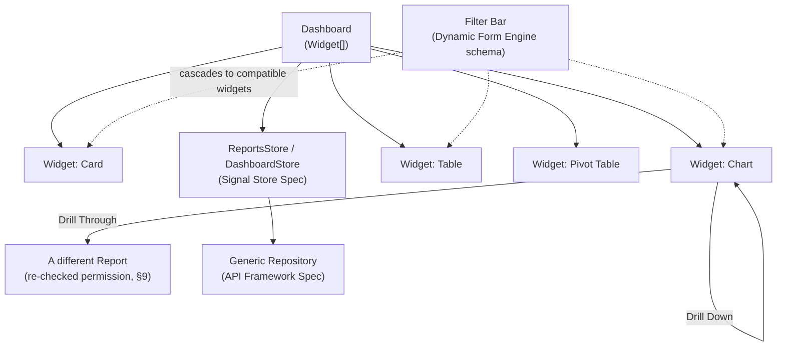
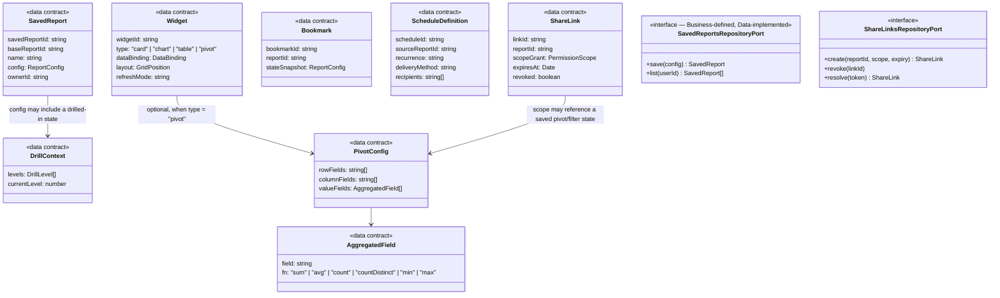

# Enterprise Reporting Engine — Specification

**Project:** Enterprise Reporting Platform (dmsReports)
**Document type:** Flagship Feature Specification (Spec-Driven Development — Stage 3)
**Status:** Draft — pending approval
**Depends on:** [Product Vision](product-vision.md), [Software Architecture Specification](architecture/software-architecture-specification.md), [Routing Architecture Specification](architecture/routing-architecture-specification.md), [Authentication Architecture Specification](architecture/authentication-architecture-specification.md), [Component Library Specification](component-library-specification.md) (Cards, Charts), [Dynamic Form Engine Specification](dynamic-form-engine-specification.md) (Filters), [Enterprise Data Table Specification](enterprise-data-table-specification.md) (Tables, Grouping, Export, Print), [Signal Store Architecture Specification](architecture/signal-store-architecture-specification.md) (Reports/Dashboard/Permission Stores), [API Framework Specification](architecture/api-framework-specification.md) (Generic Repository, Export)
**Date:** 2026-07-23

---

## 1. Purpose

This is the **assembly point**: the specification that composes everything already designed — Cards, Charts, and Tables from the Component Library; Filters from the Dynamic Form Engine; grouping/export/print from the Enterprise Data Table; Reports/Dashboard/Permission Stores from the Signal Store Architecture; the Generic Repository and Export port from the API Framework — into one coherent Reporting Engine, and designs the domain concepts genuinely new to this spec: Dashboards as widget compositions, Drill Down vs. Drill Through, the Saved Report / Bookmark / Favorite distinction, Scheduled Reports, Share Links, and Pivot Tables with their shared Aggregation model. No Angular code appears below.

---

## 2. Assumptions

| # | Assumption |
|---|---|
| A1 | This spec does not re-derive anything already fully designed elsewhere — it cites the owning spec and focuses new design effort only on what's genuinely new here. |
| A2 | Scheduled Reports' actual recurring *execution* is a backend job-scheduling concern; this frontend Reporting Engine's scope is authoring/managing schedule definitions and viewing run history/status, not running the schedule itself. |
| A3 | Share Links and Embedded Reports both rest on the same underlying security primitive — a scoped access grant (Authentication Architecture Specification §6) — delivered differently (a pasted URL vs. `postMessage` into an iframe), not two separate security mechanisms. |

---

## 3. Architecture

The Reporting Engine is **not a new architectural layer** — it is the Reports/Dashboard bounded context, assembled from layers already defined:

| Layer | Contribution to the Reporting Engine |
|---|---|
| **Business** (`libs/business/reports`, `libs/business/dashboard`) | `ReportsStore`, `DashboardStore` (Signal Store Spec §4.4/§4.5), extended here with drill/pivot/schedule/share state (§7); the Aggregation function contract (§5.7). |
| **Data** (`libs/data/reports-data`) | `HttpReportsRepository`, composing the API Framework's Generic Repository (§5.14 of that spec), plus new repositories for Saved Reports, Bookmarks, Schedules, and Share Links. |
| **Shared** (`libs/shared/ui`) | Cards, Charts, Tables (existing), plus the new **Pivot Table** component (§5.9) — all purely presentational, composed by the Feature layer. |
| **Feature** (`libs/features/reports`, `libs/features/dashboard`) | The actual Dashboard and Report Viewer screens — the only place this spec's new composition (widgets, drill navigation, filter cascade) lives as rendered UI. |
| **Routing** | Unchanged from the Routing Architecture Specification — `/reports/:reportId` (Standalone) and `/report/:reportId` (Embedded) both mount the same Report Viewer. |

---

## 4. Modules

| Module | Responsibility | Builds on |
|---|---|---|
| **Dashboard Composition** | Widget layout/grid, per-widget refresh, lazy viewport loading | Signal Store Spec §4.5 (`DashboardStore`), new: Widget model (§5.1) |
| **Report Viewer** | Renders one report's primary visualization(s) + its own local filters | Component Library (Charts/Tables/Cards), Enterprise Data Table |
| **Filter Bar** | Global (Dashboard-level) and local (report-level) filter cascade | Dynamic Form Engine, new: cascade scoping (§5.2) |
| **Drill Navigation** | Drill Down (in-place) and Drill Through (cross-report) | New (§5.3) |
| **Persistence (Saved/Bookmark/Favorite)** | Three distinct persisted-state concepts | New (§5.4) |
| **Scheduling** | Author/manage schedule definitions, view run history | New (§5.5), Dynamic Form Engine (schedule-authoring form) |
| **Sharing & Embedding** | Scoped access grants, delivered via URL or iframe | Authentication Architecture Spec §6, new: Share Link specifics (§5.6) |
| **Pivot & Aggregation** | Cross-tabulated data view, shared aggregation functions | New (§5.7/§5.9) |
| **Export & Print** | Single-widget and whole-dashboard export/print | Enterprise Data Table §7.5/§14, new: dashboard-level composition (§5.8) |

---

## 5. New Domain Concepts

### 5.1 Dashboards as Widget Compositions

A Dashboard is an ordered set of **Widgets**, each: `{ widgetId, type: 'card' | 'chart' | 'table' | 'pivot', dataBinding (reportId/query + parameters), layout (grid position/size), refreshMode ('manual' | 'interval' | 'onFilterChange') }`. This is the composition model the `DashboardStore` (Signal Store Spec §4.5) operates over — that spec defined the store's state/effects; this spec defines the shape of what it holds. A widget's `type` determines which existing Component Library primitive (or the new Pivot Table, §5.9) renders it; the Dashboard module itself has no rendering logic of its own beyond layout and lazy-loading orchestration (already specified in the `DashboardStore`'s viewport-driven fetch effect).

### 5.2 Filters — Global Cascade vs. Local Scope

The Dynamic Form Engine renders the actual filter UI (both the Dashboard-level Filter Bar and a report's own local filters are Dynamic Form Engine schema instances) — what's new here is **scoping**: a filter applied at the Dashboard's global Filter Bar cascades to every widget whose data binding declares a matching field (e.g., a global "Region" filter applies to any widget bound to a report exposing a `region` field); a filter applied within one widget's own local filter panel affects only that widget. "Dynamic Filters" (per the brief) means both (a) a filter's own options are conditionally computed via the Dynamic Form Engine's conditional-visibility/API-driven-dropdown mechanisms (already specified), and (b) which filters even *appear* in the global Filter Bar is itself dynamic — derived from the union of filterable fields across the Dashboard's currently-visible widgets, not a fixed, hand-authored list.

### 5.3 Drill Down vs. Drill Through

These are two different navigations, deliberately not conflated:

| | Drill Down | Drill Through |
|---|---|---|
| **Definition** | Navigate to a **more detailed view of the same data**, within the same report/chart context | Navigate to a **different, related report**, carrying context as parameters |
| **Example** | A bar chart grouped by Year → clicking a bar re-renders the same chart grouped by Quarter within that year | Clicking a "Total Sales by Region" bar opens a separate "Sales Detail" report pre-filtered to that region |
| **Mechanism** | Pushes a level onto a `DrillContext` breadcrumb stack (§7) within the same widget; no navigation/routing occurs | Navigates (via Router) to a different `reportId`, passing a defined parameter mapping from the source report's clicked data point |
| **Permission implication** | None beyond the current report's own permission (already checked) | **Re-checked independently** — drilling through is treated as navigating to a new protected resource, going through the same `roleGuard`/`AuthorizationService` check as a direct link (§9) |
| **Configuration** | Implicit in the report's own hierarchy definition (e.g., Year → Quarter → Month) | Explicit: a `drillThroughTarget` config on the source report/widget naming the target `reportId` and the field→parameter mapping |

### 5.4 Saved Reports, Bookmarks, and Favorites — Three Distinct Concepts

Commonly conflated in practice; kept explicitly separate here:

| | Saved Report | Bookmark | Favorite |
|---|---|---|---|
| **What it is** | A named, persisted **copy** of a report's full configuration (base report + applied filters/sort/columns/pivot config) — becomes its own addressable, catalog-listed entity | A lightweight, precise "return to this exact state" snapshot (filters/sort/drill-state) tied to one point in time | A simple flag marking an *existing* report or Saved Report as quick-access, with no configuration snapshot at all |
| **Creates a new entity?** | Yes — independently ownable/shareable, editable without affecting the original report definition | No — a pointer plus a state snapshot, not a new catalog entry | No — just a boolean/pointer |
| **Typical use** | "I customized this report's filters/columns for my monthly review — save it as my own report" | "Let me get back to exactly this filtered/drilled view later" | "Pin this report to the top of my nav for quick access" |
| **Backed by** | `SavedReportsRepositoryPort` (new Data-layer port) | `BookmarksRepositoryPort` (new) | A flag on the user's preferences (User Store, Signal Store Spec §4.2) |

### 5.5 Scheduled Reports

A `ScheduleDefinition` — `{ scheduleId, sourceReportId | savedReportId, recurrence (cron-like expression), deliveryMethod ('email' | 'export-to-storage'), recipients, parameterSnapshot }` — is authored via a Dynamic Form Engine schema and persisted through a `SchedulesRepositoryPort`. **Execution is entirely backend-owned** (A2) — the frontend's role is limited to: authoring/editing the definition, listing existing schedules, and displaying run history/status (last run time, success/failure, delivered-to count) fetched from the backend, never simulating or triggering execution client-side.

### 5.6 Share Links

A Share Link is a scoped, time-limited **access grant** to a specific report (optionally a Saved Report or Bookmark's exact state) — the same underlying mechanism as the Embedded iframe token (Authentication Architecture Spec §6.1), differing only in delivery and risk profile:

| | Embedded iframe token | Share Link |
|---|---|---|
| **Delivery** | `postMessage` (URL delivery explicitly avoided — Auth Spec §6.2) | **URL-embedded by definition** — that's what makes it a "link" someone can paste/email |
| **Leakage mitigation** | Avoided at the transport level | Cannot avoid URL exposure, so mitigated instead by: short expiry, explicit revocability, and tight scope (a single report, often read-only, optionally single-use) |
| **Scope ceiling (critical rule, §9)** | Bounded by whatever the host was granted | **Bounded by the sharer's own current permission** — a Share Link's effective access is the *intersection* of the sharer's actual permission and the requested share scope, never the requested scope alone; this prevents a user from sharing away access they don't themselves have |

A Share Link is revocable at any time (the underlying grant record is invalidated server-side, independent of the token's own expiry) and its usage is logged with a Correlation ID (API Framework Spec §5.13) for audit purposes.

### 5.7 Embedded Reports

Nothing new here by design — this is exactly Vision Mode 2, the Routing Architecture Specification's `/report/:reportId` route, and the Authentication Architecture Specification's iframe-token flow. Restated only to confirm: the Report Viewer module mounted at that route **is the same Report Viewer** used inside a Standalone Dashboard widget or a direct `/reports/:reportId` navigation — reinforcing Vision FR-3.1 one more time at the point where it's most concretely testable.

### 5.8 Export & Print — Dashboard-Level Composition

Single-widget export/print reuses the Enterprise Data Table's design (§7.5/§14 of that spec) unchanged. **New here:** exporting/printing an entire Dashboard composes each widget's own export/render into one combined document — a "Dashboard snapshot" mode that, analogous to the Table's print-mode DOM-expansion-out-of-virtualization, temporarily renders every widget in its full (non-lazy, non-virtualized) form for the duration of the snapshot, then reverts to normal lazy/virtualized rendering.

### 5.9 Pivot Table

A genuinely new component (extending, not replacing, the Enterprise Data Table's `RowModel` concept, §6.1 of that spec) — a Pivot Table doesn't render a row list at all; it renders a **2D cross-tabulation**:

- **Configuration:** `rowFields[]`, `columnFields[]`, `valueFields[]` (each paired with an Aggregation function, §5.10) — plus interactive drag-to-reassign fields between row/column/value zones (a classic pivot-table UX), which reconfigures the cross-tabulation live.
- **Rendering pipeline:** raw rows → a pivot-computation stage (groups by every distinct row-field-value × column-field-value combination, computing each cell's aggregated value) → a 2D matrix → rendered by a specialized grid reusing the Enterprise Data Table's virtualization/cell-rendering internals conceptually, but **column headers here are data-derived at compute time**, not a static, author-defined `ColumnDefinition[]` — this is the fundamental difference from the regular Table's column model.
- **Client/server duality:** consistent with the rest of the platform, pivot computation may run client-side (small/medium datasets) or be delegated to the backend as an aggregation query (large datasets, §8).

### 5.10 Aggregations — One Shared Contract

A single `AggregationFunction` type — `sum | avg | count | countDistinct | min | max` (median optional) — used identically by **both** the Enterprise Data Table's group-header aggregates (that spec's §7.3) and the Pivot Table's value fields (§5.9 above). This is a deliberate unification: aggregation is one concept applied in two rendering contexts, not two separately-implemented aggregation engines that could silently diverge (e.g., two different `avg` implementations handling `null` values differently).

---

## 6. State

This spec **extends**, rather than replaces, the Signal Store Architecture Specification's `ReportsStore`/`DashboardStore`:

| Store | New state added by this spec |
|---|---|
| `ReportsStore` | `drillContext` (breadcrumb stack, §5.3), `pivotConfig` (per-widget, §5.9), `savedReports`/`bookmarks`/`favorites` lists (§5.4) |
| `DashboardStore` | `widgets: Widget[]` (§5.1 shape), `globalFilterState` (cascading to compatible widgets, §5.2) |
| **New:** `SchedulingStore` | `schedules[]`, `scheduleRunHistory` per schedule (§5.5) — a new Business-domain store, `libs/business/reports/src/stores/scheduling.store.ts`, following the exact same Signal Store conventions as every other store in that specification |
| **New:** `SharingStore` | `activeShareLinks[]`, per-link revocation status (§5.6) — `libs/business/reports/src/stores/sharing.store.ts` |

---

## 7. Interfaces

---

## 8. Events

| Event | Fires when |
|---|---|
| `drillDownRequested` / `drillLevelChanged` | User drills into a more detailed same-report view (§5.3) |
| `drillThroughRequested` | User navigates to a related report, carrying parameters (§5.3) |
| `reportSaved` | A Saved Report is created/updated (§5.4) |
| `bookmarkCreated` | A Bookmark snapshot is captured (§5.4) |
| `favoriteToggled` | A report/Saved Report is pinned/unpinned (§5.4) |
| `scheduleCreated` / `scheduleUpdated` / `scheduleDeleted` | Schedule authoring actions (§5.5) |
| `scheduleRunStatusReceived` | Backend-reported run history updates (§5.5) |
| `shareLinkGenerated` / `shareLinkRevoked` | Sharing lifecycle (§5.6) |
| `pivotConfigChanged` | Row/column/value field reassignment (§5.9) |
| `dashboardExportRequested` / `dashboardExportCompleted` | Whole-dashboard export/print (§5.8) |
| `widgetDataLoaded` / `widgetDataFailed` | Per-widget fetch lifecycle (composes the Enterprise Data Table's/API Framework's existing request events) |

---

## 9. Performance Strategy

Mostly inherited unchanged from the Enterprise Data Table Specification (§13) and the API Framework Specification — restated only where the Reporting Engine adds something genuinely new:

- **Pivot computation cost scales with distinct row-field × column-field value combinations**, not raw row count — above a configurable distinct-combination threshold, pivot computation is delegated to the backend as an aggregation query rather than computed client-side over a fully-loaded dataset.
- **Pivot recomputation is memoized against its own input signature** (`rowFields` + `columnFields` + `valueFields` + the bound data's own signature) — changing an unrelated Dashboard filter that doesn't affect this widget's data binding must not force a pivot recompute.
- **Dashboard-level export/print (§5.8)** temporarily disables lazy/viewport-driven widget loading for the snapshot's duration only, then restores it — the performance cost of "render everything at once" is deliberately paid only during an explicit export/print action, never during normal Dashboard viewing.
- Everything else (widget lazy-loading, virtualization, debounced filters, cached/cancelled API calls) is inherited directly from the specs this document composes — restating it here would duplicate, not add, information.

---

## 10. Security

- **Drill Through re-checks permission independently** (§5.3) — the target report's own `permission.view`/`roleGuard` check runs exactly as it would for a direct navigation; the source report's permission is never treated as sufficient authorization for the target.
- **Share Links cannot escalate privilege** (§5.6) — a Share Link's effective granted scope is the **intersection** of the sharer's own current permission and the requested share scope, computed and enforced server-side at link-resolution time, not merely at link-creation time (so a sharer's later permission *reduction* also reduces what an already-issued link can do).
- **Row-level/data-level security is never enforced client-side.** The Reporting Engine passes the authenticated `SessionContext`/token with every data request; actual row/field-level filtering of report data is a backend responsibility. This frontend must never fetch a fuller dataset than the user is authorized for and then filter it down in the browser — by the time data reaches the client, it has already left the trust boundary, so client-side filtering of over-fetched sensitive data provides no real security, only an illusion of it.
- **Export, Schedule delivery, and Share Link usage are all audit-logged** with a Correlation ID (API Framework Specification §5.13) — who exported/shared/scheduled what, and when, is traceable, consistent with enterprise compliance expectations for a reporting platform.
- **Embedded and Share-Link tokens are both scoped** (`reportScope`, Authentication Architecture Spec §6.1) — a token issued for one report can never be replayed to access a different one, whether delivered via iframe or via a shared URL.

---

## 11. Risks

| # | Risk | Mitigation |
|---|---|---|
| R1 | Saved Reports, Bookmarks, and Favorites are collapsed into one confusing "save" button in a future UI pass, undermining the deliberate distinction made in §5.4. | This spec's comparison table (§5.4) should be treated as the UX requirement, not just a backend data-modeling note — flag any UI consolidation proposal against it explicitly. |
| R2 | A Share Link's permission-intersection rule (§10) is enforced only at creation time, not at resolution time, silently granting stale access after the sharer's own permission is later reduced. | State explicitly (§10) that intersection is computed at **resolution** time; this must be a required test scenario, not just documented behavior. |
| R3 | Drill Through's independent permission re-check (§5.3/§9) is skipped by an implementation that reuses the source report's already-loaded `SessionContext` without re-invoking `roleGuard`/`AuthorizationService` for the target report. | Drill-through navigation should route through the same Router/guard mechanism as any other report navigation, not a special-cased in-app shortcut that bypasses guards. |
| R4 | Client-side pivot computation is used by default on a dataset whose distinct-combination count grows unexpectedly large over time, degrading performance for a previously-fine Dashboard widget. | Same mitigation pattern as the Enterprise Data Table's R2 — document the threshold and treat exceeding it as a signal to migrate to server-side pivot computation, not a reason to raise the threshold indefinitely. |

---

## 12. Dependencies

Upstream: every specification listed in the header — this document adds no new architectural layers, only new domain concepts and their composition. Downstream: none yet — this is the current leading edge of the specification set.

---

## 13. Acceptance Criteria

- [ ] All 19 requested capabilities are addressed, with genuinely new design effort applied to Dashboards/Widgets, Drill Down vs. Drill Through, Saved Reports/Bookmarks/Favorites, Scheduled Reports, Share Links, Pivot Table, and Aggregations — and explicit cross-references (not re-derivation) for everything already specified elsewhere (Cards, Charts, Tables, Filters, Dynamic Columns, Export, Print).
- [ ] Drill Down and Drill Through are shown as clearly distinct, including their different permission implications.
- [ ] Saved Reports, Bookmarks, and Favorites are shown as three distinct concepts with distinct backing mechanisms, not a single conflated "save" feature.
- [ ] Share Links and Embedded Reports are shown to share one security primitive, with their differing leakage/scope risk profiles addressed explicitly.
- [ ] Aggregation is shown as one shared contract used by both Table grouping and Pivot Table value fields.
- [ ] A dedicated Security section addresses drill-through re-authorization, share-link privilege-escalation prevention, and the explicit rejection of client-side row-level security enforcement.
- [ ] No Angular code appears anywhere in this document.

---

## 14. Open Questions

1. Whether Bookmarks should support sharing (a Bookmark's snapshot shared via a Share Link) or remain strictly personal — left open pending product input, since §5.4/§5.6 are compatible with either answer.
2. Exact recurrence expression format for `ScheduleDefinition` (cron string vs. a structured recurrence object) — a backend-contract detail deferred to whichever team owns the scheduling execution service.
3. Whether Pivot Table's interactive field drag-and-drop (§5.9) needs the same keyboard-accessible equivalent already mandated for the Enterprise Data Table's column reorder (§7.1 of that spec) — the answer is almost certainly yes, on accessibility-consistency grounds, but is called out here rather than silently assumed.

---

## 15. Next Steps

With this spec, the platform now has a complete path from Product Vision through to a fully composed Reporting Engine. Recommended next: the long-deferred **RBAC / Authorization Model** specification — referenced as a placeholder dependency by the Routing, Authentication, Signal Store, and now this Reporting Engine specification — is the one foundational piece every downstream spec has been assuming without yet defining.
