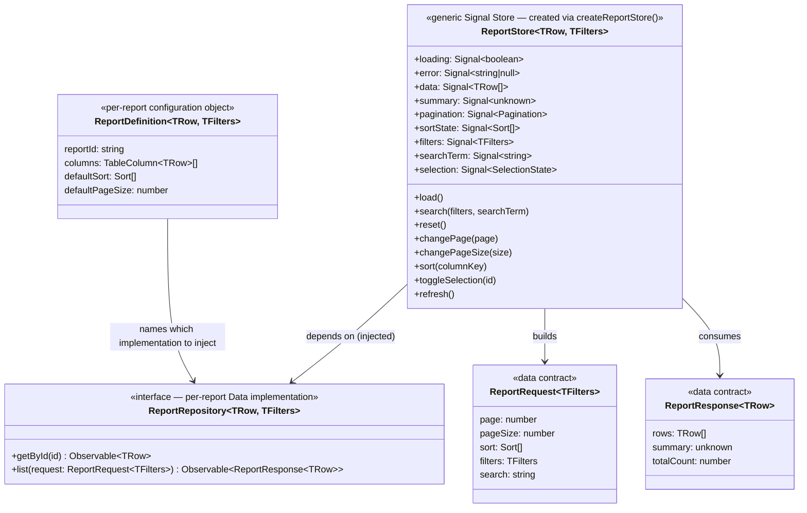

# Multi-Report Framework Specification

**Project:** Enterprise Reporting Platform (dmsReports)
**Document type:** Feature Specification (Spec-Driven Development — Stage 2c, companion to the Enterprise Data Table Specification, upstream of the Enterprise Reporting Engine Specification)
**Status:** Draft — pending approval
**Depends on:** [Enterprise Data Table Specification](enterprise-data-table-specification.md) (`ColumnDefinition`/`DataSourcePort`/`TableEngineStore` contracts), [Enterprise Reporting Engine Specification](enterprise-reporting-engine-specification.md) (names the Reports Feature as its primary near-term consumer), [Signal Store Architecture Specification](architecture/signal-store-architecture-specification.md) (§4.4 Reports Store, §3.2 hand-rolled Signal Store pattern), [Folder Structure Specification](architecture/folder-structure-specification.md), [ADR-0001](adr/0001-layered-architecture-and-workspace-structure.md)
**Reference implementation:** `src/app/features/dealer-ledger/` (as-built, pre-dates this spec)
**Date:** 2026-08-07

---

## 1. Purpose

The Dealer Ledger feature (`src/app/features/dealer-ledger/`) is the platform's first working report: a Signal Store, a repository port, request/response/column models, a filter panel, and a table, all hand-written for one report. The business now needs **8 distinct reports**, each with its own columns and search/filter parameters but the same cross-cutting mechanics (pagination, sort, global search, column filters, summary metrics, export).

This spec defines a **generic report scaffold** — shared contracts and a shared Store shape — so that adding a report means supplying *configuration* (row shape, columns, filter schema, a repository implementation), not hand-writing a new Store/models/wiring 8 times over. It does **not** redesign anything the Enterprise Data Table or Reporting Engine specs already own (pagination/sort/virtualization mechanics, export, Dashboards, Drill Down/Through) — it designs the one thing those specs assumed would exist but haven't yet specified: **how one report's Feature-layer scaffolding is built and repeated across N reports without duplication.**

---

## 2. Assumptions

| # | Assumption |
|---|---|
| A1 | The 8 reports' concrete names, columns, and filter parameters are **not yet known** to this spec — §6 is a placeholder to be filled in with the business before implementation starts. This spec defines the reusable shape; it does not invent report content. |
| A2 | This spec targets the platform **as it is actually built today** — a single `src/app` with `features/*` and `shared/*` — not the `libs/*` + `apps/shell-standalone`/`shell-embedded` monorepo described in the Folder Structure Specification and ADR-0001, which has not been scaffolded yet. Where the two diverge, this spec calls it out explicitly (§9, Open Questions) rather than silently assuming the monorepo exists. |
| A3 | Dealer Ledger is the reference implementation, not a permanent exception — this spec's acceptance criteria require Dealer Ledger to be reconciled onto the generic shape defined here, alongside the other 7 reports, so the platform ends up with one pattern, not "Dealer Ledger, plus 7 reports built differently." |
| A4 | Report-level and column-level permission gating remains **blocked on the RBAC / Authorization Model specification** (per Implementation Backlog §10/§13, `⚠ blocked on RBAC taxonomy spec`) — this spec includes placeholder permission-key seams (§8) but does not define the taxonomy itself. |
| A5 | All 8 reports are assumed to fit the Enterprise Data Table's `flat` `RowModel` (a list of rows with pagination/sort/filter) as Dealer Ledger does. A report that genuinely needs grouping, tree data, or pivot cross-tabulation still supplies its rows/columns through this same scaffold — the Data Table's existing `RowModel`/Pivot extension points (already specified) apply unchanged; this spec does not re-specify them. |
| A6 | "Search parameters" (per the request) means both column-level filters and a report-level filter/advanced-search panel — the same `DealerLedgerFilters` vs. global-search distinction already established in the reference implementation, not a new concept. |

---

## 3. Architecture

### 3.1 What stays per-report vs. what becomes shared

| Concern | Today (Dealer Ledger, hand-written) | Proposed (shared) |
|---|---|---|
| Row shape | `DealerLedgerRow` | Per-report `TRow` type — **stays per-report** (this is real domain variation) |
| Filter shape | `DealerLedgerFilters` | Per-report `TFilters` type — **stays per-report** |
| Column definitions | `DEALER_LEDGER_TABLE_COLUMNS: TableColumn<DealerLedgerRow>[]` | Per-report `TableColumn<TRow>[]` array — **stays per-report** (already generic via `shared/ui/data-table`'s `TableColumn<T>`, §3.2 below) |
| Repository port shape | `DealerLedgerRepository` (`getById`/`list`) | **Generalized once**: `ReportRepository<TRow, TFilters>` — identical method signatures, parameterized |
| Store (loading/error/rows/summary/pagination/sort/filters/search/selection + fetch pipeline) | `DealerLedgerStore` — ~200 lines hand-written | **Generalized once**: a `createReportStore<TRow, TFilters>()` factory producing the exact same Signal surface Dealer Ledger already exposes |
| Fetch request/response envelope | `DealerLedgerRequest`/`DealerLedgerResponse` | **Generalized once**: `ReportRequest<TFilters>` / `ReportResponse<TRow, TSummary>` generics |
| Repository implementation (mock/HTTP) | `DealerLedgerMockService` | **Stays per-report** — each report's actual data access is genuinely different |
| Presentation (toolbar, filter panel, table wrapper, summary cards, list/detail pages) | Dealer-Ledger-specific components | **Stays per-report**, but composes the same generic `shared/ui/data-table` (already true today) — no change needed there |

The generic pieces are exactly the parts of Dealer Ledger that contain **zero domain knowledge** today — the Store's fetch pipeline, pagination bookkeeping, sort-cycling logic, and selection-state machine never reference `dealerCode` or any Dealer Ledger concept by name. That's what makes them safe to extract once and reuse 8 times, per SOLID/DRY.

### 3.2 Already-generic (no change required)

- **`shared/ui/data-table`** (`TableColumn<T>`, `DataTableComponent`) — already domain-agnostic; each of the 8 reports plugs in its own `TableColumn<TRow>[]`.
- **`DealerLedgerFilterValue`-style filter panel shell** — already a configuration-driven shell decoupled from any specific domain field; each report supplies its own checkbox options / field set.

### 3.3 New shared contracts



**Key decision:** `ReportStore<TRow, TFilters>` is produced by a **factory function** (`createReportStore<TRow, TFilters>(repository)`), not a shared base class — consistent with this platform's existing preference for composition over inheritance in its hand-rolled Signal Stores (Signal Store Spec §3.2's rationale for avoiding extra framework machinery applies equally here: a factory keeps each report's store a plain, inspectable class instance with no inheritance chain to reason about).

---

## 4. Folder Structure Impact

Reconciled against the **as-built** structure (A2), not the not-yet-built `libs/*` monorepo:

```
src/app/
├── shared/
│   ├── ui/data-table/                       # unchanged — already generic
│   └── data-access/
│       └── report-store/                    # NEW — the one shared, generic layer
│           ├── models/
│           │   ├── report-request.model.ts       # ReportRequest<TFilters>
│           │   └── report-response.model.ts       # ReportResponse<TRow>
│           ├── interfaces/
│           │   └── report-repository.interface.ts # ReportRepository<TRow, TFilters>
│           └── report-store.factory.ts             # createReportStore<TRow, TFilters>()
│
└── features/
    ├── dealer-ledger/                        # migrated onto the shared factory (§5)
    ├── <report-2>/                           # same internal shape as dealer-ledger, minus its own Store/request/response models
    ├── ...
    └── <report-8>/
```

Each report feature folder keeps exactly what's genuinely report-specific: `models/<report>-row.model.ts`, `models/<report>-filters.model.ts`, its repository implementation (mock and/or HTTP), its column definitions, its filter panel wiring, its presentational components, and its routes. It no longer needs its own hand-written Store, request/response models, or repository *interface* (only the *implementation*).

This is a **within-`src/app` generalization**, not a migration to the `libs/*` monorepo — that migration remains ADR-0001's unimplemented decision and is out of scope here (flagged again in Open Questions, §12).

---

## 4a. Implementation Status

*(Added after the first implementation pass — kept here rather than silently left implicit, since a partially-built spec is worse than one that states plainly what's done.)*

Built in this pass: the shared common search bar (`ReportSearchBarComponent`), the mocked `DealerContextService`, per-report `ReportConfig` files + `REPORTS_CATALOG` registry, the Reports Home page, one directly-navigable top-level route per report (§6.4), Dealer Ledger's migration onto the new common search bar (columns/filters updated per §6.2), and Goods Acknowledgement built with its own checkboxes/actions/table structure but no data (§6.2).

**Not yet built:** §3.3's generic `ReportRepository`/`ReportResponse`/`createReportStore()` factory. Dealer Ledger still runs its own hand-rolled `DealerLedgerStore`, unchanged in kind from before this spec — it has not yet been migrated onto a shared factory, because only one report (Dealer Ledger) has a real Store/data source to generalize from; per §12 Open Question 2, that migration is deferred until a second report's real data requirements are known (Goods Acknowledgement deliberately has no data yet, so it cannot serve as that second example). This remains the next real step once reports #3–8 (or a second wave of Goods Acknowledgement's data) are confirmed.

## 5. Migration Path for Dealer Ledger

Per A3, this spec is not "build 7 more reports the old way, plus a new way." Sequencing:

1. Extract `ReportRepository`, `ReportRequest`/`ReportResponse`, and `createReportStore()` into `shared/data-access/report-store/` (§4), generalized directly from `DealerLedgerRepository`/`DealerLedgerRequest`/`DealerLedgerResponse`/`DealerLedgerStore` — a refactor, not a rewrite, since the existing Store already contains no domain-specific logic.
2. Re-point `dealer-ledger.routes.ts`'s providers at `createReportStore<DealerLedgerRow, DealerLedgerFilters>(dealerLedgerRepository)` in place of the hand-written `DealerLedgerStore` class; verify existing behavior (list/detail pages, filters, sort, pagination) is unchanged.
3. Only once Dealer Ledger runs on the shared factory with no regression, use it as the literal template for the remaining 7 reports.

This order matters: it proves the abstraction against a real, already-working report before multiplying it by 7, rather than designing the generic shape against untested assumptions.

---

## 6. The 8 Reports

Confirmed by the business. Every report shares the four **common search parameters**
(§6.1); "Search/Filter Parameters" below lists each report's *additional*,
report-specific parameters on top of those four. Reports without a confirmed column set
get a route and the common search parameters only — no table, per §6.2's rule against
fabricating columns/data ahead of confirmed requirements.

### 6.1 Common search parameters (every report)

Rendered by the shared `ReportSearchBarComponent` (`shared/ui/report-search-bar`), prefilled from the current dealer's context:

| Parameter | Notes |
|---|---|
| Dealer Code | Prefilled from `DealerContext` (§6.3) |
| Dealer Description | Prefilled from `DealerContext` |
| Company Code | Prefilled from `DealerContext` |
| Date Range (From/To) | Not prefilled |

### 6.2 Report catalog

| # | Report Name | Status | Additional Search/Filter Parameters | Table Columns |
|---|---|---|---|---|
| 1 | Dealer Ledger | **Built** (existing feature, migrated onto the new common search bar) | "Include Details" checkbox group: With OE Details, With SP Details, With AC Details, With EV Details, With ACWSH Details | Dealer Code, Doc. Type, Doc. Reference No., Doc. Date, Assignment, CCA, Text Dec., Narration Veh. Description, Debit Amount, Credit Amount, Dealer Name, Dealer Address, Currency, Text, QNT., Amt |
| 2 | Goods Acknowledgement | **Built**, no data (source data not yet confirmed) | Two checkboxes: Vehicle, Spares; actions are Display / Update / Clear (not Search/Reset/Export) | Invoice No., Shipment No., Date, plus row selection (checkbox) |
| 3 | Warranty Reconciliation | Route + common search only | *TBD* | *TBD — table deferred* |
| 4 | Warranty Labour Tax Invoice | Route + common search only | *TBD* | *TBD — table deferred* |
| 5 | Warranty Cost Report | Route + common search only | *TBD* | *TBD — table deferred* |
| 6 | Parts Packing List | Route + common search only | *TBD* | *TBD — table deferred* |
| 7 | VOR Print | Route + common search only | *TBD* | *TBD — table deferred* |
| 8 | PQM | Route + common search only | *TBD* | *TBD — table deferred* |

Reports #3–8 are intentionally scaffolded as **search-parameters-only** pages (§13) — each has its own `<report>.config.ts` and its own route, but no fabricated table/columns/mock data, since none of their column sets or data sources have been confirmed yet. Filling in their "Additional Search/Filter Parameters" and "Table Columns" columns above is what upgrades a given report from a placeholder to a fully built one — at that point it follows the same build shape as Goods Acknowledgement.

### 6.3 Dealer Context (mocked auth API)

Per the business requirement, dealer identity — Dealer Name, Dealer Description, Company Name (and the codes used in filtering: Dealer Code, Company Code) — is expected to come from the platform's future **auth API**. No such API exists yet, so `DealerContextService` (`shared/services/dealer-context/`) mocks a fixed `DealerContext` value. Every report's common search bar reads this service to prefill Dealer Code/Dealer Description/Company Code. Swapping the mock for a real auth-API-backed implementation later requires no change to any report — only to `DealerContextService` itself.

### 6.4 Home Page & iframe Routing

A **Reports Home page** (`features/reports-home/`) lists all 8 reports (from `REPORTS_CATALOG`, an aggregation of each report's own `<report>.config.ts`) and links to each report's own route — this is the app's `''` root route. Because this application is also integrated by a host application via `<iframe>` (per the Product Vision's Embedded mode, FR-2.1–FR-2.7), **every report has its own directly-navigable top-level route** (e.g. `/dealer-ledger`, `/goods-acknowledgement`, `/warranty-reconciliation`, …) so a host can deep-link an iframe straight to one report without passing through the Home page — consistent with Vision FR-2.4 ("direct access to a specific report as the sole rendered content").

---

## 7. Alternatives Considered

1. **Replicate the Dealer Ledger pattern per report (no shared factory)** — rejected as the default: 8 hand-written Stores/models/repository interfaces duplicate the same ~200 lines of pagination/sort/selection logic 8 times, directly contradicting the platform's stated SOLID/DRY/"reusable platform, not bespoke app" conventions. Would only be justified if the 8 reports' state-management needs turn out to diverge structurally (see Open Questions, §12).
2. **Fully schema/JSON-driven reports** (a report is entirely a data file — columns, filters, endpoint — consumed by one generic component, no per-report TypeScript at all) — deferred, not rejected: this is the more radical version of the idea and would remove even the small per-report `models`/repository-implementation files. Deferred because it requires the column/filter shapes to be fully expressible as data (no custom cell templates, no bespoke filter UI) — not yet known to hold for all 8 reports (§6 is still TBD). Worth revisiting once the 8 reports' concrete needs are known; the factory-based approach in §3.3 does not block moving to this later.
3. **Generic factory + shared contracts, per-report config for the rest (chosen)** — best fit for what's actually known today: eliminates the real, provable duplication (Store/request/response/port), keeps the genuinely-variable parts (row shape, columns, filter UI, actual data access) where they naturally differ per report.

---

## 8. Security

- Report-level and column-level permission gating is a **placeholder seam only** in this spec — `ReportDefinition` may carry a `permissionKey` field reserved for future use, but no enforcement logic is defined here (blocked on RBAC taxonomy, A4).
- Per the Reporting Engine Specification §10's already-established rule: **row/field-level security is never enforced client-side** by any of the 8 reports' repository implementations — a mock/HTTP repository must never fetch a broader dataset than the user is authorized for and filter it down in the browser.
- No new security surface is introduced by generalizing the Store/repository shape — the same `ReportRepository.list()` contract Dealer Ledger already uses is simply parameterized, not changed in kind.

---

## 9. Performance Strategy

Inherited unchanged from the Enterprise Data Table Specification (§13) — restated only to confirm the generalization doesn't affect it: debounced search, memoized sort/filter computation, and virtualization are properties of `shared/ui/data-table`, which every report already uses identically regardless of whether its Store is hand-written or factory-produced. Generalizing the Store introduces no new performance characteristic; it removes duplicate code, not duplicate computation.

---

## 10. Testing Strategy

- **One contract-test suite for `ReportRepository<TRow, TFilters>`**, run against every report's mock implementation (and, later, HTTP implementation) — so report #5's mock and report #5's future HTTP repository can't silently diverge in behavior, and so the same suite catches a mistake in report #8's implementation without writing 8 separate test suites from scratch.
- **`createReportStore()` is unit-tested once**, against a fake `ReportRepository`, covering fetch-pipeline behavior (loading/error states, search/reset/sort/pagination semantics, selection state machine) — individual reports do not need to re-test this generic behavior, only their own column/filter configuration and repository implementation.
- Existing Dealer Ledger tests (if any) are the acceptance bar for the migration in §5 — behavior must be unchanged after moving onto the shared factory.

---

## 11. Risks

| # | Risk | Impact | Mitigation |
|---|---|---|---|
| R1 | One of the 8 reports needs state-management behavior the generic factory doesn't support (e.g., a fundamentally different selection model), forcing either a factory redesign or a one-off exception that reintroduces the duplication this spec avoids. | Medium | Fill in §6 with real report requirements *before* building the factory's final shape — the factory should be finalized against Dealer Ledger + at least one structurally different report, not Dealer Ledger alone. |
| R2 | This spec's generalization happens inside `src/app/features`/`shared`, while ADR-0001/Folder Structure Spec describe a `libs/*` monorepo that doesn't exist yet — a future migration to that structure has to move both the generic factory and 8 reports' worth of config, not just 1. | Medium | Explicitly tracked as an open question (§12); the `shared/data-access/report-store/` module boundary chosen in §4 is deliberately clean (no cross-imports from `features/*`) so a later move into `libs/business`/`libs/data` is a relocation, not a redesign. |
| R3 | Report-level permission gating is deferred (A4) — 8 reports ship without enforcement, then need retrofitting once RBAC lands. | Medium | `ReportDefinition`'s reserved `permissionKey` seam (§8) means retrofitting is additive (wire the key to `AuthorizationService.evaluate()`), not a rework of all 8 reports' routing/guards. |
| R4 | "8 reports" is treated as a hard ceiling in the factory's design, making a 9th report later feel bolted-on. | Low | The factory is parameterized by `<TRow, TFilters>` generically, not by an enum of 8 known reports — a 9th report is exactly as supported as report #2. |

---

## 12. Dependencies

**Upstream:** Enterprise Data Table Specification (`ColumnDefinition`/`TableColumn<T>`, `DataSourcePort` concept this spec's `ReportRepository` mirrors at Feature scale), Signal Store Architecture Specification (§3.2 hand-rolled store convention, §4.4 Reports Store — this spec is the concrete Feature-layer realization of the pattern that store spec describes at the platform/business-domain level), Engineering Standards.

**Downstream:** The Enterprise Reporting Engine Specification's Dashboard/Widget composition (§5.1 of that spec) will eventually bind widgets to reports built on this scaffold — no changes required there; a `Widget.dataBinding.reportId` referencing one of these 8 reports is already compatible with this shape.

---

## 13. Acceptance Criteria

- [ ] `ReportRepository<TRow, TFilters>`, `ReportRequest<TFilters>`, `ReportResponse<TRow>`, and `createReportStore<TRow, TFilters>()` exist in `shared/data-access/report-store/` with no reference to any specific report's domain concepts.
- [ ] Dealer Ledger is migrated onto `createReportStore()` with no behavioral regression (§5), proving the abstraction against the one real, already-working report before the other 7 are built.
- [ ] Each of the remaining 7 reports is implemented by supplying only: row model, filters model, `TableColumn<TRow>[]`, a `ReportRepository` implementation, and presentational wiring — no report hand-writes its own Store, request/response models, or repository interface.
- [ ] §6's report table is fully completed (no `TBD` rows) before any of reports #2–8 begins implementation.
- [ ] A shared `ReportRepository` contract-test suite exists and runs against every report's repository implementation.
- [ ] No report-specific logic leaks into `shared/data-access/report-store/` (verified by the same "Shared stays pure" review discipline already established for `shared/ui/data-table`).

---

## 14. Open Questions

1. **§6 is the primary blocker** — the 8 reports' names, row shapes, columns, and filter parameters are needed from the business before the factory's generics can be finalized against more than one real example (see R1).
2. Whether `createReportStore()` should be finalized now against Dealer Ledger alone, or whether implementation should wait until at least one more report's requirements are known, to avoid designing the generic shape against a sample size of one.
3. Whether/when to proceed with the ADR-0001 `libs/*` monorepo migration — this spec deliberately does not decide that question, only avoids making it harder later (R2).
4. Whether `TFilters` should remain a fully-typed per-report interface (as Dealer Ledger does today) or move toward a more generic `FilterDescriptor[]` shape closer to the Enterprise Data Table's own `FilterDescriptor` — affects how much of the filter panel wiring can eventually be generalized too, beyond just the Store.

---

## 15. Next Steps

Pending approval of this spec:

1. **Fill in §6** with the actual 8 reports' details — this is the input this spec is currently missing, not a technical decision.
2. **ADR**: record the "generic report-store factory vs. per-report replication" decision (§7) formally, since it's an architecturally significant, hard-to-reverse choice affecting all future reports on the platform.
3. Only after both are approved: implement §5's Dealer Ledger migration first, then the remaining 7 reports against the proven factory.
